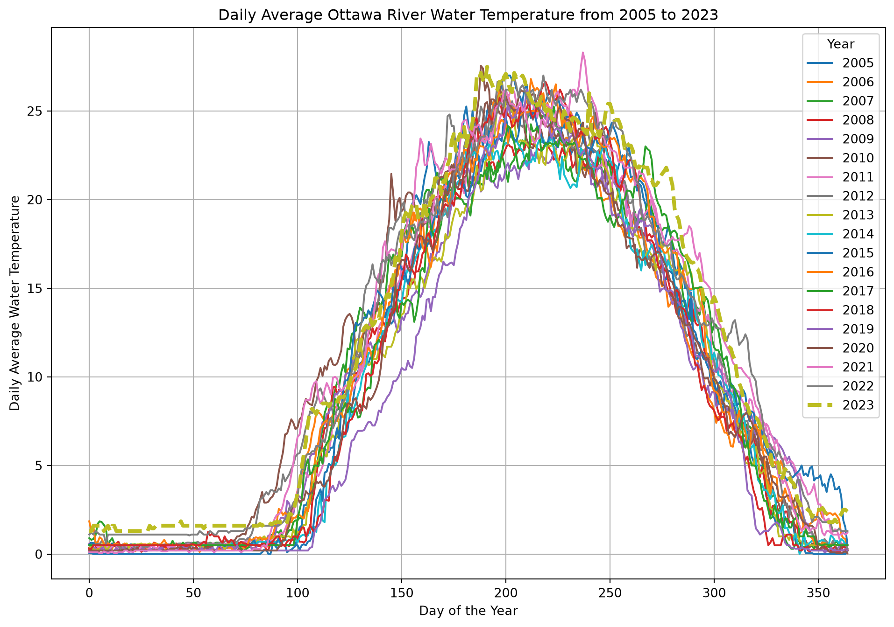

# Jupyter Notebook - Ottawa River Temperature

CSI 4106 - Fall 2025

Author

Affiliations

Marcel Turcotte [](mailto:marcel.turcotte@uottawa.ca)

School of Electrical Engineering and Computer Science

University of Ottawa

Published

August 31, 2026

# Learning objectives

- **Demonstrate** a basic understanding of Jupyter Notebooks.
- **Execute** code cells within Jupyter Notebooks using Google Colab.
- **Modify** a Jupyter Notebook with simple changes and execute the updated code cells in Google Colab.

# Quick Start

## Play with this notebook online without having to install anything

While the specifics of the code will be discussed in subsequent notebooks, it is important to note that this notebook requires the installation of both [pandas](https://pandas.pydata.org) and [matplotlib](https://matplotlib.org). These libraries are pre-installed on [Google Colab](https://colab.research.google.com), facilitating immediate use. However, a Google account is needed in order to execute the code!

- [](https://colab.research.google.com/github/turcotte/csi4106-f26/blob/main/notebooks/computing/01/01_ottawa_river_temperature.ipynb)

If you are viewing this document on the course website, you are seeing the result of converting a Jupyter Notebook to HTML. You can download the corresponding Jupyter Notebook from the table of contents, typically located in the upper right corner when browsing on a computer. Alternatively, you can download it directly [here](01_ottawa_river_temperature.ipynb).

## Look at this notebook, without executing any code

- [](https://nbviewer.jupyter.org/github/turcotte/csi4106-f26/blob/main/notebooks/computing/01/01_ottawa_river_temperature.ipynb)

# Concepts

A Jupyter notebook is an interactive computational environment that combines code execution, text, and multimedia in a single document. Below are the key components of a Jupyter notebook:

## Cells

- **Code Cells:** These cells contain executable code, typically in Python, but other languages like R, Julia, and Scala are also supported. The code is executed in the kernel, and the output is displayed directly below the cell.
- **Markdown Cells:** These cells contain text formatted using Markdown. They are used to add explanations, headers, bullet points, links, images, and other formatted text to the notebook.
- **Raw Cells:** These cells contain text that is not meant to be executed or rendered. They are useful for including code snippets or text that should remain unformatted.

## Execution

- **Standard Output:** The output of code execution, including text, tables, and plots, is displayed directly below the code cell.
- **Rich Media Output:** Jupyter notebooks support rich media output such as HTML, images, videos, LaTeX, and interactive widgets (e.g., Plotly, Bokeh).

# Ottawa River Temperature

In this example, we utilize the [**Ottawa River Temperature**](https://open.ottawa.ca/documents/2dff4bca304f4308996681aa6265f64d/about) dataset, available through the [City of Ottawa’s Open Data portal](https://open.ottawa.ca).

## Importing the necessary librairies

``` python
import pandas as pd
import matplotlib.pyplot as plt
import requests
from io import BytesIO
```

## Fetching the data

> **WARNING:**
>
> When working with Google Colab, it is essential to recognize that you are operating within a temporary environment. Any data or changes made will be deleted after the session ends. Therefore, it is imperative to download and securely store any data or results that you wish to retain.
>
> You are also responsible for ensuring that the source code for your assignments remains private and is not publicly accessible.

``` python
# URL of the Excel file
url = 'https://www.arcgis.com/sharing/rest/content/items/2dff4bca304f4308996681aa6265f64d/data'

# Fetch the Excel file from the web
response = requests.get(url)
response.raise_for_status()  # Ensure we notice bad responses
```

## Reading the Excel file

``` python
# Read the Excel file into a pandas DataFrame
df = pd.read_excel(BytesIO(response.content), sheet_name='Britannia raw water temperature', header=None)
```

## Extracting the data from the Excel file

Columns B to U contain daily average temperatures for each year from 2005 to 2023, with each column corresponding to a specific year. Rows 11 to 375 represent daily average values, where row 11 corresponds to January 1 and row 375 corresponds to December 31. For example, cell B11 contains the average temperature for January 1, 2005, while cell U375 contains the average temperature for December 31, 2023.

``` python
# Define the range of years and columns
years = range(2005, 2023 + 1)  # Up to 2023 as per your description
columns = range(1, 21)  # Columns B to U (1-indexed in Excel, 0-indexed in pandas)

# Prepare a dictionary to hold the data
data = {}

# Extract data for each year
for year, col in zip(years, columns):
    # Note: B11 to B375 corresponds to row indices 10 to 374 in pandas (0-indexed)
    data[year] = df.iloc[10:375, col].values
```

## Ploting the data

``` python
# Plot the data
plt.figure(figsize=(12, 8))

for year in years:
  if year == 2023:
    plt.plot(data[year], label=str(year), linewidth=3, linestyle='--')
  else:
    plt.plot(data[year], label=str(year))

plt.xlabel('Day of the Year')
plt.ylabel('Daily Average Water Temperature')
plt.title('Daily Average Ottawa River Water Temperature from 2005 to 2023')
plt.legend(title='Year')
plt.grid(True)
plt.show()
```



# Experimentation

Gain familiarity with the technology by performing the following tasks:

1.  Modify the year range to span from 2020 to 2023 and regenerate the plot.
2.  Refer to the [documentation](https://matplotlib.org/stable/gallery/lines_bars_and_markers/linestyles.html) to alter the line style.
3.  Consult the [markdown documentation](https://jupyter-notebook.readthedocs.io/en/stable/examples/Notebook/Working%20With%20Markdown%20Cells.html).
