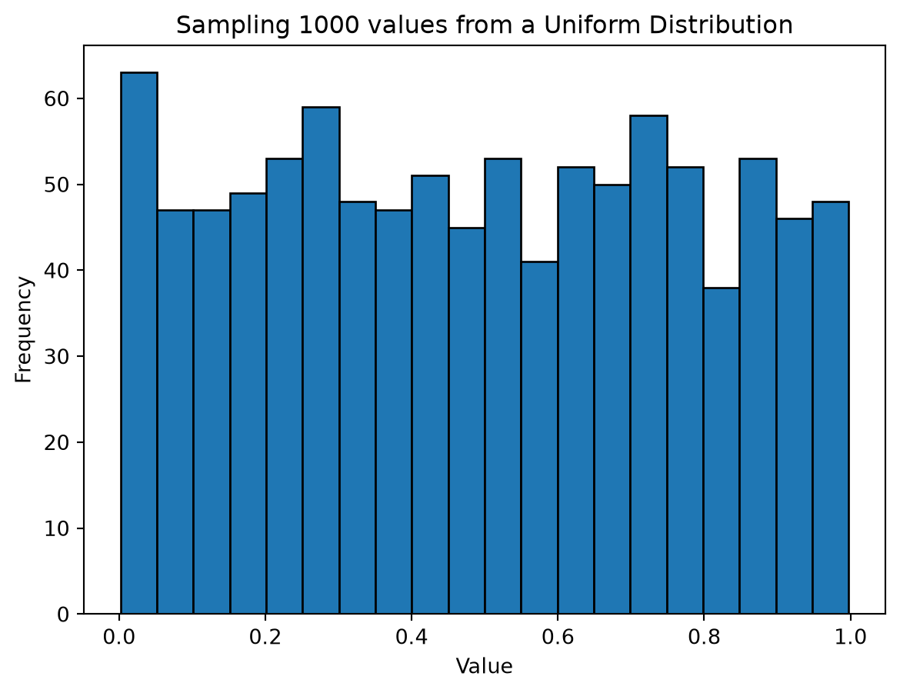
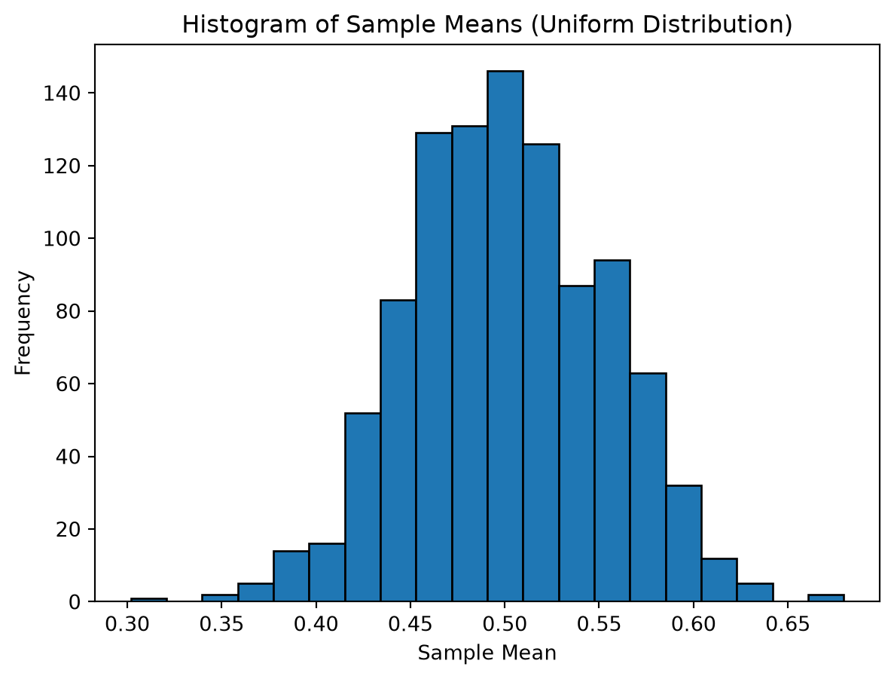
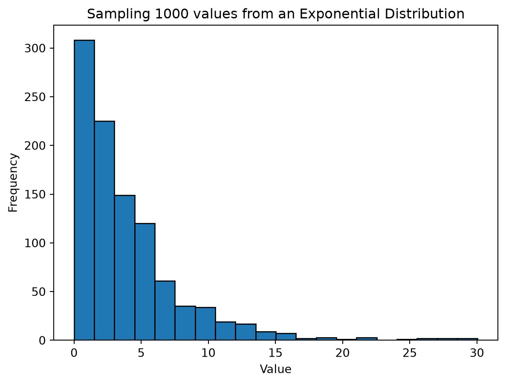
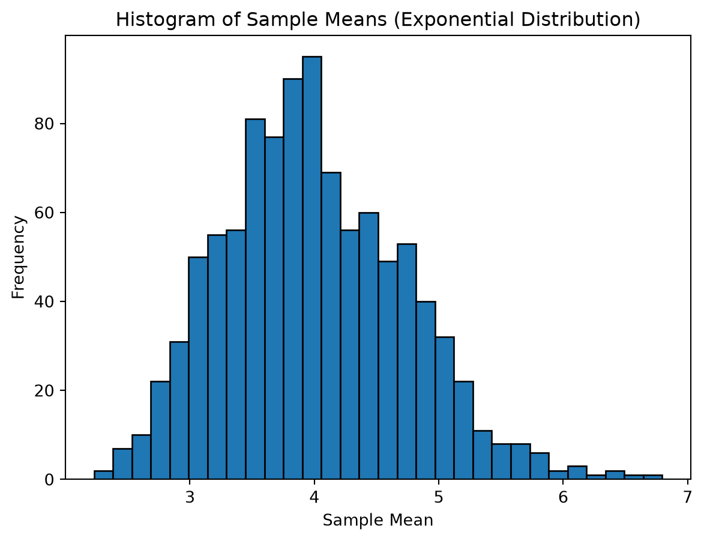

# Jupyter Notebook - Central Limit Theorem

CSI 4106 - Fall 2025

Author

Affiliations

Marcel Turcotte [](mailto:marcel.turcotte@uottawa.ca)

School of Electrical Engineering and Computer Science

University of Ottawa

Published

January 30, 2026

This example is derived from my personal notes. Jupyter notebooks can be effectively used for writing interactive notes and exploring ideas.

# Central Limit Theorem

The Central Limit Theorem is a fundamental statistical concept that states that the distribution of sample means approximates a normal distribution (bell-shaped curve) as the sample size becomes large, regardless of the shape of the population distribution, provided that the samples are independent and identically distributed.

\\ \text{sample standard deviation} = \frac{\text{population standard deviation}}{\sqrt{\text{sample size}}} \\

Let’s illustrate the concept with two popular but dissimilar probability distributions.

To refresh our memory, we will generate 1000 values from a uniform distribution with range 0 to 1, and plot the result.

``` python
import numpy as np
import matplotlib.pyplot as plt

# Sample size
sample_size = 1000

# Generate values
values = np.random.uniform(0, 1, sample_size)

# Plot the histogram
plt.hist(values, bins=20, edgecolor='black')
plt.title(f'Sampling {sample_size} values from a Uniform Distribution')
plt.xlabel('Value')
plt.ylabel('Frequency')
plt.show()
```



In this first example, 1000 samples are generated each with 31 values sampled from a uniform distribution with range \\\[0,1\]\\

``` python
import numpy as np
import matplotlib.pyplot as plt

# Number of samples and sample size
num_samples = 1000
sample_size = 31

# Generate samples and calculate their means
sample_means = [np.mean(np.random.uniform(0, 1, sample_size)) for _ in range(num_samples)]

# Plot the histogram of the sample means
plt.hist(sample_means, bins=20, edgecolor='black')
plt.title('Histogram of Sample Means (Uniform Distribution)')
plt.xlabel('Sample Mean')
plt.ylabel('Frequency')
plt.show()
```



The above histogram has the characteristic bell shape.

For the next example, we will turn our attention to the exponential probability distribution. Again, we will refresh our memory. The following shows the histogram for 1000 values generated from an exponential distribution with rate \\\lambda = \frac{1}{4}\\. Hence, the scale, \\\beta=\frac{1}{\lambda}\\, is \\4\\.

``` python
import numpy as np
import matplotlib.pyplot as plt

# Sample size
sample_size = 1000

# Generate values
values = np.random.exponential(scale=4, size=sample_size)

# Plot the histogram
plt.hist(values, bins=20, edgecolor='black')
plt.title(f'Sampling {sample_size} values from an Exponential Distribution')
plt.xlabel('Value')
plt.ylabel('Frequency')
plt.show()
```



Now, let’s generate 1000 samples, each with 31 values sampled from an exponential distribution.

``` python
import numpy as np
import matplotlib.pyplot as plt

# Number of samples and sample size
num_samples = 1000
sample_size = 31

# Scale parameter for the exponential distribution
scale_parameter = 4

# Generate the samples and calculate their means
sample_means = [np.mean(np.random.exponential(scale=scale_parameter, size=sample_size)) for _ in range(num_samples)]

# Plot the histogram of the sample means
plt.hist(sample_means, bins=30, edgecolor='black')
plt.title('Histogram of Sample Means (Exponential Distribution)')
plt.xlabel('Sample Mean')
plt.ylabel('Frequency')
plt.show()
```



Why does this matter? In experimental work, we frequently lack knowledge of the underlying distribution of the data. Yet, when we summarize experimental results using the mean, we can be confident that these means will follow a normal distribution. This allows us to apply statistical techniques such as calculating confidence intervals, conducting t-tests to compare the means of two different samples, or performing ANOVA to determine if there are differences among the means of three or more samples.

As a rule of thumb, the sample size should be at least 30 for the Central Limit Theorem to be applicable. This guideline is not universally applicable. For populations with significant skewness or outliers, larger sample sizes may be needed for the Central Limit Theorem to hold. Conversely, if the population distribution is already normal, even smaller sample sizes will yield a distribution of sample means that is approximately normal.
