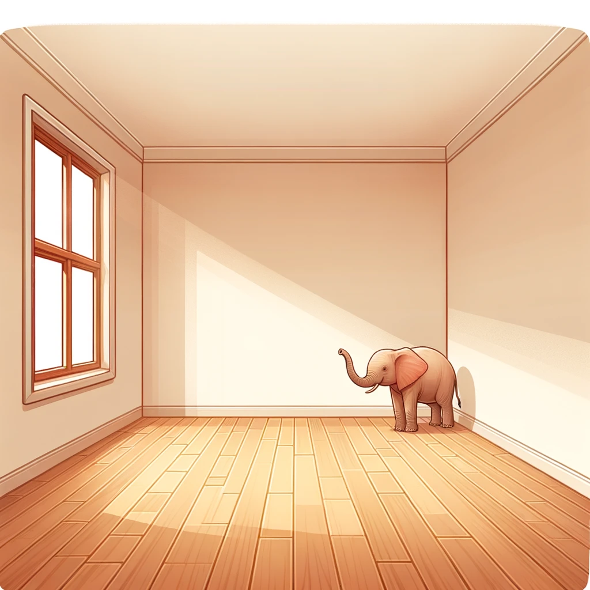

# Useful links

Author

Marcel Turcotte

Published

August 23, 2026

# Datasets

Here is a list of websites with datasets relevant to class concepts, enhancing your skills and intuition in data analysis.

## Small-to-medium datasets, very student-friendly

- [UCI Machine Learning Repository](https://archive.ics.uci.edu/)
- [scikit-learn toy datasets](https://scikit-learn.org/stable/datasets/toy_dataset.html)

## Larger datasets

- [OpenML](https://www.openml.org/), integrates directly with scikit-learn
- [PMLB (Penn Machine Learning Benchmarks)](https://epistasislab.github.io/pmlb/)

## Competition(s)

- [Kaggle Datasets](https://www.kaggle.com/datasets)
  - Kaggle, a platform owned by Google, serves as an online community tailored for data scientists and machine learning practitioners. It facilitates participation in data science competitions, collaboration on various projects, and provides access to diverse datasets. Additionally, users can build models using its web-based tools.
  - Public datasets from Kaggle or the web are not automatically reliable simply because they are easy to access, widely shared, or used in published papers. Recent reporting has shown that some widely used health datasets contain unrealistic or dubious values, which can lead to invalid analyses and misleading AI models. Students should critically evaluate dataset provenance, documentation, and plausibility before use, and avoid relying on unverifiable datasets for serious academic work.
    - [Basu, M. (2026, April 15). Dozens of AI disease-prediction models were trained on dubious data. Nature.](https://www.nature.com/articles/d41586-026-00697-4)
    - [Gibson, A. D., White, N. M., Collins, G. S., & Barnett, A. G. (2026, February 26). Evidence of unreliable data and poor data provenance in clinical prediction model research and clinical practice (preprint). medRxiv.](https://www.medrxiv.org/content/10.64898/2026.02.24.26347028v1)
- [ML Contests](https://mlcontests.com)
  - **ML Contests** is a curated directory of active, upcoming, and past machine learning, data science, and robotics competitions, with filters by technique, application domain, platform, and prize pool. It helps practitioners quickly discover relevant challenges across major platforms.
  - [The State of Machine Learning Competitions: 2025 Edition](https://mlcontests.com/state-of-machine-learning-competitions-2025/): The report can help you see which frameworks, libraries, and modelling approaches are most widely used in top-performing solutions, grounding your learning in current practice. It also provides insight into realistic workflows, compute budgets, and evaluation standards in competitive machine learning.

# Jobs

- [There will be no AI jobpocalypse](https://info.deeplearning.ai/seedance-makes-splash-nvidias-ai-guided-chip-designs-helping-robots-not-forget), The Batch, Andrew Ng, 2026-05-08.
- [At \$250 million, top AI salaries dwarf those of the Manhattan Project and the Space Race](https://arstechnica.com/ai/2025/08/at-250-million-top-ai-salaries-dwarf-those-of-the-manhattan-project-and-the-space-race/), Ars Technica, Aug 1, 2025.
- [Shopify CEO says no new hires without proof AI can’t do the job](https://www.theverge.com/news/644943/shopify-ceo-memo-ai-hires-job), **The Verge**, by Jay Peters, Apr 7, 2025.
- [Canada’s AI Ecosystem: A Brief Overview of In-Demand Skills and Trends](https://ictc-ctic.ca/reports/canadas-ai-ecosystem-a-brief-overview-of-indemand-skills-and-trends), by **ICTC**, April 1, 2025.
- [AI software engineers make \$100,000 more than their colleagues.](https://qz.com/ai-software-engineers-make-100k-more-than-colleagues-a-1851496766) **Quartz**. Updated May 23, 2024.
- [Canada leads the world in AI talent concentration.](https://www2.deloitte.com/ca/en/pages/press-releases/articles/impact-and-opportunities.html) **Deloitte** Press Release. September 23, 2023.
- [Don’t fear AI. It will lead to long-term job growth.](https://www.weforum.org/agenda/2020/10/dont-fear-ai-it-will-lead-to-long-term-job-growth/) **World Economic Forum**, October 26, 2020.
- [Talent and workforce effects in the age of AI.](https://www2.deloitte.com/xe/en/insights/focus/cognitive-technologies/ai-adoption-in-the-workforce.html) **Deloitte** Insights, March 3, 2020.

# Podcasts

- [Santa Fe Institute, Complexity Podcast, The **Nature of Intelligence**](https://www.santafe.edu/culture/podcasts), published from September to December 2024
- [Are We Thinking Correctly About **AI Intelligence**? The Joy of Why](https://www.youtube.com/watch?v=cSZo8GZIUYI), published on 2026-08-20
- [Google DeepMind: The Podcast](https://www.youtube.com/playlist?list=PLqYmG7hTraZBiUr6_Qf8YTS2Oqy3OGZEj)
- [Machine Learning Street Talk](https://www.youtube.com/c/MachineLearningStreetTalk)
- [Google: The AI Company, Acquired, Fall 2025, Episode 1](https://www.acquired.fm/episodes/google-the-ai-company)

# AI for Good

- [Responsible AI](https://www.caiac.ca/en/conferences/canadianai-2026/responsible-ai), a [Canadian AI](https://www.caiac.ca) event
- [AI for Good](https://aiforgood.itu.int)
- [We’re Doing AI All Wrong. Here’s How to Get It Right](https://www.youtube.com/watch?v=Bl-vPf_IAoA), TED Talk by Sasha Luccioni, 10m 31s, 2025-12-01.

# Ethics

- [Evitable](https://evitable.com/) - informing and organizing the public around societal-scale risks and harms of AI
- [Gibney, E. (2026). AI doom warnings are getting louder. Are they realistic? Nature, 652(8111), 848–850.](https://doi.org/10.1038/d41586-026-01257-6)
- [We have a ‘12 to 24-month period’ to forge a pro-human future, warns AI ethicist](https://edition.cnn.com/2026/04/08/tv/video/amanpour-tristan-harris) Bianna Golodryga, CNN, 2026-04-08
- [‘We have to stop it taking over’ - the past, present and future of AI with Geoffrey Hinton](https://https://www.youtube.com/watch?v=Y7nrAOmUtRs), Royal Institution, 2025-08-26.
- [AI2027: Is this how AI might destroy humanity?](https://www.youtube.com/watch?v=1UufaK3pQMg), BBC World Service, 2025-08-01
- [What Happens When Robots Don’t Need Us Anymore?](https://www.youtube.com/watch?v=sK5_pQV_QEA), Bloomberg, 2024-11-11
- [Stop Autonomous Weapons (2017) Slaughterbots](https://www.youtube.com/watch?v=9CO6M2HsoIA), 2025-03-06
- [Slaughterbots - if human: kill()](https://www.youtube.com/watch?v=9rDo1QxI260)
- [BBC AI Decoded - Stephanie Hare interview Yoshua Bengio](https://www.youtube.com/watch?v=3cFk225CyXU)

# Hype

- [12 Graphs That Explain the State of AI in 2025](https://spectrum.ieee.org/ai-index-2025) in IEEE Spectrum
- [15 Graphs That Explain the State of AI in 2024](https://spectrum.ieee.org/ai-index-2024) in IEEE Spectrum
- [It’s Here: The 2024 Gartner AI Hype Cycle](https://youtu.be/qXKYOR3KqxQ?si=PZ7gHka0MohXtdCO) (video)
- [ChatGPT passes the famous ‘Turing test’ - suggesting the AI bot has intelligence equivalent to a human, scientists claim](https://www.dailymail.co.uk/sciencetech/article-13554489/ChatGPT-passes-famous-Turing-test.html) in Daily Mail, 2024-06-21.
- [AI’s Turing Test Moment GPT-4 advances beyond Turing test to mark new threshold in AI language mastery.](https://www.psychologytoday.com/ca/blog/the-digital-self/202405/ais-turing-test-moment) Psychology Today, 2024-05-17.
- [The most recent version of ChatGPT passes a rigorous Turing test, diverging from average human behavior chiefly to be more cooperative.](https://humsci.stanford.edu/feature/study-finds-chatgpts-latest-bot-behaves-humans-only-better#:~:text=Study%20finds%20ChatGPT's%20latest%20bot%20behaves%20like%20humans%2C%20only%20better,-Scroll%20to%20more&text=The%20most%20recent%20version%20of,chiefly%20to%20be%20more%20cooperative.) Standford, School of Humanities and Sciences. 2024-02-22.
- [AI: great expectations](https://people.csail.mit.edu/brooks/idocs/AI_hype_1988.pdf) by Rodney A. Brooks, in Manufacturing Engineeinrg, March 1988, p. 148.
- [AI and the Popular Press](https://melaniemitchell.me/EssaysContent/AIPopularPress1985.pdf) by Melanie Mitchell, in Popular Computing, March 1985, p. 23.

# Popularization

- [The Thinking Game (2024)](https://thinkinggamefilm.com)
- [The Age of A.I.](https://www.youtube.com/watch?v=UwsrzCVZAb8&list=PLjq6DwYksrzz_fsWIpPcf6V7p2RNAneKc) An 8 parts YouTube Originals, 2019-12-18
- [“The Thinking Machine” (1961) - MIT Centennial Film](https://techtv.mit.edu/videos/88997eb8681a4a728dd798b1454d68a6/)

# Science

- [The Turing AI scientist grand challenge](https://www.turing.ac.uk/research/research-projects/turing-ai-scientist-grand-challenge)
- [Stockholm declaration on AI ethics](https://www.nature.com/articles/d41586-024-00517-7)

# Professional societies

- [Canadian Artificial Intelligence Association](https://www.caiac.ca)
- [Association for the Advancement of Artificial Intelligence (AAAI)](https://aaai.org)
- [ACM Special Interest Group in Artificial Intelligence (SIGAI)](https://sigai.acm.org/main/)
- [European Association for AI](https://www.eurai.org)
- [Society for Artificial Intelligence and Simulation of Behaviour (AISB)](https://aisb.org.uk)

# Conferences

- [International Joint Conference on AI (IJCAI)](https://www.ijcai.org)
- [European Conference on AI (ECAI)](https://www.eurai.org/ecai)
- [AAAI Conference](https://aaai.org/aaai-conference/)
- [Neural Information Processing Systems (NeurIPS)](https://neurips.cc)
- [International Conference on Machine Learning (ICML)](https://icml.cc)
- [International Conference on Learning Representations (ICLR)](https://iclr.cc)

# Journals

- [Artificial Intelligence](https://www.sciencedirect.com/journal/artificial-intelligence)
- [Computational Intelligence](https://onlinelibrary.wiley.com/journal/14678640)
- [IEEE Transactions on Pattern Analysis and Machine Intelligence](https://ieeexplore.ieee.org/xpl/RecentIssue.jsp?punumber=34)
- [IEEE Intelligent Systems](https://www.computer.org/csdl/magazine/ex)
- [Journal of Artificial Intelligence Research](https://www.jair.org/index.php/jair)

# Fun

- **Adapted from:** Mitchell, M. (2025). [Artificial intelligence learns to reason](https://www.science.org/doi/10.1126/science.adw5211). Science, 387(6740):eadw5211.

> **NOTE:**
>
> **User**: Julia has two sisters and one brother. How many sisters does her brother Martin have?
>
> **ChatGPT-4o**: Martin has **two sisters**.
>
> Since Julia is one of the two sisters, and Martin is her brother, the other sister is also Martin’s sister. So, Martin has **two sisters**.
>
> ------------------------------------------------------------------------
>
> **ChatGPT-o3**: Martin has **two sisters** —Julia and the other sister mentioned in the statement.
>
> ------------------------------------------------------------------------
>
> **ChatGPT-o4-mini-high**: Martin has **three sisters**: Julia plus her two other sisters.
>
> > **Reasoning:** Julia has two sisters and one brother, named Martin. So, there are four children in total: Julia, her two sisters, and her brother Martin. Since Martin is her only brother, and he has three sisters: Julia and her two sisters. The answer is three. Previous responses saying Martin has two sisters were wrong — there are actually three sisters.
>
> ------------------------------------------------------------------------
>
> Surprisingly, **Open AI o3** produces the wrong answer. Similar results were produced, at the time of writing, using Google Gemini 2.5 Flash and Pro.

> **NOTE:**
>
> **User**: Julia has two sisters and one brother. How many sisters does her brother Martin have?
>
> **ChatGPT 5**: Three.
>
> If Julia has 2 sisters and 1 brother (Martin), the children are {Julia, Sister₁, Sister₂, Martin}. Martin’s sisters = {Julia, Sister₁, Sister₂} ⇒ 3.

- **Adapted from:** [Why AI can’t spell ‘strawberry’](https://techcrunch.com/2024/08/27/why-ai-cant-spell-strawberry/)

> **NOTE:**
>
> **user**: How many “t”s are there in “Turcotte”?
>
> **ai**: There are two “t’s in the word”Turcotte”.
>
> **user**: Are you sure?
>
> **ai**: Yes, I am sure. The word “Turcotte” contains two “t”s.
>
> **user**: What are the letters at positions 1, 6, and 7 of “Turcotte”, with 1-base indexing?
>
> **ai**: Using 1-base indexing, the letters at positions 1, 6, and 7 of “Turcotte” are:
>
> 1.  Position 1: T
> 2.  Position 6: t
> 3.  Position 7: t
>
> **user**: Based on this, how many “t”s are there?
>
> **ai**: Based on the positions you provided, it appears there are three “t”s in “Turcotte”. I apologize for the earlier mistake.
>
> **user**: How many “t”’s are there in Turcotte?
>
> **ai**: There are three “t”s in the word “Turcotte”.

- **Adapted from:** [Gary Marcus’s post on X 2024-02-08](https://twitter.com/garymarcus/status/1755476468157833593):

> **NOTE:**
>
> **Me:** Create a picture of an empty room with no elephant in it. Absolutely no elephant anywhere in the room.
>
> **ChatGPT**
>
> 
>
> An empty room with no elephant in it.
>
> Figure 1
>
> Here’s the illustration of an empty room with no elephant in it. The room is completely empty, emphasizing the lack of contents and any animals.
>
> **Me:** Hum, describe the image that you have just generated.
>
> **ChatGPT:** The image depicts an empty room characterized by bare walls and a wooden floor. The room is brightly lit, enhancing its sense of space and emptiness. There are no furniture pieces or objects present, ensuring the room appears unoccupied. Notably, there is no elephant or any other animal within the room, strictly adhering to the request for an environment devoid of any such elements. The perspective of the image reinforces the openness and emptiness of the room, emphasizing the complete absence of contents.
>
> **Me:** What is in the right corner of the room?
>
> **ChatGPT:** In the image generated, the right corner of the room appears empty, consistent with the overall description of an unoccupied and bare space. There are no objects, furniture, or decorations in that corner, aligning with the room’s depiction as entirely empty.

- [GOODY-2](https://www.goody2.ai), the most responsible AI model, and its [model card](https://www.goody2.ai/goody2-modelcard.pdf).

- [Spurious correlations: correlation is not causation](http://www.tylervigen.com/spurious-correlations)
