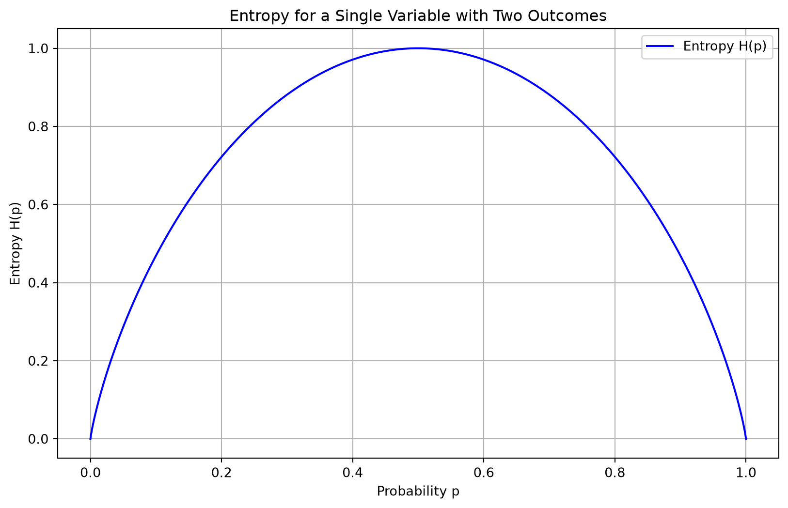

# Glossary

Entropy

Author

Affiliations

Marcel Turcotte [](mailto:marcel.turcotte@uottawa.ca)

School of Electrical Engineering and Computer Science

University of Ottawa

Published

January 30, 2026

Entropy in information theory quantifies the uncertainty or unpredictability of a random variable’s possible outcomes. It measures the average amount of information produced by a stochastic source of data and is typically expressed in bits for binary systems. The entropy \\H\\ of a discrete random variable \\X\\ with possible outcomes \\\\x_1, x_2, \ldots, x_n\\\\ and probability mass function \\P(X)\\ is given by:

\\ H(X) = -\sum\_{i=1}^n P(x_i) \log_2 P(x_i) \\

Entropy is maximized when all outcomes are equally likely, in which case it equals the logarithm of the number of outcomes:

\\ H\_{\text{max}} = \log_2(n) \\

Using the logarithm base 2 is common because it measures entropy in bits, aligning with binary systems and digital information processing. High entropy indicates more randomness and less predictability, while low entropy suggests more predictability and less information content.

Below is a Python program that visualizes the entropy of a single variable with two outcomes. The program uses Matplotlib to plot the entropy as a function of the probability of one of the outcomes (since the probability of the other outcome is simply 1 minus the probability of the first outcome).

Entropy \\H(p)\\ for a binary variable (with outcomes 0 and 1) is given by:

\\ H(p) = -p \log_2(p) - (1 - p) \log_2(1 - p) \\

where \\p\\ is the probability of one of the outcomes, and \\1 - p\\ is the probability of the other outcome.

Here’s the Python program:

``` python
import numpy as np
import matplotlib.pyplot as plt

# Function to compute entropy
def entropy(p):
    if p == 0 or p == 1:
        return 0
    return -p * np.log2(p) - (1 - p) * np.log2(1 - p)

# Generate probabilities from 0 to 1
probabilities = np.linspace(0, 1, 1000)

# Compute entropy for each probability
entropies = [entropy(p) for p in probabilities]

# Plot the results
plt.figure(figsize=(10, 6))
plt.plot(probabilities, entropies, label='Entropy H(p)', color='blue')
plt.title('Entropy for a Single Variable with Two Outcomes')
plt.xlabel('Probability p')
plt.ylabel('Entropy H(p)')
plt.grid(True)
plt.legend()
plt.show()
```

[](entropy_files/figure-html/cell-2-output-1.png)

### Explanation:

1.  **Entropy Function**: The `entropy` function computes the entropy for a given probability \\p\\. It handles the edge cases where \\p\\ is 0 or 1, returning 0 for these cases since the entropy is zero when there is no uncertainty (suprise).
2.  **Probability Range**: The `probabilities` array contains 1000 equally spaced values between 0 and 1.
3.  **Compute Entropies**: The `entropies` list stores the entropy values computed for each probability in the `probabilities` array.
4.  **Plotting**: The program uses Matplotlib to plot entropy \\H(p)\\ against the probability \\p\\. The plot includes labels, a title, a grid for better readability, and a legend.

This visualization elucidates the relationship between entropy and the probability of one outcome in a binary variable. When the two outcomes are equally probable (\\p = 0.5\\), the entropy reaches its maximum value of 1.0 bit. Conversely, as the probability of one outcome approaches 0 or 1, the entropy decreases to 0. This demonstrates that maximum uncertainty occurs with equal probabilities, while certainty (or predictability) arises when one outcome dominates.
