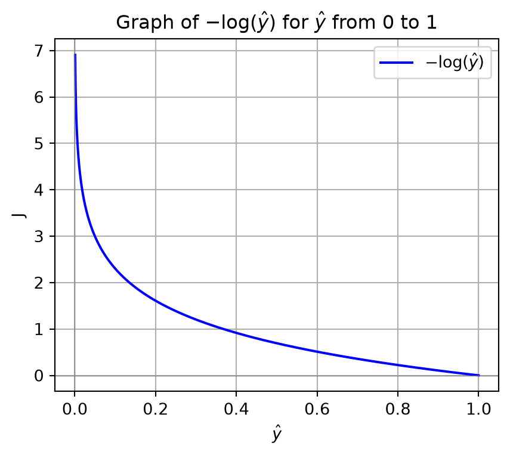
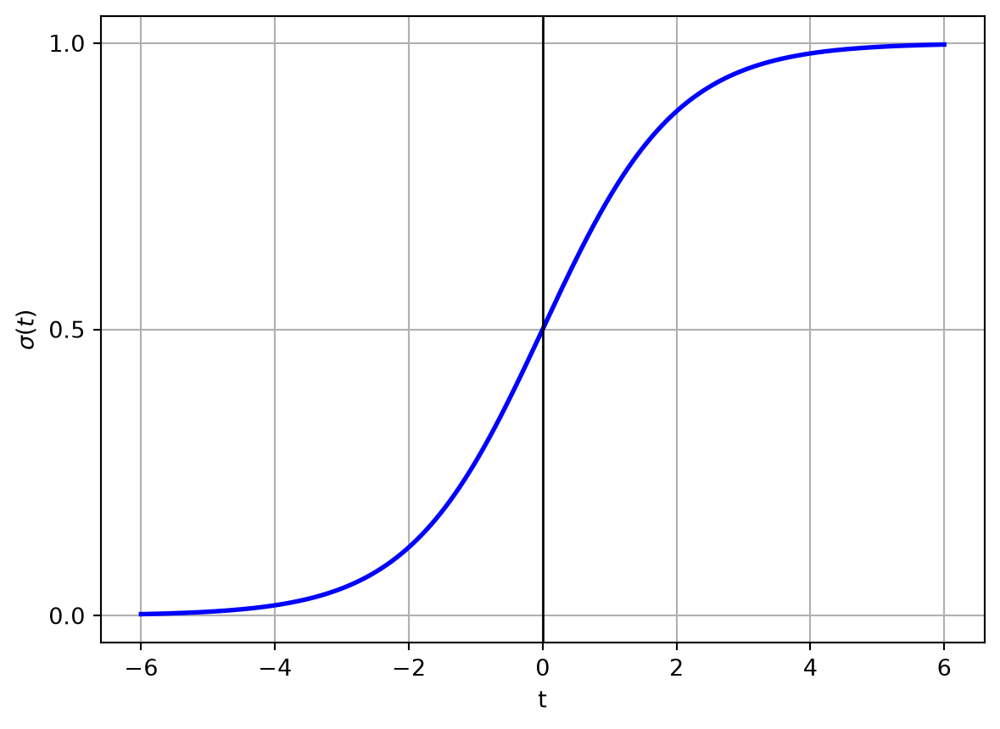
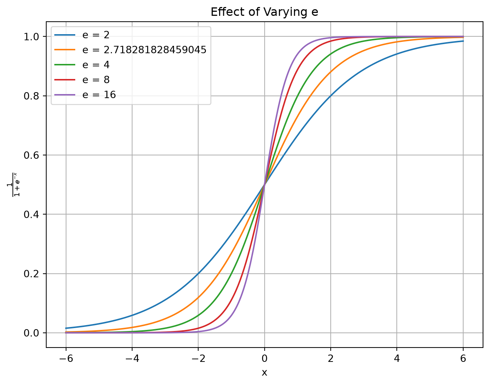
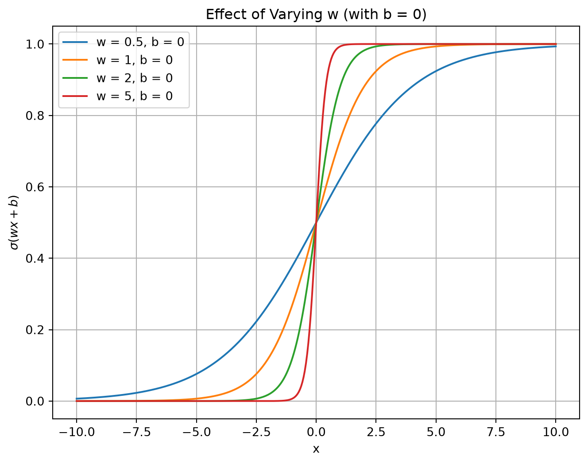
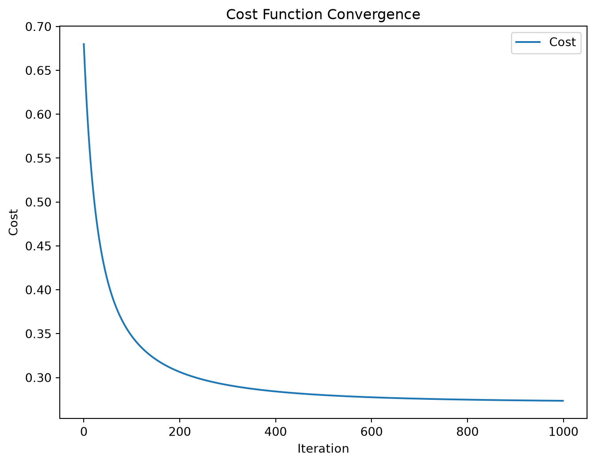
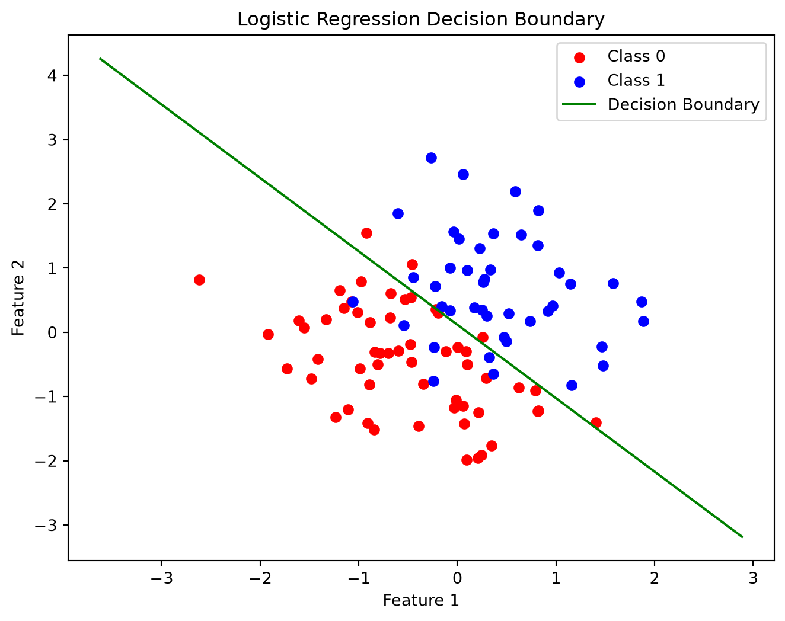

# Cross-entropy, geometric interpretation, and implementation

CSI 4106 - Fall 2026

Author

Marcel Turcotte

Published

Version: Sep 19, 2026 17:28

# Preamble

## Message of the Day

# An error occurred.

Unable to execute JavaScript.

Bazett, Trefor. (2026) [The Learning Crisis in Academia](https://youtu.be/cLFkoeWe1dQ). Published on YouTube on 2026-08-30.

Trefor Bazett is an Associate Teaching Professor of Mathematics and Statistics at the [University of Victoria](https://onlineacademiccommunity.uvic.ca/treforbazett/?utm_source=gemini), having earned his Ph.D. from the University of Toronto. His academic focus centers on mathematics education and algebraic topology. He is prominently known for his educational [YouTube channel](https://www.youtube.com/watch?v=cLFkoeWe1dQ&utm_source=gemini), which scales university-level mathematical instruction to a global audience and contributed to his receipt of the 2024 PIMS Education Prize.

The video presents five recommendations for using AI in educational contexts, which are reframed below.

1.  **Be an Active Learner**
    - Put yourself in the driver’s seat.
    - Before querying an LLM to generate Python code for an A\* search algorithm, manually trace the node expansion on a small graph using a heuristic function. If stuck, prompt the AI solely for specific syntax hints or debugging rather than generating the full pathfinding implementation.
2.  **Treat AI as a Tutor, Not an Answer Key**
    - Prompt for nudges, not solutions.
    - When struggling to implement alpha-beta pruning within a Minimax agent, input your current code and state: “This is my logic so far. Provide a small conceptual hint on why my beta cutoffs are failing,” rather than requesting the fully corrected script.
3.  **Distinguish Between Unnecessary Friction and Essential Learning**
    - Don’t optimize away the cognitive struggle.
    - While it is efficient to have an AI output the mathematical derivation of backpropagation for a multilayer perceptron, manually deriving the chain rule builds the structural scaffolding necessary to fundamentally grasp gradient descent.
4.  **Self-Assess Constantly**
    - Test recollection over recognition.
    - Instead of passively reading an AI-generated summary of Markov Decision Processes (MDPs) and assuming comprehension, prompt the AI to act as an examiner and generate conceptual questions testing your ability to formulate the Bellman equation entirely from memory.
5.  **Be Critically Reflective**
    - Verify accuracy, relevance, and complexity.
    - An AI prompted to solve a basic propositional logic problem might output a proof using advanced resolution theorem-proving techniques outside the scope of an introductory syllabus. Critically evaluate whether the AI’s solution aligns with the foundational techniques currently being taught.

## Learning Objectives

By the end of this presentation, you should be able to:

- **Derive** binary cross-entropy from the Bernoulli likelihood.
- **Explain** why binary cross-entropy is preferred to MSE for logistic regression.
- **Interpret** the logistic-regression decision boundary and its normal vector geometrically.
- **Distinguish** the linear score from its corresponding probability and signed distance.
- **Relate** the mathematical model to a batch-gradient-descent implementation.

# Logistic Regression Review

## Problem

- **General Case:** P(y = k \mid x, \theta), where k is a class label.
- **Binary Case**: y \in \\0,1\\
  - **Predict** P(y = 1 \mid x, \theta)

For a new instance x\_{\textrm{new}}, determine the probability that it belongs to class k, denoted as P(y = k \mid x\_{\textrm{new}}, \theta).

## Logistic Regression

The **Logistic Regression** model is defined as:

\hat{p}\_i = h\_\theta(x_i) = \sigma(\theta^\top x_i) = \frac{1}{1+e^{-\theta^\top x_i}}

- **Predictions** are made as follows:

- \hat{y}\_i = 0, if h\_\theta(x_i) \< 0.5

- \hat{y}\_i = 1, if h\_\theta(x_i) \geq 0.5

The problem is formulated as a **binary classification** task, wherein the model presumes that the classes are separable by a **linear function** within the feature space.

In the previous lecture, we considered an example wherein **logistic regression** was used to classify **handwritten digits**.

- The classification problem was addressed using a **one-vs-rest** strategy, which involved training ten separate logistic regression models, each dedicated to recognizing a specific digit.
- Each model consisted of **65 parameters**: **one bias** term and **64 weights**. Each **weight** corresponded to a **pixel** (or **attribute**) of an 8 \times 8 image.
- This method demonstrated an excellent performance, achieving an overall accuracy of 0.97.
- Analyzing the weights provided insights into the areas of the image to which the model was most responsive (what does it pay attention to?).

The model presented above is expressed in its vectorized form, allowing it to be applied to problems involving multiple attributes. In the context of recognizing handwritten digits, the model utilizes 64 attributes, corresponding to individual pixels. The function \sigma employed in this model is the logistic, or sigmoid, function.

# Loss Function

## Model Overview

- Our model is expressed in a vectorized form as:

  \hat{p}\_i = h\_\theta(x_i) = \sigma(\theta^\top x_i) = \frac{1}{1+e^{-\theta^\top x_i}}

- **Prediction**:

  - Assign \hat{y}\_i = 0, if h\_\theta(x_i) \< 0.5; \hat{y}\_i = 1, if h\_\theta(x_i) \geq 0.5

- The parameter vector \theta is optimized using **gradient descent**.

- Which **loss function** should be used and why?

In logistic regression, the output is regarded as a probability, with particular emphasis on the interpretation process.

## Remarks

- In constructing machine learning models with libraries like `scikit-learn` or `keras`, one has to **select a loss function** or **accept the default one**.

- Initially, the **terminology can be confusing**, as identical functions may be referenced by various names.

- Our aim is to **elucidate these complexities**.

- It is actually **not that complicated**!

## Parameter Estimation

- Logistic regression is **a statistical model**.

- Its output is \hat{p} = P(y = 1 \mid x, \theta).

- P(y = 0 \mid x, \theta) = 1 - \hat{p}.

- Assumes that y values come from a **Bernoulli distribution**.

- \theta is commonly found by **Maximum Likelihood Estimation**.

The expressions \hat{p}\_i, h\_\theta(x_i), and \sigma(\theta^\top x_i) all denote the predicted probability that example i belongs to the positive class. The symbol \hat{y}\_i denotes the class label obtained after applying the threshold.

## Parameter Estimation

**Maximum Likelihood Estimation (MLE)** is a statistical method used to estimate the parameters of a probabilistic model.

It identifies the parameter values that maximize the **likelihood function**, which measures how well the model explains the observed data.

## Likelihood Function

Assuming the y values are *independent and identically distributed (i.i.d.)*, the **likelihood function** is expressed as the **product of individual probabilities**.

In other words, given our data, \\(x_i, y_i)\\\_{i=1}^N, the likelihood function is given by this equation. \mathcal{L}(\theta) = \prod\_{i=1}^{N} P(y_i \mid x_i, \theta)

## Maximum Likelihood

\hat{\theta} = \underset{\theta \in \Theta}{\argmax}\\ \mathcal{L}(\theta) = \underset{\theta \in \Theta}{\argmax} \prod\_{i=1}^{N} P(y_i \mid x_i, \theta)

- **Observations**:

  1.  **Maximizing** a function is equivalent to **minimizing its negative.**
  2.  The **logarithm of a product** equals the **sum of its logarithms**.

## Negative Log-Likelihood

**Maximum likelihood** \hat{\theta} = \underset{\theta \in \Theta}{\argmax}\\ \mathcal{L}(\theta) = \underset{\theta \in \Theta}{\argmax} \prod\_{i=1}^{N} P(y_i \mid x_i, \theta)

becomes **negative log-likelihood**

\hat{\theta} = \underset{\theta \in \Theta}{\arg \min} - \log \mathcal{L}(\theta) = \underset{\theta \in \Theta}{\arg \min} - \log \prod\_{i=1}^{N} P(y_i \mid x_i, \theta) = \underset{\theta \in \Theta}{\arg \min} - \sum\_{i=1}^{N} \log P(y_i \mid x_i, \theta)

## Mathematical Reformulation

For binary outcomes, the probability P(y \mid x, \theta) is:

P(y \mid x, \theta) = \begin{cases} \sigma(\theta^\top x), & \text{if}\\ y = 1 \\ 1 - \sigma(\theta^\top x), & \text{if}\\ y = 0 \end{cases}

. . .

This can be compactly expressed as:

P(y \mid x, \theta) = \sigma(\theta^\top x)^y (1 - \sigma(\theta^\top x))^{1-y}

Because y \in \\0,1\\, one factor always has exponent zero and equals one. The other factor selects the probability assigned to the observed label.

## Loss Function

We define the objective as the **mean negative log-likelihood**.

J(\theta) = -\frac{1}{N}\log \mathcal{L}(\theta) = -\frac{1}{N}\sum\_{i=1}^{N} \log P(y_i \mid x_i, \theta) where P(y \mid x, \theta) = \sigma(\theta^\top x)^y (1 - \sigma(\theta^\top x))^{1-y}.

. . .

Consequently, J(\theta) = -\frac{1}{N}\sum\_{i=1}^{N} \log \[ \sigma(\theta^\top x_i)^{y_i} (1 - \sigma(\theta^\top x_i))^{1-y_i} \]

## Loss Function (continued)

Simplifying the equation. J(\theta) = -\frac{1}{N}\sum\_{i=1}^{N} \log \[ \sigma(\theta^\top x_i)^{y_i} (1 - \sigma(\theta^\top x_i))^{1-y_i} \]

. . .

by distributing the \log over the product. J(\theta) = -\frac{1}{N}\sum\_{i=1}^{N} \[ \log \sigma(\theta^\top x_i)^{y_i} + \log (1 - \sigma(\theta^\top x_i))^{1-y_i} \]

## Loss Function (continued)

Simplifying the equation further. J(\theta) = -\frac{1}{N}\sum\_{i=1}^{N} \[ \log \sigma(\theta^\top x_i)^{y_i} + \log (1 - \sigma(\theta^\top x_i))^{1-y_i} \]

. . .

by moving the exponents in front of the \logs.

J(\theta) = -\frac{1}{N}\sum\_{i=1}^{N} \[ y_i \log \sigma(\theta^\top x_i) + (1-y_i) \log (1 - \sigma(\theta^\top x_i)) \]

The rationale for these additional simplifications will be elucidated shortly.

## From Entropy to Cross-Entropy

- Decision tree algorithms often employ **entropy**, a measure from **information theory**, to evaluate the quality of splits or partitions in decision rules.
- Entropy quantifies the uncertainty or impurity associated with the potential outcomes of a random variable.

## Entropy

**Entropy** in information theory quantifies the **uncertainty** or unpredictability of a random variable’s possible outcomes. It measures the average information associated with an outcome. When the base-2 logarithm is used, entropy is measured in bits. The entropy H of a discrete random variable X with possible outcomes \\x_1, x_2, \ldots, x_n\\ and probability mass function P(X) is given by:

H(X) = -\sum\_{i=1}^n P(x_i) \log_2 P(x_i)

## Cross-Entropy

**Cross-entropy** measures the expected negative log probability that a predicted distribution q assigns to outcomes drawn from a distribution p.

H(p, q) = -\sum\_{k} p_k \log q_k

It is not a distance: H(p,q) need not equal H(q,p).

## Cross-Entropy

- For a binary label, the observed distribution is (y_i, 1-y_i).
- The predicted Bernoulli distribution is (\hat{p}\_i, 1-\hat{p}\_i).
- Their cross-entropy is the loss for example i.

## Cross-Entropy

Consider the **negative log-likelihood loss** function:

J(\theta) = -\frac{1}{N}\sum\_{i=1}^{N} \left\[ y_i \log \sigma(\theta^\top x_i) + (1-y_i) \log (1 - \sigma(\theta^\top x_i)) \right\]

By substituting \sigma(\theta^\top x_i) with \hat{p}\_i, the function becomes:

J(\theta) = -\frac{1}{N}\sum\_{i=1}^{N} \left\[ y_i \log \hat{p}\_i + (1-y_i) \log (1 - \hat{p}\_i) \right\]

For the Bernoulli model, the **mean negative log-likelihood** is the **binary cross-entropy**.

In binary logistic regression, **binary cross-entropy**, **log loss**, and **mean negative log-likelihood** refer to the same objective.

Binary classification has two outcomes, labelled 0 and 1. The two terms inside the brackets are the cross-entropy over these two outcomes; the outer sum averages the loss over the N examples.

Changing the logarithm base rescales the loss. We use the natural logarithm because it follows directly from likelihood and gives convenient derivatives.

## For Each Example

Code

``` python
import matplotlib.pyplot as plt
import numpy as np

rng = np.random.default_rng(42)

# Generate an array of p values from just above 0 to 1
p_values = np.linspace(0.001, 1, 1000)

# Compute the natural logarithm of each p value
ln_p_values = - np.log(p_values)

# Plot the graph
plt.figure(figsize=(5, 4))
plt.plot(p_values, ln_p_values, label=r'$-\log(\hat{p})$', color='b')

# Add labels and title
plt.xlabel(r'$\hat{p}$')
plt.ylabel(r'J')
plt.title(r'Loss for a positive example ($y=1$)')
plt.grid(True)
plt.axhline(0, color='gray', lw=0.5)  # Add horizontal line at y=0
plt.axvline(0, color='gray', lw=0.5)  # Add vertical line at x=0

# Display the plot
plt.legend()
plt.show()
```

[](slides_files/figure-html/cell-2-output-1.png)

J(\theta) = -\frac{1}{N}\sum\_{i=1}^{N} \left\[ y_i \log \hat{p}\_i + (1-y_i) \log (1 - \hat{p}\_i) \right\]

For each example:

- Only one of the two terms in the summation is not zero.
- 1 - \hat{p}\_i is P(y_i = 0 \mid x_i, \theta).
- For a positive example, as \hat{p}\_i tends to 1, -\log(\hat{p}\_i) tends to zero.
- For a positive example, as \hat{p}\_i tends to 0, the loss tends to infinity.
- For a negative example, the corresponding loss is -\log(1-\hat{p}\_i).

## Why not MSE as a Loss Function?

- Binary cross-entropy is the negative log-likelihood of the Bernoulli model.
- With binary cross-entropy, the logistic-regression objective is convex in the parameters.
- Composing MSE with the sigmoid generally produces a non-convex objective and small gradients for confidently incorrect predictions.

We will revisit cross-entropy when studying neural networks, especially in conjunction with the softmax function.

Optional explanations:

- [Cross Entropy vs. MSE as Cost Function for Logistic Regression for Classification](https://www.youtube.com/watch?v=m0ZeT1EWjjI)
- [What is the difference between negative log likelihood and cross entropy?](https://www.youtube.com/watch?v=ziq967YrSsc)

In linear regression, MSE is convex because the prediction is linear in the parameters. The issue here is the composition of MSE with the nonlinear sigmoid.

# Geometric Interpretation

## Geometric Interpretation

- Let w=(\theta_1,\ldots,\theta_D)^\top denote the **feature-weight vector**.

- The feature-dependent part of the linear score is a **dot product**: w^\top x = \theta_1 x_1 + \theta_2 x_2 + \ldots + \theta_D x_D.

- The complete **linear score** includes the **intercept**: t(x)=\theta_0 + w^\top x.

- The **dot product** has a **geometric interpretation**. w^\top x = \\w\\\\x\\\cos\phi

The complete parameter vector is \theta=(\theta_0,\theta_1,\ldots,\theta_D)^\top. The vector w contains only the feature weights.

## Geometric Interpretation

w^\top x = \\w\\\\x\\\cos\phi

- The dot product depends on both vector lengths and the angle between them.
- It is positive when the angle is acute and negative when the angle is obtuse.
- It is zero when the vectors are perpendicular (\phi=90^\circ).

## Geometric Interpretation

- **Logistic regression** applies the sigmoid to the linear score t(x)=\theta_0+w^\top x.

- The equation t(x)=0 defines a hyperplane in feature space.

- The feature-weight vector w is normal to this hyperplane. The intercept \theta_0 shifts the boundary without changing its orientation.

## Geometric Interpretation

- The **decision boundary** is where t(x)=0.

- Points with t(x)\>0 receive probability greater than 0.5.

- Points with t(x)\<0 receive probability less than 0.5.

- The sigmoid converts the **linear score** into a probability. The signed distance to the boundary is \frac{t(x)}{\\w\\}.

## Logistic Function

\sigma(t) = \frac{1}{1+e^{-t}}

- As t \to \infty, e^{-t} \to 0, so \sigma(t) \to 1.
- As t \to -\infty, e^{-t} \to \infty, making the denominator approach infinity, so \sigma(t) \to 0.
- When t = 0, e^{-t} = e^0 = 1, resulting in a denominator of 2, so \sigma(t) = 0.5.

Code

``` python
# Sigmoid function
def sigmoid(t):
    return 1 / (1 + np.exp(-t))

# Generate t values
t = np.linspace(-6, 6, 1000)

# Compute y values for the sigmoid function
sigma = sigmoid(t)

# Create a figure
fig, ax = plt.subplots()
ax.plot(t, sigma, color='blue', linewidth=2)  # Keep the curve opaque

# Draw vertical axis at x = 0
ax.axvline(x=0, color='black', linewidth=1)

# Add labels on the vertical axis
ax.set_yticks([0, 0.5, 1.0])

# Add labels to the axes
ax.set_xlabel('t')
ax.set_ylabel(r'$\sigma(t)$')

plt.grid(True)
plt.show()
```

[](slides_files/figure-html/cell-3-output-1.png)

## Varying \theta_1

\sigma(\theta_1x + \theta_0)

Code

``` python
def logistic(x, theta_1, theta_0):
    """Compute the logistic function for one feature."""
    return sigmoid(theta_1 * x + theta_0)

# Define a range for x values.
x = np.linspace(-10, 10, 400)

# Vary theta_1 (steepness) with theta_0 fixed at 0.
plt.figure(figsize=(8, 6))
theta_1_values = [0.5, 1, 2, 5]
theta_0 = 0

for theta_1 in theta_1_values:
    plt.plot(x, logistic(x, theta_1, theta_0), label=fr'$\theta_1={theta_1}$')
plt.title(r'Effect of varying $\theta_1$ (with $\theta_0=0$)')
plt.xlabel('x')
plt.ylabel(r'$\sigma(\theta_1x+\theta_0)$')
plt.legend()
plt.grid(True)
plt.show()
```

[](slides_files/figure-html/cell-4-output-1.png)

## Varying \theta_0

\sigma(\theta_1x + \theta_0)

Code

``` python
# Vary theta_0 (horizontal shift) with theta_1 fixed at 1.
plt.figure(figsize=(8, 6))
theta_1 = 1
theta_0_values = [-5, -2, 0, 2, 5]

for theta_0 in theta_0_values:
    plt.plot(x, logistic(x, theta_1, theta_0), label=fr'$\theta_0={theta_0}$')
plt.title(r'Effect of varying $\theta_0$ (with $\theta_1=1$)')
plt.xlabel('x')
plt.ylabel(r'$\sigma(\theta_1x+\theta_0)$')
plt.legend()
plt.grid(True)

plt.show()
```

[](slides_files/figure-html/cell-5-output-1.png)

# Implementation

## Implementation: Generating Data

``` python
# Generate synthetic data for a binary classification problem

m = 100  # number of examples
d = 2    # number of features

X = rng.standard_normal((m, d))

# Define labels using a linear decision boundary with some noise:

noise = 0.5 * rng.standard_normal(m)

y = (X[:, 0] + X[:, 1] + noise > 0).astype(int)
```

## Implementation: Visualization

Code

``` python
# Visualize the decision boundary along with the data points
plt.figure(figsize=(8, 6))
plt.scatter(X[y == 0][:, 0], X[y == 0][:, 1], color='red', label='Class 0')
plt.scatter(X[y == 1][:, 0], X[y == 1][:, 1], color='blue', label='Class 1')

plt.xlabel("Feature 1")
plt.ylabel("Feature 2")
plt.title("Data")
plt.legend()
plt.show()
```

[](slides_files/figure-html/cell-7-output-1.png)

## Implementation: Cost Function

``` python
# Cost function: binary cross-entropy
def cost_function(theta, X, y):
    m = len(y)
    h = sigmoid(X.dot(theta))
    h = np.clip(h, 1e-12, 1 - 1e-12)
    cost = -(1/m) * np.sum(y * np.log(h) + (1 - y) * np.log(1 - h))
    return cost

# Gradient of the cost function
def gradient(theta, X, y):
    m = len(y)
    h = sigmoid(X.dot(theta))
    grad = (1/m) * X.T.dot(h - y)
    return grad
```

## Implementation: Logistic Regression

``` python
# Logistic regression training using gradient descent
def logistic_regression(X, y, learning_rate=0.1, iterations=1000):
    m, n = X.shape
    theta = np.zeros(n)
    cost_history = []
    
    for i in range(iterations):
        theta -= learning_rate * gradient(theta, X, y)
        cost_history.append(cost_function(theta, X, y))
        
    return theta, cost_history
```

## Training

``` python
# Add intercept term (bias)
X_with_intercept = np.hstack([np.ones((m, 1)), X])

# Train the logistic regression model
theta, cost_history = logistic_regression(X_with_intercept, y, learning_rate=0.1, iterations=1000)
theta_0 = theta[0]
w = theta[1:]

print("Optimized theta:", theta)
```

    Optimized theta: [-0.28250171  3.11670841  3.46892095]

## Cost Function Convergence

Code

``` python
plt.figure(figsize=(8, 6))
plt.plot(cost_history, label="Cost")
plt.xlabel("Iteration")
plt.ylabel("Cost")
plt.title("Cost Function Convergence")
plt.legend()
plt.show()
```

[](slides_files/figure-html/cell-11-output-1.png)

## Decision Boundary and Data Points

Code

``` python
plt.figure(figsize=(8, 6))
plt.scatter(X[y == 0][:, 0], X[y == 0][:, 1], color='red', label='Class 0')
plt.scatter(X[y == 1][:, 0], X[y == 1][:, 1], color='blue', label='Class 1')

# Decision boundary: theta_0 + w[0]*x1 + w[1]*x2 = 0
x_vals = np.array([min(X[:, 0]) - 1, max(X[:, 0]) + 1])
y_vals = -(theta_0 + w[0] * x_vals) / w[1]
plt.plot(x_vals, y_vals, label='Decision Boundary', color='green')
plt.xlabel("Feature 1")
plt.ylabel("Feature 2")
plt.title("Logistic Regression Decision Boundary")
plt.legend()
plt.show()
```

[](slides_files/figure-html/cell-12-output-1.png)

## Visualizing the Weight Vector

The fitted feature-weight vector w=(\theta_1,\theta_2)^\top is **normal** to the decision boundary.

The intercept \theta_0 determines the position of the boundary.

## Visualizing the Weight Vector

Code

``` python
# Plot decision boundary and data points
plt.figure(figsize=(8, 6))
plt.scatter(X[y == 0][:, 0], X[y == 0][:, 1], color='red', label='Class 0')
plt.scatter(X[y == 1][:, 0], X[y == 1][:, 1], color='blue', label='Class 1')

# Decision boundary: theta_0 + w[0]*x1 + w[1]*x2 = 0
x_vals = np.array([min(X[:, 0]) - 1, max(X[:, 0]) + 1])
y_vals = -(theta_0 + w[0] * x_vals) / w[1]
plt.plot(x_vals, y_vals, label='Decision Boundary', color='green')

# --- Draw the normal vector ---
# The normal vector is w.
# Choose a reference point on the decision boundary. Here, we use x1 = 0:
x_ref = 0
y_ref = -theta_0 / w[1]

# Copy the feature-weight vector for display.
normal = w.copy()

# Normalize and scale for display
normal_norm = np.linalg.norm(normal)
if normal_norm != 0:
    normal_unit = normal / normal_norm
else:
    normal_unit = normal
scale = 2  # adjust scale as needed
normal_display = normal_unit * scale

# Draw an arrow starting at the reference point
plt.arrow(x_ref, y_ref, normal_display[0], normal_display[1],
          head_width=0.1, head_length=0.2, fc='black', ec='black')
plt.text(x_ref + normal_display[0]*1.1, y_ref + normal_display[1]*1.1, 
         r'$w$', color='black', fontsize=12)

plt.xlabel("Feature 1")
plt.ylabel("Feature 2")
plt.title("Logistic Regression Decision Boundary and Normal Vector")
plt.legend()
plt.gca().set_aspect('equal', adjustable='box')
plt.ylim(-3, 3)
plt.show()
```

[](slides_files/figure-html/cell-13-output-1.png)

## Near the Decision Boundary

Code

``` python
# --- Visualization Setup ---
# Create a grid over the feature space
x1_range = np.linspace(X[:, 0].min()-1, X[:, 0].max()+1, 100)
x2_range = np.linspace(X[:, 1].min()-1, X[:, 1].max()+1, 100)
xx1, xx2 = np.meshgrid(x1_range, x2_range)

# Construct the grid input (with intercept) for predictions
grid = np.c_[np.ones(xx1.ravel().shape), xx1.ravel(), xx2.ravel()]
# Compute predicted probabilities over the grid
probs = sigmoid(grid.dot(theta)).reshape(xx1.shape)
# --- Approach 2: 2D Contour (Heatmap) Plot ---
plt.figure(figsize=(8, 6))
contour = plt.contourf(xx1, xx2, probs, cmap='spring', levels=50)
plt.colorbar(contour)
plt.contour(xx1, xx2, probs, levels=[0.5], colors='green', linewidths=2)
plt.xlabel('Feature x1')
plt.ylabel('Feature x2')
plt.title('Contour Plot (Heatmap) of Predicted Probabilities')
# Overlay training data
plt.scatter(X[y == 0][:, 0], X[y == 0][:, 1], color='red', edgecolor='k', label='Class 0')
plt.scatter(X[y == 1][:, 0], X[y == 1][:, 1], color='blue', edgecolor='k', label='Class 1')
plt.legend()
plt.show()
```

[](slides_files/figure-html/cell-14-output-1.png)

# Epilogue

## Summary

- Logistic regression models the probability of a binary outcome.
- Maximizing the Bernoulli likelihood is equivalent to minimizing binary cross-entropy.
- Cross-entropy strongly penalizes confident, incorrect predictions.
- The equation \theta_0+w^\top x=0 defines the decision boundary, and the feature-weight vector w is normal to it.
- Batch gradient descent updates the parameters using the average gradient over the training set.

## Next lecture

- Performance measures and model evaluation

## References

Russell, Stuart, and Peter Norvig. 2020. *Artificial Intelligence: A Modern Approach*. 4th ed. Pearson. <http://aima.cs.berkeley.edu/>.

------------------------------------------------------------------------

Marcel **Turcotte**

School of Electrical Engineering and **Computer Science** (EE**CS**)

University of Ottawa
