# Performance Evaluation

CSI 4106 - Fall 2026

Author

Marcel Turcotte

Published

Version: Sep 24, 2026 12:49

# Preamble

## Message of the Day

[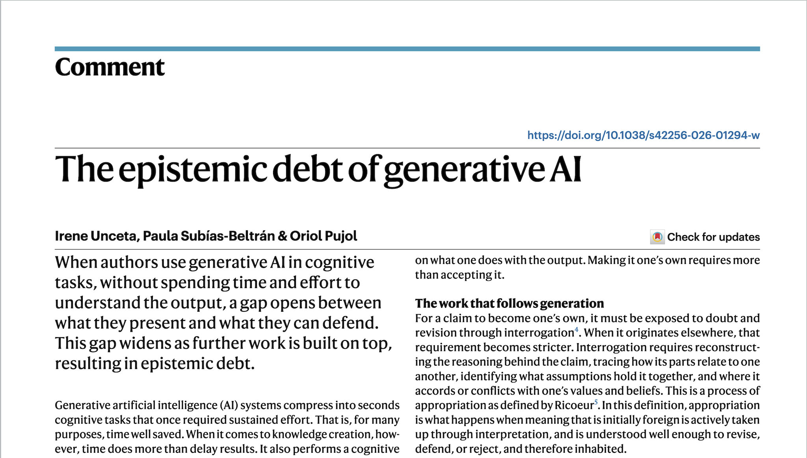](../../assets/images/10_1038_s42256-026-01294-w.png)

Unceta et al. ([2026](#ref-Unceta:2026aa)), [www.nature.com/articles/s42256-026-01294-w](https://www.nature.com/articles/s42256-026-01294-w)

> **NOTE:**
>
> When authors use generative AI in cognitive tasks, without spending time and effort to understand the output, a gap opens between what they present and what they can defend. This gap widens as further work is built on top, resulting in epistemic debt.

You have full access to this article when connected through a uOttawa IP address.

## Lecture overview

This lecture develops classification evaluation from the confusion matrix. It introduces accuracy, precision, recall, and the F_1 score, then examines class imbalance and micro versus macro averaging. The final sections connect decision thresholds to precision-recall and ROC curves and interpret AUROC as a measure of score ranking.

## Learning Objectives

- **Derive** binary and one-vs-rest counts from a confusion matrix.
- **Compute** and **interpret** accuracy, precision, recall, and the F_1 score.
- **Explain** why class imbalance can make accuracy misleading.
- **Compare** micro and macro averaging for multiclass metrics.
- **Relate** a decision threshold to precision, recall, and an ROC operating point.
- **Construct** an ROC curve from classifier scores and **interpret** AUROC as a ranking measure.

# Performance Metrics

## Confusion Matrix

|  | **Positive** (**Predicted**) | **Negative** (**Predicted**) |
|----|----|----|
| **Positive** (**Actual**) | True positive (TP) | False negative (FN) |
| **Negative** (**Actual**) | False positive (FP) | True negative (TN) |

A **confusion matrix** is a table summarizing the performance of a classification algorithm (here for a binary classification task).

- In statistical analysis, **False Positives (FP)** are commonly referred to as **Type I errors**, and **False Negatives (FN)** are known as **Type II errors**.
- The diagonal elements represent the correctly predicted outcomes, namely true positives (TP) and true negatives (TN).
- In contrast, the off-diagonal elements correspond to incorrect predictions, specifically false positives (FP) and false negatives (FN).
- The **confusion matrix** contains the counts needed to assess a classification model.
- While the confusion matrix provides a comprehensive view, more **concise metrics** such as **accuracy**, **precision**, **recall**, and the **F\_1 score** are often more intuitive and practical for summarizing model performance.

## ConfusionMatrixDisplay

Code

``` python
import matplotlib.pyplot as plt
from sklearn.datasets import make_classification
from sklearn.metrics import confusion_matrix, ConfusionMatrixDisplay
from sklearn.model_selection import train_test_split
from sklearn.linear_model import LogisticRegression

seed = 42

X, y = make_classification(n_samples=500, random_state=seed)

X_train, X_test, y_train, y_test = train_test_split(
    X,
    y,
    test_size=0.2,
    random_state=seed,
    stratify=y,
)

clf = LogisticRegression(random_state=seed)

clf.fit(X_train, y_train)

predictions = clf.predict(X_test)

cm = confusion_matrix(y_test, predictions, labels=[1, 0])

disp = ConfusionMatrixDisplay(
    confusion_matrix=cm,
    display_labels=["Positive", "Negative"],
)

disp.plot()
plt.show()
```

[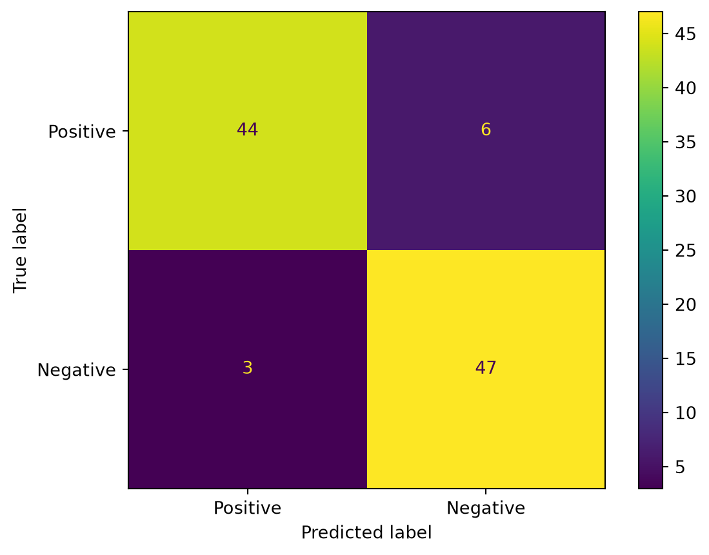](slides_files/figure-html/cell-2-output-1.png)

The example uses `make_classification` to generate a synthetic dataset and fits a `LogisticRegression` model. Passing `labels=[1, 0]` places the positive class first so that the display matches the table on the preceding page.

## Confusion Matrix

Given a test set with N examples and a classifier h(x):

C\_{i,j} = \sum\_{k = 1}^N \[y_k = i \wedge h(x_k) = j\]

Here, C is an l \times l matrix for a dataset with l classes.

A confusion matrix C is defined such that each element C\_{i,j} represents the count of observations actually belonging to class i but predicted to belong to class j.

The same definition applies to l classes. Rows represent actual labels, columns represent predicted labels, and each entry counts one actual-predicted pairing.

## Confusion Matrix

- The total number of examples of the (**actual**) class i is C\_{i \cdot} = \sum\_{j=1}^l C\_{i,j}

- The total number of examples assigned to the (**predicted**) class j by classifier h is C\_{\cdot j} = \sum\_{i=1}^l C\_{i,j}

## Confusion Matrix

- Terms on the **diagonal** denote the total number of examples **classified correctly** by classifier h. Hence, the number of correctly classified examples is \sum\_{i=1}^l C\_{i,i}

- **Non-diagonal** terms represent **misclassifications**.

## Confusion Matrix: Multiclass

For a **multiclass** problem, derive **one-vs-rest** counts for each class and then combine the resulting class-specific metrics.

## Confusion Matrix: Multiclass

[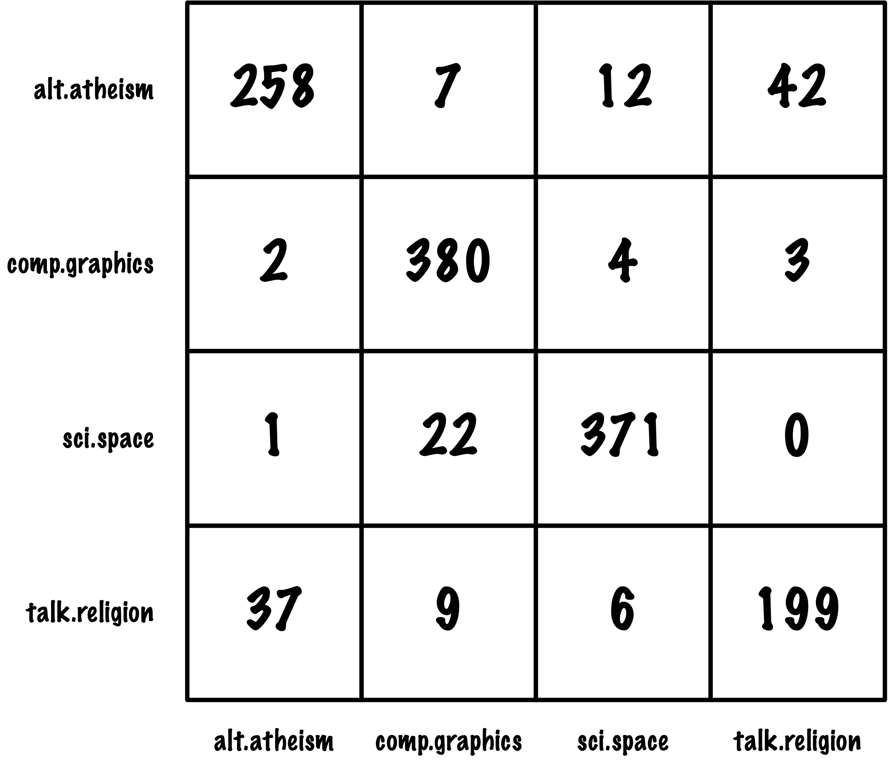](../../assets/images/cm_multiclass-00.png)

Using data from the [20 Newsgroups text dataset](https://scikit-learn.org/stable/modules/generated/sklearn.datasets.fetch_20newsgroups.html#sklearn.datasets.fetch_20newsgroups) from [scikit-learn](https://scikit-learn.org).

## Confusion Matrix: True Positive

[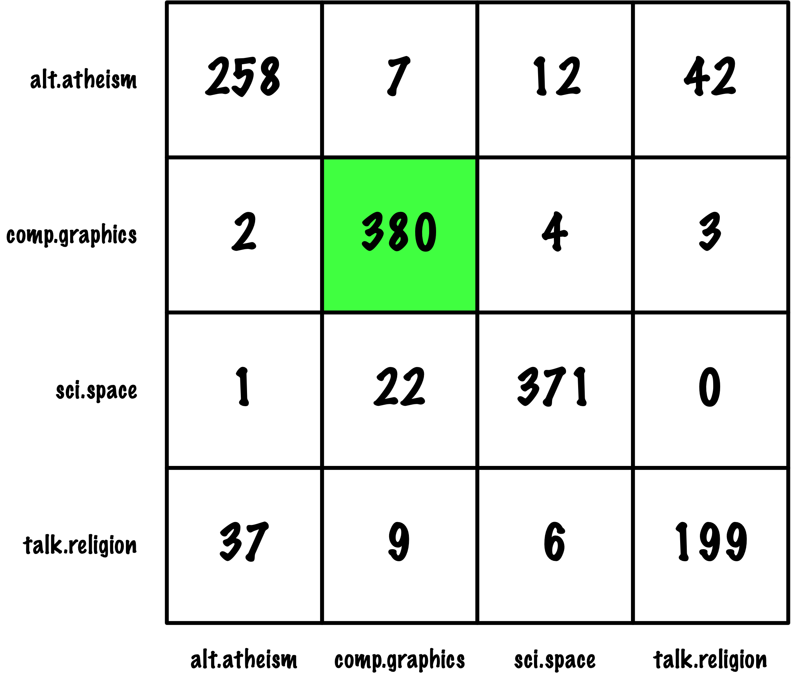](../../assets/images/cm_multiclass-01-tp.png)

`comp.graphics` is both the **actual** and **predicted** class.

## Confusion Matrix: False Positive

[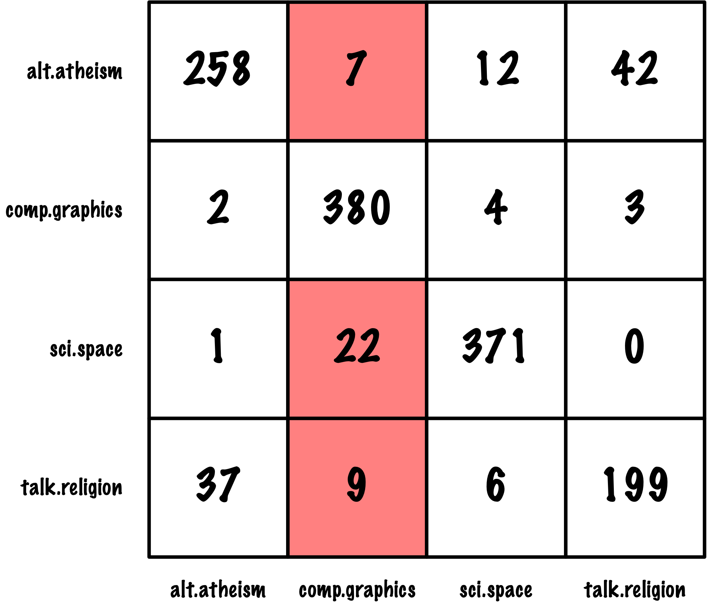](../../assets/images/cm_multiclass-02-fp.png)

The model predicts `comp.graphics`, but the example belongs to another class.

## Confusion Matrix: False Negative

[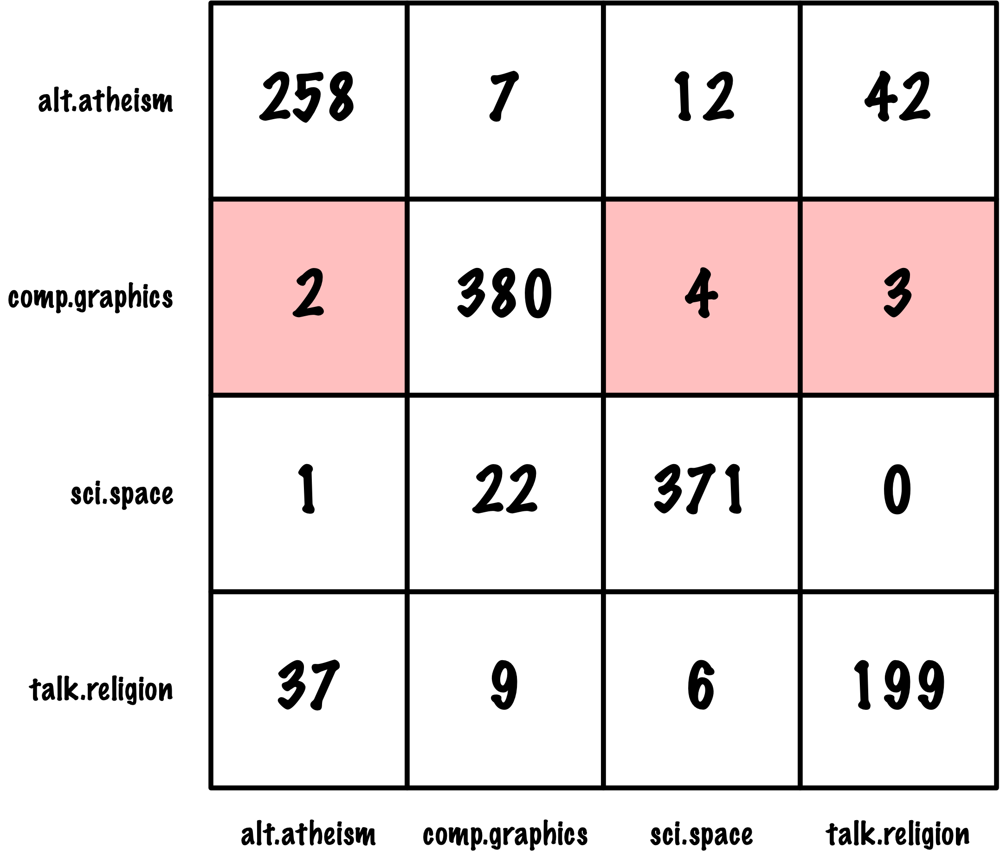](../../assets/images/cm_multiclass-03-fn.png)

The example belongs to `comp.graphics`, but the model predicts another class.

## Confusion Matrix: True Negative

[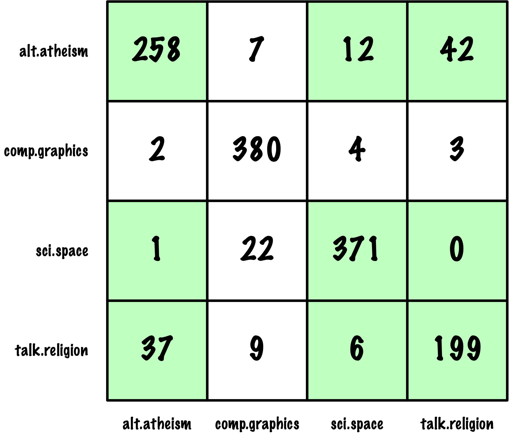](../../assets/images/cm_multiclass-04-tn.png)

Neither the actual class nor the predicted class is `comp.graphics`.

## Confusion Matrix: Multiclass

[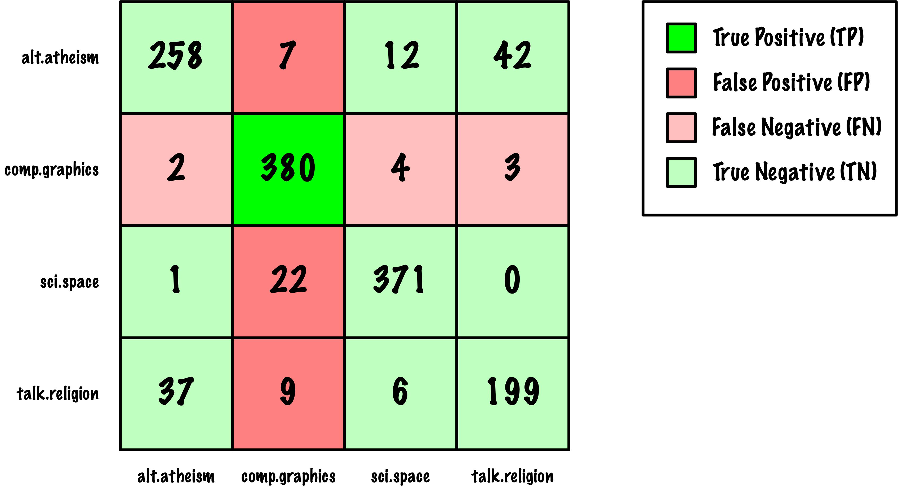](../../assets/images/cm_multiclass-05.png)

Together, these four regions form the one-vs-rest confusion matrix for `comp.graphics`.

## Multiclass counts

For class i, treat that class as positive and all other classes as negative:

- **True Positives** (\mathrm{TP}\_i): Diagonal entry C\_{i,i}
- **False Positives** (\mathrm{FP}\_i): Sum of column i excluding C\_{i,i}
- **False Negatives** (\mathrm{FN}\_i): Sum of row i excluding C\_{i,i}
- **True Negatives** (\mathrm{TN}\_i): N - (\mathrm{TP}\_i + \mathrm{FP}\_i + \mathrm{FN}\_i), equivalently \sum\_{j \ne i}\sum\_{k \ne i}C\_{j,k}

## sklearn.metrics.confusion_matrix

``` python
from sklearn.metrics import confusion_matrix

y_actual = [0, 0, 0, 1, 1, 1, 1, 1, 1, 1]
y_pred   = [0, 1, 1, 0, 0, 0, 1, 1, 1, 1]

confusion_matrix(y_actual,y_pred)
```

    array([[1, 2],
           [3, 4]])

. . .

``` python
tn, fp, fn, tp = confusion_matrix(y_actual, y_pred).ravel().tolist()
(tn, fp, fn, tp)
```

    (1, 2, 3, 4)

By default, `sklearn.metrics.confusion_matrix` determines the set of labels from the data (\textrm{y_true} \cup \textrm{y_pred}), and then:

- It sorts labels in ascending order. String labels use lexicographic ordering. Mixed string and numeric labels are not supported.
- It then builds the matrix so that row `i` corresponds to the true class with label `labels[i]`, and column `j` corresponds to the predicted class with label `labels[j]`.

If you do not pass `labels=...`, the class order may differ from what you expect. This is especially relevant for string labels or when you assume the matrix follows the order of appearance in the dataset.

**Example**

``` python
from sklearn.metrics import confusion_matrix

y_true = ["dog", "cat", "cat", "dog"]
y_pred = ["dog", "dog", "cat", "cat"]

print(confusion_matrix(y_true, y_pred))
```

Output:

    [[1 1]
     [1 1]]

Here the rows/columns are in lexicographic order: `["cat", "dog"]`. So the matrix is:

- Row 0: true = “cat”
- Row 1: true = “dog”

**Controlling order**

To force a specific order, you should pass the labels argument:

``` python
confusion_matrix(y_true, y_pred, labels=["dog", "cat"])
```

This will swap the row/column order accordingly.

## Perfect Prediction

``` python
y_actual = [0, 1, 0, 0, 1, 1, 1, 0, 1, 1]
y_pred   = [0, 1, 0, 0, 1, 1, 1, 0, 1, 1]

confusion_matrix(y_actual,y_pred)
```

    array([[4, 0],
           [0, 6]])

. . .

``` python
tn, fp, fn, tp = confusion_matrix(y_actual, y_pred).ravel().tolist()  
(tn, fp, fn, tp)
```

    (4, 0, 0, 6)

When an algorithm achieves perfect classification accuracy, all non-zero values in the confusion matrix appear exclusively along its diagonal.

All off-diagonal entries, which represent misclassifications, will be zero.

## Confusion Matrix: Multiple Classes

Code

``` python
from sklearn.datasets import load_digits
import numpy as np

digits = load_digits()

X = digits.data
y = digits.target

X_train, X_test, y_train, y_test = train_test_split(
    X,
    y,
    test_size=0.1,
    random_state=seed,
    stratify=y,
)

from sklearn.preprocessing import StandardScaler

scaler = StandardScaler()
X_train_scaled = scaler.fit_transform(X_train)
X_test_scaled = scaler.transform(X_test)

from sklearn.multiclass import OneVsRestClassifier

clf = OneVsRestClassifier(LogisticRegression(max_iter=1000))
clf.fit(X_train_scaled, y_train)

y_pred = clf.predict(X_test_scaled)

ConfusionMatrixDisplay.from_predictions(y_test, y_pred)
plt.show()
```

[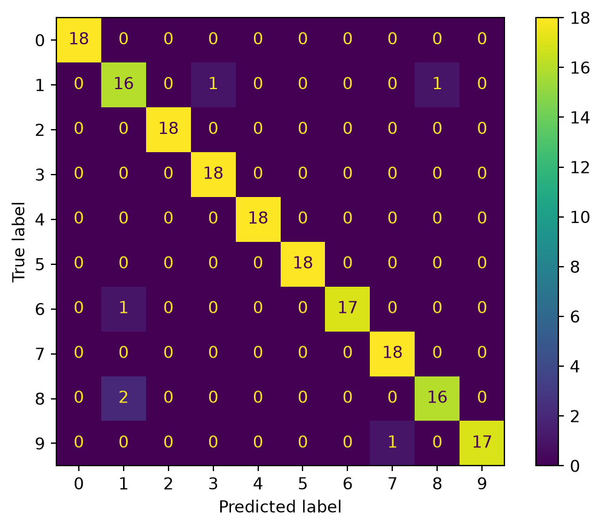](slides_files/figure-html/cell-7-output-1.png)

**Confusion matrix** for the **digits example** presented in the previous lecture.

The image displays a heatmap of the confusion matrix for the digit classification task. This task, a multiclass classification problem, was addressed using `OneVsRestClassifier` and `LogisticRegression`.

The confusion matrix summarizes the predictions made on the test set, which is a subset of the data that was neither used for training nor for preprocessing with `StandardScaler`.

The confusion matrix contains the prediction results for the test set. Performance metrics summarize these counts in a smaller number of values.

## Visualizing errors

Code

``` python
mask = (y_test == 8) & (y_pred == 1)
misclassified_images = X_test[mask][:5]

plt.figure(figsize=(8, 2))
for index, image in enumerate(misclassified_images):
    plt.subplot(1, len(misclassified_images), index + 1)
    plt.imshow(np.reshape(image, (8,8)), cmap=plt.cm.gray)
    plt.title("Predicted 8")
    plt.axis("off")

plt.tight_layout()
plt.show()
```

[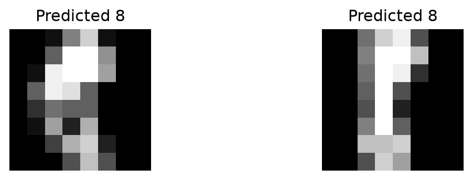](slides_files/figure-html/cell-8-output-1.png)

The preceding confusion matrix shows examples whose true label is 8 but whose predicted label is 1. Inspecting the original pixel values, rather than the standardized features supplied to the classifier, preserves the appearance of each digit.

## Accuracy

How **accurate** is this result?

\mathrm{accuracy} = \frac{\mathrm{TP}+\mathrm{TN}}{\mathrm{TP}+\mathrm{TN}+\mathrm{FP}+\mathrm{FN}} = \frac{\mathrm{TP}+\mathrm{TN}}{\mathrm{N}}

``` python
from sklearn.metrics import accuracy_score

y_actual = [0, 0, 0, 1, 1, 1, 1, 1, 1, 1]
y_pred   = [0, 1, 1, 0, 0, 0, 1, 1, 1, 1]

accuracy_score(y_actual,y_pred)
```

    0.5

**Accuracy** is the ratio of correctly predicted instances to the total number of predictions.

## Accuracy

``` python
y_actual = [0, 1, 0, 0, 1, 1, 1, 0, 1, 1]
y_pred   = [1, 0, 1, 1, 0, 0, 0, 1, 0, 0]

accuracy_score(y_actual,y_pred)
```

    0.0

``` python
y_actual = [0, 1, 0, 0, 1, 1, 1, 0, 1, 1]
y_pred   = [0, 1, 0, 0, 1, 1, 1, 0, 1, 1]

accuracy_score(y_actual,y_pred)
```

    1.0

**Accuracy** is a number between 0 (all wrong) and 1 (perfect).

## Accuracy can be misleading

``` python
y_actual = [0, 0, 0, 0, 1, 1, 0, 0, 0, 0]
y_pred   = [0, 0, 0, 0, 0, 0, 0, 0, 0, 0]

accuracy_score(y_actual,y_pred)
```

    0.8

**Why** is it problematic?

**Class imbalance** occurs when one class contains substantially more examples than another. Accuracy can then disproportionately reflect performance on the majority class and mask poor performance on the minority class.

As class imbalance increases, accuracy can become increasingly misleading. We return to this issue later in the lecture when we introduce micro and macro averaging.

## Precision

Also known as **positive predictive value** (PPV).

\mathrm{precision} = \frac{\mathrm{TP}}{\mathrm{TP}+\mathrm{FP}}

``` python
from sklearn.metrics import precision_score

y_actual = [0, 0, 0, 1, 1, 1, 1, 1, 1, 1]
y_pred   = [0, 1, 1, 0, 0, 0, 1, 1, 1, 1]

precision_score(y_actual, y_pred)
```

    0.6666666666666666

**Precision** is the proportion of **true positive predictions** among **all positive predictions**.

Can you think of a problem or situation where precision is especially important?

One example is selecting candidate compounds for expensive laboratory validation.

- A model screens a large compound library and predicts which compounds are active.
- Each positive prediction triggers a costly experiment.
- High precision means that a larger proportion of the tested compounds are genuinely active:

\text{Precision} = \frac{\text{TP}}{\text{TP} + \text{FP}}

- Higher precision reduces the number of experiments spent on inactive compounds.

Other real-world settings where precision is key:

- Spam detection: High precision ensures that emails classified as spam are really spam (minimizing false positives that would hide real emails).
- Legal document search / e-discovery: High precision ensures that returned documents are relevant, reducing time wasted on irrelevant results.
- Recommender systems: High precision means that recommended items are very likely to be of interest, improving user trust.

## Precision alone is not enough

``` python
y_actual = [0, 0, 0, 1, 1, 1, 1, 1, 1, 1]
y_pred   = [0, 0, 0, 0, 0, 0, 1, 0, 0, 0]

precision_score(y_actual,y_pred)
```

    1.0

An algorithm that makes a small number of high-confidence predictions might achieve a high precision score, but this may not necessarily be useful.

## Recall

Also known as **sensitivity** or **true positive rate** (TPR). \mathrm{recall} = \frac{\mathrm{TP}}{\mathrm{TP}+\mathrm{FN}}

``` python
from sklearn.metrics import recall_score

y_actual = [0, 0, 0, 1, 1, 1, 1, 1, 1, 1]
y_pred   = [0, 1, 1, 0, 0, 0, 1, 1, 1, 1]

recall_score(y_actual,y_pred)
```

    0.5714285714285714

**Recall** is the proportion of true positive instances correctly identified among all actual positive instances.

Can you think of a problem or situation where recall is especially important?

One example is **cancer screening for malignant tumours**.

- Here, false negatives (missing an actual cancer case) are far more dangerous than false positives.
- Recall measures the proportion of actual positives correctly identified:

\text{Recall} = \frac{\text{TP}}{\text{TP} + \text{FN}}

- A high recall means the test finds nearly all patients with cancer, even if it also produces some false alarms.
- Missing a true case could delay treatment. In this setting, that error is more serious than investigating additional false positives.

Other real-world settings where recall matters most:

- Security / Intrusion detection: Better to flag all suspicious activity (even with false positives) than miss a real attack.
- Search engines: For certain queries (e.g., legal precedent search, medical literature search), recall ensures you retrieve all relevant documents.
- Emergency response systems: For natural disaster warnings, high recall ensures no real threat goes unnoticed.

## F\_1 score

\begin{align\*} F_1~\mathrm{score} &= \frac{2}{\frac{1}{\mathrm{precision}}+\frac{1}{\mathrm{recall}}} = 2 \times \frac{\mathrm{precision}\times\mathrm{recall}}{\mathrm{precision}+\mathrm{recall}} \\ &= \frac{\mathrm{TP}}{\mathrm{TP}+\frac{\mathrm{FN}+\mathrm{FP}}{2}} \end{align\*}

``` python
from sklearn.metrics import f1_score

y_actual = [0, 0, 0, 1, 1, 1, 1, 1, 1, 1]
y_pred   = [0, 1, 1, 0, 0, 0, 1, 1, 1, 1]

f1_score(y_actual,y_pred)
```

    0.6153846153846154

**F\_1** is the **harmonic mean** of precision and recall.

- The harmonic mean is pulled towards the lower of precision and recall, so a high F_1 score requires both to be high.
- The F_1 score gives precision and recall equal importance. Applications with unequal error costs may require a different metric or an explicit threshold choice.
- Increasing **recall** often decreases **precision**, and vice versa. This relationship is the **precision-recall trade-off**.

# Micro and Macro Averaging

## Definition

The **class imbalance problem** occurs when one class has substantially more examples than another.

. . .

Without appropriate training and evaluation choices, a model may favour the **majority class** and perform poorly on the **minority class**.

Standard evaluation metrics like accuracy may be misleading in the presence of class imbalance.

The next two slides introduce micro and macro averaging. The distinction can seem abstract at first. The worked confusion-matrix examples that follow show exactly which counts each method combines and why the two averages can differ.

## Micro Performance Metrics

- Micro averaging **pools the true positives, false positives, and false negatives across classes** before computing precision, recall, or F_1.
- It **treats each prediction equally**, so frequent classes contribute more to the final metric.

## Macro Performance Metrics

- Macro averaging **computes the metric independently for each class and then takes the arithmetic mean**.
- It **treats each class equally**, regardless of its frequency, so poor performance on an infrequent class remains visible.

A useful mnemonic is the level of aggregation:

- **Micro** works at the finer level of individual predictions. It pools the contributions from every example before computing the metric.
- **Macro** works at the class level. It computes one metric for each class, where each class contains many examples, and then averages those class-level values.

## Multiclass metrics

When calculating **precision**, **recall**, and F_1, one usually computes one-vs-rest metrics for each class and then averages them using a **micro** or **macro** scheme.

- **True Positives** (\mathrm{TP}\_i): Diagonal entry C\_{i,i}
- **False Positives** (\mathrm{FP}\_i): Sum of column i excluding C\_{i,i}
- **False Negatives** (\mathrm{FN}\_i): Sum of row i excluding C\_{i,i}
- **True Negatives** (\mathrm{TN}\_i): N - (\mathrm{TP}\_i + \mathrm{FP}\_i + \mathrm{FN}\_i)

## Multiclass formulas

When calculating **precision**, **recall**, and F_1, one usually computes one-vs-rest metrics for each class and then averages them using a micro or macro scheme.

- \mathrm{TP}\_i = C\_{i,i}
- \mathrm{FP}\_i = \sum\_{k \ne i} C\_{k,i}
- \mathrm{FN}\_i = \sum\_{k \ne i} C\_{i,k}
- \mathrm{TN}\_i = \sum\_{j \ne i} \sum\_{k \ne i} C\_{j,k}

## Micro/Macro Metrics

``` python
# Sample data
y_true = ['Cat'] * 42 + ['Dog'] *  7 + ['Fox'] * 11
y_pred = ['Cat'] * 39 + ['Dog'] *  1 + ['Fox'] *  2 + \
         ['Cat'] *  4 + ['Dog'] *  3 + ['Fox'] *  0 + \
         ['Cat'] *  5 + ['Dog'] *  1 + ['Fox'] *  5

ConfusionMatrixDisplay.from_predictions(y_true, y_pred)
```

[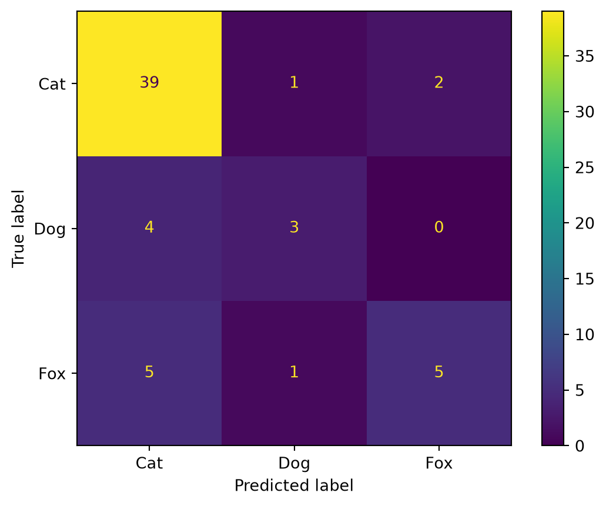](slides_files/figure-html/cell-17-output-1.png)

The dataset can be conceptualized as resulting from an **image classification task**, involving images of **cats**, **dogs**, and **foxes**. Reflecting common trends observed on the internet, images of cats are disproportionately represented, leading to a **class imbalance** issue.

## Micro/Macro Precision

``` python
from sklearn.metrics import classification_report, precision_score

print(classification_report(y_true, y_pred), "\n")

micro_precision = precision_score(y_true, y_pred, average="micro")
macro_precision = precision_score(y_true, y_pred, average="macro")
print(f"Micro precision: {micro_precision:.2f}")
print(f"Macro precision: {macro_precision:.2f}")
```

                  precision    recall  f1-score   support

             Cat       0.81      0.93      0.87        42
             Dog       0.60      0.43      0.50         7
             Fox       0.71      0.45      0.56        11

        accuracy                           0.78        60
       macro avg       0.71      0.60      0.64        60
    weighted avg       0.77      0.78      0.77        60
     

    Micro precision: 0.78
    Macro precision: 0.71

## Micro/Macro Precision

- **Macro-average precision** is calculated as the mean of the **precision** scores[^1] for each class: \frac{0.81 + 0.60 + 0.71}{3} = 0.71.

- **Micro-average precision** pools the counts from the entire confusion matrix: \frac{TP}{TP+FP} = \frac{39+3+5}{39+3+5+9+2+2} = \frac{47}{60} = 0.78.

The high micro-average precision observed here is primarily due to the high precision and large number of examples in the majority class, Cat. This masks the classifier’s relatively poor performance on the minority classes, Dog and Fox.

Micro and macro averages are similar when class frequencies and class-specific performance are similar. Class balance alone does not guarantee that the two averages will agree.

With imbalanced classes, poor performance on a minority class may have little effect on the micro average but a substantial effect on the macro average.

In **macro-average metrics**, each class contributes equally to the final metric calculation, **irrespective of the number of examples it contains**. The metric is computed independently for each class and then averaged, without weighting classes by their frequency. Consequently, macro-averaging ensures that **each class has an equal impact on the overall metric**, which can be particularly useful when the class distribution is imbalanced.

## Micro/Macro Recall

``` python
from sklearn.metrics import classification_report, recall_score

print(classification_report(y_true, y_pred), "\n")

micro_recall = recall_score(y_true, y_pred, average="micro")
macro_recall = recall_score(y_true, y_pred, average="macro")
print(f"Micro recall: {micro_recall:.2f}")
print(f"Macro recall: {macro_recall:.2f}")
```

                  precision    recall  f1-score   support

             Cat       0.81      0.93      0.87        42
             Dog       0.60      0.43      0.50         7
             Fox       0.71      0.45      0.56        11

        accuracy                           0.78        60
       macro avg       0.71      0.60      0.64        60
    weighted avg       0.77      0.78      0.77        60
     

    Micro recall: 0.78
    Macro recall: 0.60

## Micro/Macro Recall

- **Macro-average** recall is calculated as the **mean of the recall scores for each class**: \frac{0.93 + 0.43 + 0.45}{3} = 0.60.

- **Micro-average recall** pools the counts from the entire confusion matrix: \frac{TP}{TP+FN} = \frac{39+3+5}{39+3+5+3+4+6} = \frac{47}{60} = 0.78.

Micro averages in single-label multiclass classification

Each example contributes one actual label and one predicted label. Therefore,

\text{micro precision} = \text{micro recall} = \text{micro }F_1 = \text{accuracy}.

For this example, every micro-averaged metric equals 47/60 = 0.78. Macro averages can differ because they give every class equal weight.

# Class Imbalance in Medical Data

## Micro/Macro Metrics (Medical Data)

Code

``` python
# Sample data
y_true = ['Normal'] *  990 + ['Tumour'] *  10
y_pred = ['Normal'] *  985 + ['Tumour'] *   5 + \
         ['Normal'] *    4 + ['Tumour'] *   6

ConfusionMatrixDisplay.from_predictions(y_true, y_pred)
```

[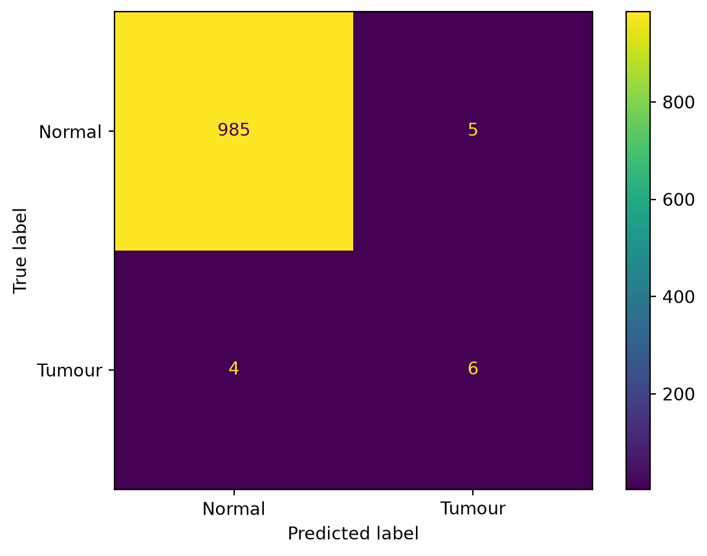](slides_files/figure-html/cell-20-output-1.png)

Consider a medical dataset, such as one involving diagnostic tests or imaging, comprising 990 normal samples and 10 abnormal (tumour) samples. This represents the ground truth.

## Micro/macro metrics (medical data)

``` python
from sklearn.metrics import classification_report, recall_score

print(classification_report(y_true, y_pred), "\n")

micro_precision = precision_score(y_true, y_pred, average="micro")
macro_precision = precision_score(y_true, y_pred, average="macro")
print(f"Micro precision: {micro_precision:.2f}")
print(f"Macro precision: {macro_precision:.2f}")

print("\n")

micro_recall = recall_score(y_true, y_pred, average="micro")
macro_recall = recall_score(y_true, y_pred, average="macro")
print(f"Micro recall: {micro_recall:.2f}")
print(f"Macro recall: {macro_recall:.2f}")
```

                  precision    recall  f1-score   support

          Normal       1.00      0.99      1.00       990
          Tumour       0.55      0.60      0.57        10

        accuracy                           0.99      1000
       macro avg       0.77      0.80      0.78      1000
    weighted avg       0.99      0.99      0.99      1000
     

    Micro precision: 0.99
    Macro precision: 0.77


    Micro recall: 0.99
    Macro recall: 0.80

The precision for the `Tumour` class is low. However, due to the small sample size, this does not significantly impact the micro-averaged precision.

# Precision-Recall Trade-Off

## Handwritten Digits (Revisited)

Loading the dataset

Code

``` python
from sklearn.datasets import fetch_openml

digits = fetch_openml('mnist_784', as_frame=False)
X, y = digits.data, digits.target
```

Plotting the first five examples

Code

``` python
plt.figure(figsize=(10,2))
n = 5

for index, (image, label) in enumerate(zip(X[0:n], y[0:n])):
    plt.subplot(1, n, index + 1)
    plt.imshow(np.reshape(image, (28,28)), cmap=plt.cm.gray)
    plt.title(f'y = {label}')
```

[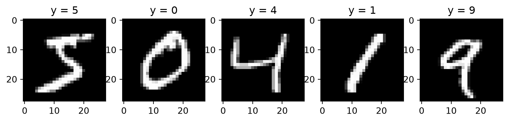](slides_files/figure-html/cell-23-output-1.png)

These images have dimensions of 28 \times 28 pixels.

## Creating a Binary Classification Task

``` python
# Creating a binary classification task (one vs the rest)

some_digit = X[0]
some_digit_y = y[0]

y = (y == some_digit_y)
y
```

    array([ True, False, False, ..., False,  True, False], shape=(70000,))

. . .

``` python
# Creating the training and test sets
X_train, X_test, y_train, y_test = train_test_split(
    X,
    y,
    test_size=0.1,
    random_state=seed,
    stratify=y,
)
```

## `SGDClassifier`

``` python
from sklearn.linear_model import SGDClassifier

clf = SGDClassifier(random_state=seed)

clf.fit(X_train, y_train)
```

`SGDClassifier` is a linear classifier trained with stochastic gradient descent. It is well suited to this large dataset and exposes a continuous score through `decision_function`. Logistic regression also exposes probabilities and decision scores that can be thresholded.

## Performance

``` python
y_pred = clf.predict(X_test)

accuracy_score(y_test, y_pred)
```

    0.9657142857142857

. . .

The score appears strong,

. . .

but the class distribution provides essential context.

## Not so Fast

``` python
from sklearn.dummy import DummyClassifier

dummy_clf = DummyClassifier(strategy="most_frequent")

dummy_clf.fit(X_train, y_train)
```

. . .

``` python
y_pred = dummy_clf.predict(X_test)

accuracy_score(y_test, y_pred)
```

    0.9098571428571428

The [DummyClassifier](https://scikit-learn.org/stable/modules/generated/sklearn.dummy.DummyClassifier.html) in scikit-learn generates predictions without considering the input features. With `strategy="most_frequent"`, it consistently predicts the most frequent class label in the training data and provides a simple baseline.

Why is the accuracy so high despite this classifier ignoring the input data?

The high accuracy is attributed to the class distribution within the dataset. Approximately 10% of the samples correspond to the digit ‘5’, which is the positive class in our binary classification task. Consequently, about 90% of the samples are ‘not 5’ and belong to the negative class. Since the DummyClassifier always predicts the majority class, its accuracy is expected to be around 90%.

This illustrates why accuracy alone is insufficient for evaluating an imbalanced dataset.

## Precision-Recall Trade-Off

[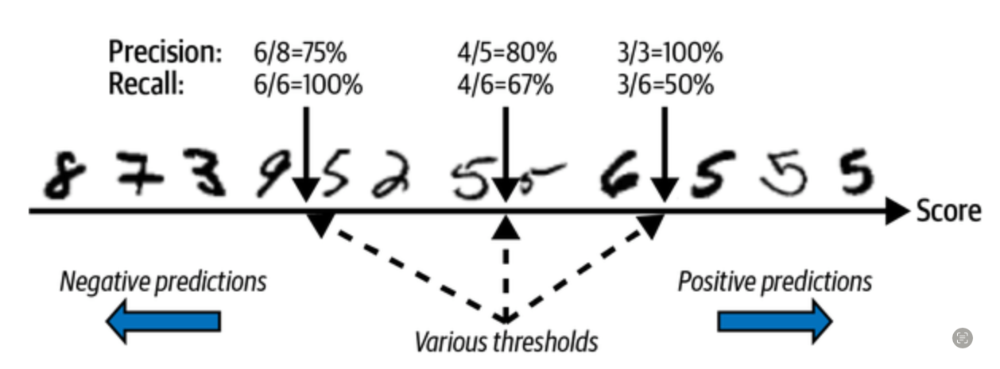](../../assets/images/geron_2022-f3_4.png)

**Attribution**: Géron ([2022](#ref-Geron:2022aa)) Figure 3.4

## Precision-Recall Trade-Off

Code

``` python
from sklearn.model_selection import cross_val_predict
y_scores = cross_val_predict(
    clf,
    X_train,
    y_train,
    cv=3,
    method="decision_function",
)

from sklearn.metrics import precision_recall_curve

precisions, recalls, thresholds = precision_recall_curve(
    y_train,
    y_scores,
)

threshold = 3000

plt.figure(figsize=(8, 4))
plt.plot(
    thresholds,
    precisions[:-1],
    "b--",
    label="Precision",
    linewidth=2,
)
plt.plot(thresholds, recalls[:-1], "g-", label="Recall", linewidth=2)
plt.vlines(threshold, 0, 1.0, "k", "dotted", label="threshold")

idx = (thresholds >= threshold).argmax()  # first index ≥ threshold
plt.plot(thresholds[idx], precisions[idx], "bo")
plt.plot(thresholds[idx], recalls[idx], "go")
plt.axis([-50000, 50000, 0, 1])
plt.grid()
plt.xlabel("Threshold")
plt.legend(loc="center right")

plt.show()
```

[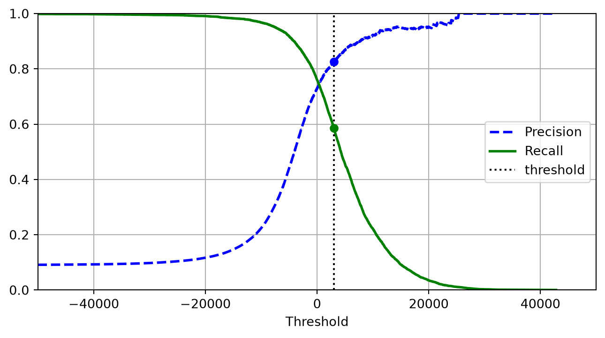](slides_files/figure-html/cell-30-output-1.png)

The continuous score produced by `decision_function` lets us vary the decision threshold and observe the precision-recall trade-off. ([Géron 2022](#ref-Geron:2022aa)) [`03_classification.ipynb`](https://github.com/ageron/handson-ml3/blob/main/03_classification.ipynb).

As the decision threshold decreases, a higher number of examples are predicted as positive, potentially leading the classifier to eventually label all instances as positive.

Conversely, as the decision threshold increases, fewer examples are classified as positive, which may result in the classifier predicting no positive instances at all.

For certain applications, a classifier with high precision is essential. For example, consider a scenario where each prediction necessitates a costly laboratory experiment to verify its accuracy, such as in a pharmaceutical company aiming to discover new drugs. Here, the classifier predicts whether a compound is active. Given the high cost of experiments to validate candidates, the company would prioritize focusing on the most promising compounds first.

In contrast, consider a scenario involving cancer screening, such as using mammograms to detect breast cancer. In this case, it may be preferable to lower the decision threshold, thereby increasing the number of false-positive predictions. Although this approach results in more patients undergoing additional tests, such as biopsies, it can potentially save more lives by ensuring that fewer cases of cancer go undetected.

## Precision/Recall Curve

Code

``` python
import matplotlib.patches as patches

plt.figure(figsize=(5, 5))

plt.plot(
    recalls,
    precisions,
    linewidth=2,
    label="Precision/Recall Curve",
)

plt.plot([recalls[idx], recalls[idx]], [0., precisions[idx]], "k:")
plt.plot([0.0, recalls[idx]], [precisions[idx], precisions[idx]], "k:")
plt.plot([recalls[idx]], [precisions[idx]], "ko",
         label="Point at threshold 3,000")
plt.gca().add_patch(patches.FancyArrowPatch(
    (0.79, 0.60), (0.61, 0.78),
    connectionstyle="arc3,rad=.2",
    arrowstyle="Simple, tail_width=1.5, head_width=8, head_length=10",
    color="#444444"))
plt.text(0.56, 0.62, "Higher\nthreshold", color="#333333")
plt.xlabel("Recall")
plt.ylabel("Precision")
plt.axis([0, 1, 0, 1])
plt.grid()
plt.legend(loc="lower left")

plt.show()
```

[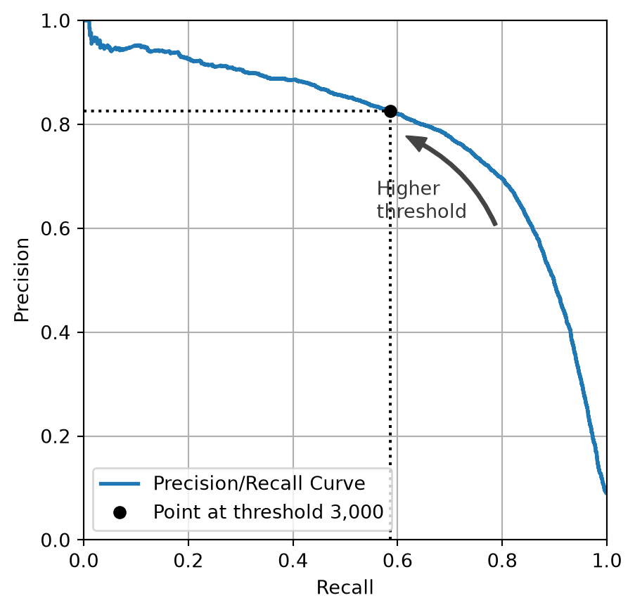](slides_files/figure-html/cell-31-output-1.png)

([Géron 2022](#ref-Geron:2022aa)) [`03_classification.ipynb`](https://github.com/ageron/handson-ml3/blob/main/03_classification.ipynb).

# ROC Curve

## ROC Curve

**Receiver operating characteristic (ROC) curve**

- **True positive rate** (TPR) against **false positive rate** (FPR)
- An ideal classifier has **TPR** close to **1.0** and **FPR** close to **0.0**
- \mathrm{TPR} = \frac{\mathrm{TP}}{\mathrm{TP}+\mathrm{FN}} (recall, sensitivity)
- **TPR** approaches **one** when there are few **false negatives**
- \mathrm{FPR} = \frac{\mathrm{FP}}{\mathrm{FP}+\mathrm{TN}} = 1-\mathrm{specificity}
- **FPR** approaches **zero** when the number of **false positives** is low

An ROC curve plots the true-positive rate against the false-positive rate as the decision threshold varies. Each threshold produces one operating point. An ideal operating point lies near the upper-left corner, while random ranking produces the diagonal on average.

The curve summarizes score ranking across thresholds, but a deployment decision still requires a particular threshold. The relative costs of false positives and false negatives help determine which operating point is appropriate. One-vs-rest evaluation extends ROC analysis to multiclass tasks.

## ROC Curve

[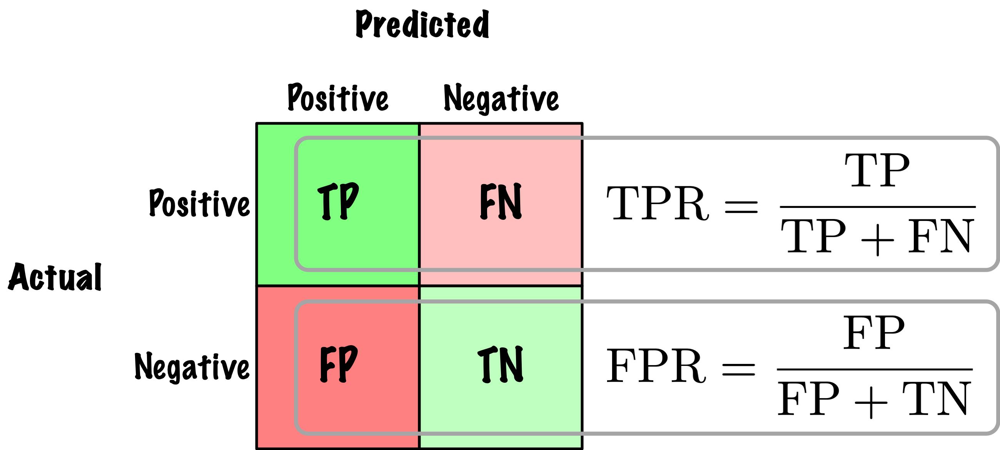](../../assets/images/tpr_fpr.png)

## ROC Curve

Code

``` python
idx_for_90_precision = (precisions >= 0.90).argmax()
threshold_for_90_precision = thresholds[idx_for_90_precision]
y_train_pred_90 = (y_scores >= threshold_for_90_precision)

from sklearn.metrics import roc_curve

fpr, tpr, thresholds = roc_curve(y_train, y_scores)

idx_for_threshold_at_90 = (
    thresholds <= threshold_for_90_precision
).argmax()
tpr_90 = tpr[idx_for_threshold_at_90]
fpr_90 = fpr[idx_for_threshold_at_90]

plt.figure(figsize=(5, 5))
plt.plot(fpr, tpr, linewidth=2, label="ROC curve")
plt.plot([0, 1], [0, 1], 'k:', label="Random classifier's ROC curve")
plt.plot([fpr_90], [tpr_90], "ko", label="Threshold for 90% precision")

plt.gca().add_patch(patches.FancyArrowPatch(
    (0.20, 0.89), (0.07, 0.70),
    connectionstyle="arc3,rad=.4",
    arrowstyle="Simple, tail_width=1.5, head_width=8, head_length=10",
    color="#444444"))
plt.text(0.12, 0.71, "Higher\nthreshold", color="#333333")
plt.xlabel('False Positive Rate (Fall-Out)')
plt.ylabel('True Positive Rate (Recall)')
plt.grid()
plt.axis([0, 1, 0, 1])
plt.legend(loc="lower right", fontsize=13)

plt.show()
```

[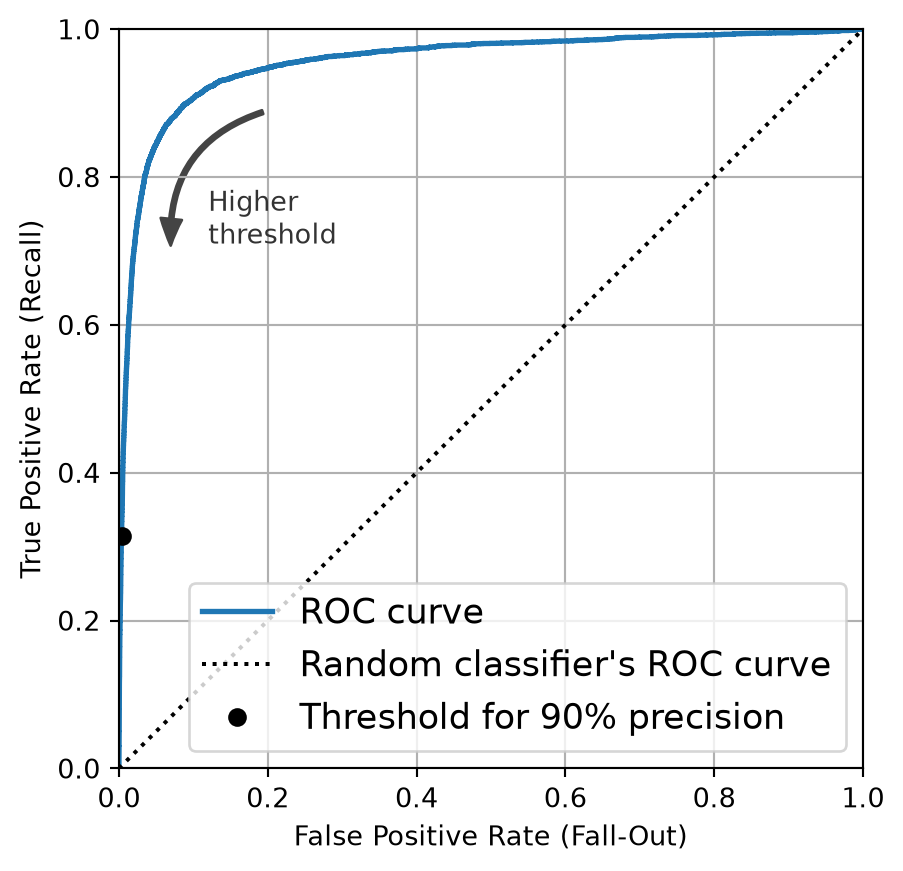](slides_files/figure-html/cell-32-output-1.png)

**Attribution:** [03_classification.ipynb](https://github.com/ageron/handson-ml3/blob/main/03_classification.ipynb)

Moving the threshold changes both the true-positive and false-positive rates. The ROC curve records every resulting operating point. The curve alone does not identify the best threshold because that choice depends on the relative costs of false positives and false negatives.

## Score distributions and the ROC curve

Code

``` python
from sklearn.metrics import roc_auc_score, roc_curve

def plot_scores_and_roc(
    ax_scores,
    ax_roc,
    negative_scores,
    positive_scores,
    title,
    threshold=None,
):
    """Plot class score distributions beside their ROC curve."""
    labels = np.concatenate([
        np.zeros(len(negative_scores), dtype=int),
        np.ones(len(positive_scores), dtype=int),
    ])
    scores = np.concatenate([negative_scores, positive_scores])

    bins = np.linspace(0, 1, 21)
    ax_scores.hist(
        negative_scores,
        bins=bins,
        alpha=0.6,
        label="Negative examples",
    )
    ax_scores.hist(
        positive_scores,
        bins=bins,
        alpha=0.6,
        label="Positive examples",
    )
    ax_scores.set(
        title=title,
        xlabel="Prediction score",
        ylabel="Number of examples",
        xlim=(0, 1),
    )

    curve_fpr, curve_tpr, _ = roc_curve(labels, scores)
    area = roc_auc_score(labels, scores)
    ax_roc.plot(curve_fpr, curve_tpr, linewidth=2, label="ROC curve")
    ax_roc.plot([0, 1], [0, 1], "k--", label="Random ranking")
    ax_roc.set(
        title=f"AUROC = {area:.2f}",
        xlabel="False-positive rate",
        ylabel="True-positive rate",
        xlim=(0, 1),
        ylim=(0, 1),
    )
    ax_roc.set_aspect("equal", adjustable="box")

    if threshold is not None:
        predictions = (scores >= threshold).astype(int)
        tn, fp, fn, tp = confusion_matrix(
            labels,
            predictions,
            labels=[0, 1],
        ).ravel()
        point_fpr = fp / (fp + tn)
        point_tpr = tp / (tp + fn)
        accuracy = np.mean(predictions == labels)

        ax_scores.axvline(
            threshold,
            color="black",
            linestyle=":",
            label=f"Threshold = {threshold:.2f}",
        )
        ax_scores.text(
            0.02,
            0.95,
            f"Accuracy = {accuracy:.2f}",
            transform=ax_scores.transAxes,
            va="top",
        )
        ax_roc.scatter(
            point_fpr,
            point_tpr,
            color="black",
            zorder=3,
            label="Selected threshold",
        )

    ax_scores.legend(fontsize=8)
    ax_roc.legend(fontsize=8, loc="lower right")


roc_demo_rng = np.random.default_rng(seed)
roc_demo_size = 250
good_negative_scores = np.clip(
    roc_demo_rng.normal(0.35, 0.16, roc_demo_size),
    0,
    1,
)
good_positive_scores = np.clip(
    roc_demo_rng.normal(0.65, 0.16, roc_demo_size),
    0,
    1,
)

fig, axes = plt.subplots(1, 2, figsize=(10, 4.5), constrained_layout=True)
plot_scores_and_roc(
    axes[0],
    axes[1],
    good_negative_scores,
    good_positive_scores,
    "Overlapping score distributions",
    threshold=0.50,
)
plt.show()
```

[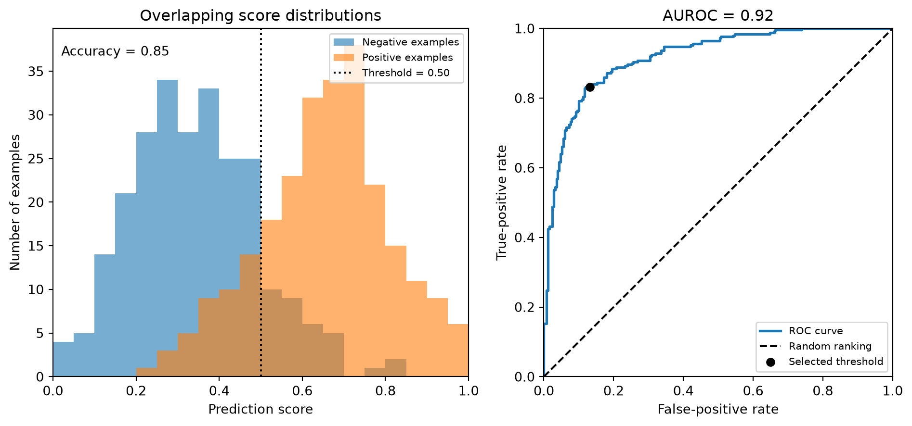](slides_files/figure-html/cell-33-output-1.png)

[Interactive ROC Curve](https://www.interactive-ml.com/roc-curve.html)

The histogram shows the scores assigned to negative and positive examples. For the marked threshold, examples to its right are predicted positive. This produces one pair of false-positive and true-positive rates, shown as the marked point on the ROC curve.

Moving the threshold changes the predicted labels, the confusion matrix, accuracy, and the marked ROC operating point. It does not change AUROC because the ordering of the scores remains unchanged. Sweeping the threshold across all observed scores traces the full ROC curve.

The linked interactive demonstration animates this process and provides excellent, good, poor, and random score distributions.

## Area under the ROC curve

The **area under the ROC curve (AUROC)** summarizes how well a score ranks positive examples above negative examples.

- \mathrm{AUROC}=1: every positive example receives a higher score than every negative example.
- \mathrm{AUROC}=0.5: random ranking on average.
- \mathrm{AUROC}\<0.5: the ranking is systematically reversed.

AUROC compares rankings across thresholds. It does not measure probability calibration and does not choose an operating threshold.

With the usual half-credit convention for tied scores,

\mathrm{AUROC} = P(s^+ \> s^-) + \frac{1}{2}P(s^+ = s^-),

where s^+ and s^- are the scores of randomly selected positive and negative examples. This gives AUROC its probabilistic ranking interpretation ([Hanley and McNeil 1982](#ref-Hanley:1982aa)). A classifier with AUROC below 0.5 may still contain useful information if its ranking is consistently reversed.

ROC curves and AUROC are often used to compare how multiple classifiers rank the same examples. A complete worked comparison using the Pima diabetes dataset appears in the appendix.

## Perfect classifier

Code

``` python
perfect_rng = np.random.default_rng(seed + 1)
perfect_negative_scores = np.clip(
    perfect_rng.normal(0.25, 0.07, roc_demo_size),
    0,
    1,
)
perfect_positive_scores = np.clip(
    perfect_rng.normal(0.75, 0.07, roc_demo_size),
    0,
    1,
)

fig, axes = plt.subplots(1, 2, figsize=(10, 4.5), constrained_layout=True)
plot_scores_and_roc(
    axes[0],
    axes[1],
    perfect_negative_scores,
    perfect_positive_scores,
    "Separated Gaussian score distributions",
)
plt.show()
```

[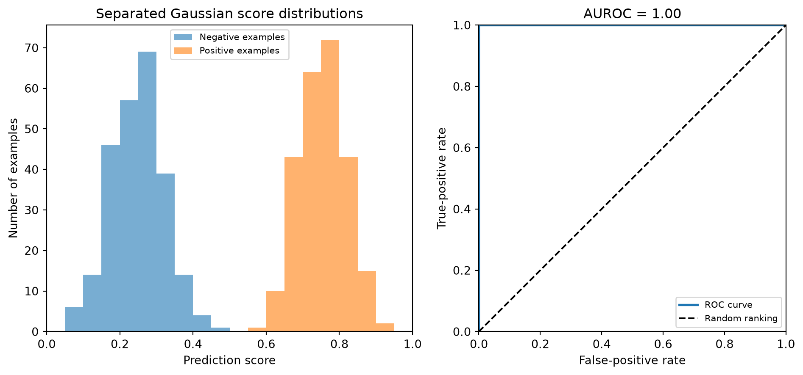](slides_files/figure-html/cell-34-output-1.png)

The two score distributions have Gaussian shapes and do not overlap in this sample. Every positive example therefore receives a higher score than every negative example, so AUROC equals 1.

## Random classifier

Code

``` python
random_rng = np.random.default_rng(seed + 2)
random_negative_scores = random_rng.uniform(0.05, 0.95, roc_demo_size)
random_positive_scores = random_rng.uniform(0.05, 0.95, roc_demo_size)

fig, axes = plt.subplots(1, 2, figsize=(10, 4.5), constrained_layout=True)
plot_scores_and_roc(
    axes[0],
    axes[1],
    random_negative_scores,
    random_positive_scores,
    "Independent uniform score samples",
)
plt.show()
```

[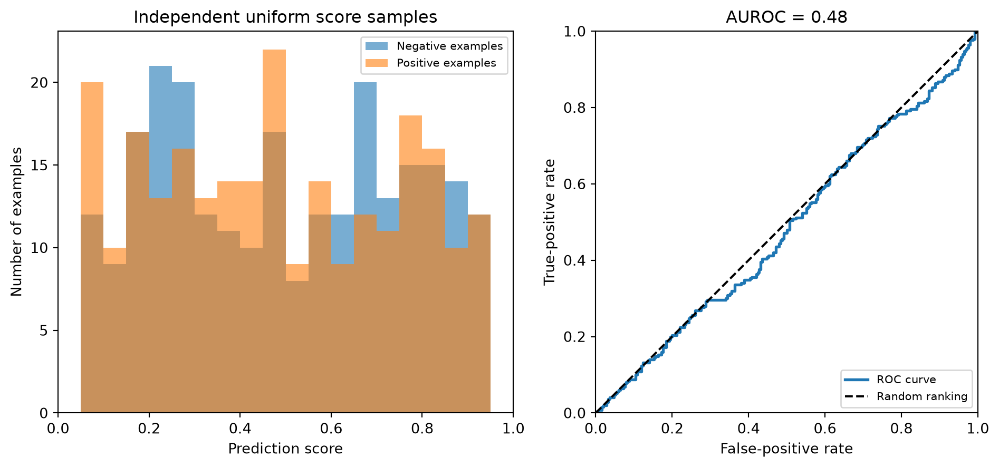](slides_files/figure-html/cell-35-output-1.png)

Both classes draw scores independently from the same uniform distribution. Their empirical histograms differ because of sampling variation, but neither class tends to receive higher scores. AUROC is therefore close to 0.5, and the empirical ROC curve fluctuates around the random diagonal.

The all-positive rule occurs when the threshold lies below every score and corresponds to the ROC endpoint (1,1). The all-negative rule corresponds to (0,0). These are operating points produced by extreme thresholds, whereas the diagonal represents random ranking across thresholds.

## AUROC below 0.5

Code

``` python
reversed_negative_scores = 1 - good_negative_scores
reversed_positive_scores = 1 - good_positive_scores

fig, axes = plt.subplots(1, 2, figsize=(10, 4.5), constrained_layout=True)
plot_scores_and_roc(
    axes[0],
    axes[1],
    reversed_negative_scores,
    reversed_positive_scores,
    "Reversed score ordering",
)
plt.show()
```

[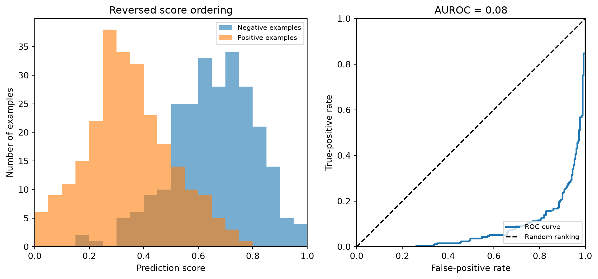](slides_files/figure-html/cell-36-output-1.png)

Before examining the figure, predict what the score histograms should look like when AUROC is below 0.5.

The positive examples must tend to receive lower scores than the negative examples. The ranking is therefore systematically reversed, and the ROC curve falls below the random diagonal. Reversing the score direction would transform an AUROC of a into 1-a, apart from the treatment of ties.

## ROC or precision-recall?

- ROC uses **recall** and the **false-positive rate**, whose denominator contains all negative examples.
- With a very rare positive class, a large number of true negatives can make the false-positive rate appear small even when many predicted positives are wrong.
- A precision-recall curve focuses on the positive class and reveals how many positive predictions are correct.

Use the curve that matches the decision problem, and always inspect class prevalence and an operating threshold.

ROC curves remain valid with imbalanced data, but their visual interpretation can be optimistic when the negative class is much larger than the positive class. Precision-recall curves often communicate performance on a rare positive class more directly because precision responds to the number of false-positive predictions ([Davis and Goadrich 2006](#ref-Davis:2006aa)).

# Constructing ROC and AUROC

## Logistic Regression

- **Model**:

  h\_\theta(x_i) = \sigma(\theta_0 + x_i^\top\theta) = \frac{1}{1+e^{-(\theta_0+x_i^\top\theta)}}

- **Prediction**:

  - Assign y_i = 0 if h\_\theta(x_i) \< 0.5.
  - Assign y_i = 1 if h\_\theta(x_i) \geq 0.5.

- **Loss Function**: cross-entropy

J(\theta) = -\frac{1}{N} \sum\_{i=1}^{N} \left\[ y_i \log h\_\theta(x_i) + (1-y_i) \log\left(1-h\_\theta(x_i)\right) \right\]

The confusion-matrix counts change systematically as the decision threshold moves from 0 to 1.

At threshold = 0

- All predicted positive.
- TP: all actual positives are predicted positive, maximal TP.
- FP: all actual negatives are predicted positive, maximal FP.
- \text{TPR} = 1 (since \text{TP} = P, where P is total positives).
- \text{FPR} = 1 (since \text{FP} = N, where N is total negatives).
- ROC point = (1,1).

As threshold increases from 0 to 1

- Fewer examples are predicted positive.
- TP decreases (some positives no longer exceed threshold).
- FP decreases (some negatives no longer exceed threshold).
- TPR decreases monotonically from 1 to 0.
- FPR decreases monotonically from 1 to 0.
- Curve traces down-left along the ROC space.

At threshold = 1

- All predicted negative.
- TP = 0, FP = 0.
- \text{TPR} = 0, \text{FPR} = 0.
- ROC point = (0,0).

Summary intuition

- Lower threshold, more predicted positives, both TP and FP increase, both TPR and FPR increase.
- Higher threshold, more predicted negatives, both TP and FP decrease, both TPR and FPR decrease.
- The shape of the ROC curve depends on how well logistic regression separates positives from negatives:
- A perfect model climbs immediately towards (0,1).
- Random ranking follows the diagonal on average.
- A useful ranking usually lies above the diagonal, while a systematically reversed ranking lies below it.

## Implementation: Logistic Regression

This implementation was presented in Lecture 6. It is repeated here so that the notebook contains a working model for constructing the ROC curve and computing AUROC.

Code

``` python
import numpy as np

class LogisticRegression:

    """
    Binary logistic regression trained with batch gradient descent.

    Parameters
    ----------
    learning_rate : float, default=0.1
        Step size for gradient descent.
    max_iter : int, default=1000
        Number of gradient descent iterations.
    Notes
    -----
    - This implementation expects binary labels {0, 1}.
    - The intercept (bias) term is added internally during `fit`.
    - For simplicity, there is no regularization and no early stopping.
    """

    def __init__(
        self,
        learning_rate: float = 0.1,
        max_iter: int = 1000,
    ):
        if learning_rate <= 0:
            raise ValueError("learning_rate must be positive.")
        if max_iter <= 0:
            raise ValueError("max_iter must be positive.")

        self.learning_rate = learning_rate
        self.max_iter = max_iter

        # Attributes set after fitting
        self._theta = None
        self._loss_history = None
        self._n_features = None
        self._fitted = False

    def fit(self, X: np.ndarray, y: np.ndarray) -> "LogisticRegression":
        """Fit the model parameters using gradient descent."""
        X = self._as_2d_array(X, name="X")
        y = self._as_1d_array(y, name="y")

        if X.shape[0] != y.shape[0]:
            raise ValueError(
                "X and y must contain the same number of examples."
            )
        self._check_binary_labels(y)

        n_examples, n_features = X.shape
        self._n_features = n_features
        Xb = self._add_intercept(X)

        # Zero initialization works because the objective is convex.
        self._theta = np.zeros(n_features + 1, dtype=float)
        self._loss_history = []

        for _ in range(self.max_iter):
            probabilities = self._sigmoid(Xb @ self._theta)
            gradient = (Xb.T @ (probabilities - y)) / n_examples
            self._theta -= self.learning_rate * gradient

            updated_probabilities = self._sigmoid(Xb @ self._theta)
            self._loss_history.append(
                self._bce_loss(updated_probabilities, y)
            )

        self._fitted = True
        return self

    def predict_proba(self, X: np.ndarray) -> np.ndarray:
        """Return predicted probabilities for the positive class."""
        self._ensure_fitted()
        X = self._as_2d_array(X, name="X")
        self._ensure_same_n_features(X)

        Xb = self._add_intercept(X)
        return self._sigmoid(Xb @ self._theta)

    def predict(
        self,
        X: np.ndarray,
        threshold: float = 0.5,
    ) -> np.ndarray:
        """Return class predictions using a probability threshold."""
        if not 0 <= threshold <= 1:
            raise ValueError("threshold must be between 0 and 1.")
        return (self.predict_proba(X) >= threshold).astype(int)

    @property
    def intercept_(self) -> float:
        """Return the fitted intercept."""
        self._ensure_fitted()
        return float(self._theta[0])

    @property
    def coef_(self) -> np.ndarray:
        """Return a copy of the fitted feature coefficients."""
        self._ensure_fitted()
        return self._theta[1:].copy()

    def get_loss_history(self) -> list:
        """Return a copy of the loss values collected during fitting."""
        self._ensure_fitted()
        return list(self._loss_history)

    @staticmethod
    def _sigmoid(z: np.ndarray) -> np.ndarray:
        """Compute the sigmoid without numerical overflow."""
        z = np.asarray(z, dtype=float)
        result = np.empty_like(z)
        positive = z >= 0
        result[positive] = 1.0 / (1.0 + np.exp(-z[positive]))
        exp_z = np.exp(z[~positive])
        result[~positive] = exp_z / (1.0 + exp_z)
        return result

    @staticmethod
    def _bce_loss(probabilities: np.ndarray, y: np.ndarray) -> float:
        probabilities = np.clip(probabilities, 1e-12, 1.0 - 1e-12)
        return float(
            -np.mean(
                y * np.log(probabilities)
                + (1 - y) * np.log(1 - probabilities)
            )
        )

    @staticmethod
    def _as_2d_array(X, name="X") -> np.ndarray:
        X = np.asarray(X, dtype=float)
        if X.ndim != 2:
            message = (
                f"{name} must be a 2D array of shape "
                "(n_samples, n_features)."
            )
            raise ValueError(message)
        return X

    @staticmethod
    def _as_1d_array(y, name="y") -> np.ndarray:
        y = np.asarray(y, dtype=float)
        if y.ndim != 1:
            message = f"{name} must have shape (n_samples,)."
            raise ValueError(message)
        return y

    @staticmethod
    def _check_binary_labels(y: np.ndarray) -> None:
        if not np.array_equal(np.unique(y), np.array([0.0, 1.0])):
            raise ValueError(
                "y must contain both binary labels 0 and 1."
            )

    @staticmethod
    def _add_intercept(X: np.ndarray) -> np.ndarray:
        return np.column_stack([np.ones(X.shape[0]), X])

    def _ensure_fitted(self) -> None:
        if not self._fitted or self._theta is None:
            raise RuntimeError(
                "Call fit(X, y) before using the fitted model."
            )

    def _ensure_same_n_features(self, X: np.ndarray) -> None:
        if X.shape[1] != self._n_features:
            message = (
                f"X has {X.shape[1]} features; "
                f"expected {self._n_features}."
            )
            raise ValueError(message)
```

## Implementation: ROC

``` python
def compute_roc_curve(y_true, y_scores):
    y_true = np.asarray(y_true)
    y_scores = np.asarray(y_scores, dtype=float)
    thresholds = np.r_[np.inf, np.sort(np.unique(y_scores))[::-1]]
    tpr_list, fpr_list = [], []

    for threshold in thresholds:
        y_pred = (y_scores >= threshold).astype(int)
        tp = np.sum((y_true == 1) & (y_pred == 1))
        fn = np.sum((y_true == 1) & (y_pred == 0))
        fp = np.sum((y_true == 0) & (y_pred == 1))
        tn = np.sum((y_true == 0) & (y_pred == 0))

        tpr_list.append(tp / (tp + fn)) # true positive rate
        fpr_list.append(fp / (fp + tn)) # false positive rate

    return np.array(fpr_list), np.array(tpr_list), thresholds
```

## Implementation: AUROC

``` python
def compute_auroc(fpr, tpr):

    return np.trapezoid(tpr, fpr)
```

The **trapezoidal rule** approximates an integral by dividing the region under a curve into trapezoids. Here, it computes the area under the piecewise-linear ROC curve.

## Example: Generate Data + Predictions

Code

``` python
from sklearn.datasets import make_blobs

X, y = make_blobs(
    n_samples=1000,
    n_features=2,
    centers=2,
    cluster_std=5,
    random_state=seed,
)

X_train, X_test, y_train, y_test = train_test_split(
    X,
    y,
    test_size=0.3,
    random_state=seed,
    stratify=y,
)

model = LogisticRegression(learning_rate=0.1, max_iter=500)
model.fit(X_train, y_train)
```

## Example: Plot

Code

``` python
# Compute predicted probabilities for the positive class on the test set
y_probs = model.predict_proba(X_test)

# Compute the ROC curve (FPR and TPR for each threshold)
fpr, tpr, thresholds = compute_roc_curve(y_test, y_probs)
auroc_value = compute_auroc(fpr, tpr)

from sklearn.metrics import roc_auc_score
sklearn_auc = roc_auc_score(y_test, y_probs)

print(f"Manual AUROC:       {auroc_value:.3f}")
print(f"scikit-learn AUROC: {sklearn_auc:.3f}")

# Plot the ROC curve
plt.figure(figsize=(8, 6))
plt.plot(
    fpr,
    tpr,
    color="blue",
    lw=2,
    label=f"ROC curve (AUROC = {auroc_value:.2f})",
)
plt.plot(
    [0, 1],
    [0, 1],
    color="gray",
    lw=1,
    linestyle="--",
    label="Random classifier",
)
plt.xlabel('False Positive Rate')
plt.ylabel('True Positive Rate')
plt.title('Receiver Operating Characteristic (ROC) Curve')
plt.legend(loc="lower right")
plt.show()
```

    Manual AUROC:       0.938
    scikit-learn AUROC: 0.938

[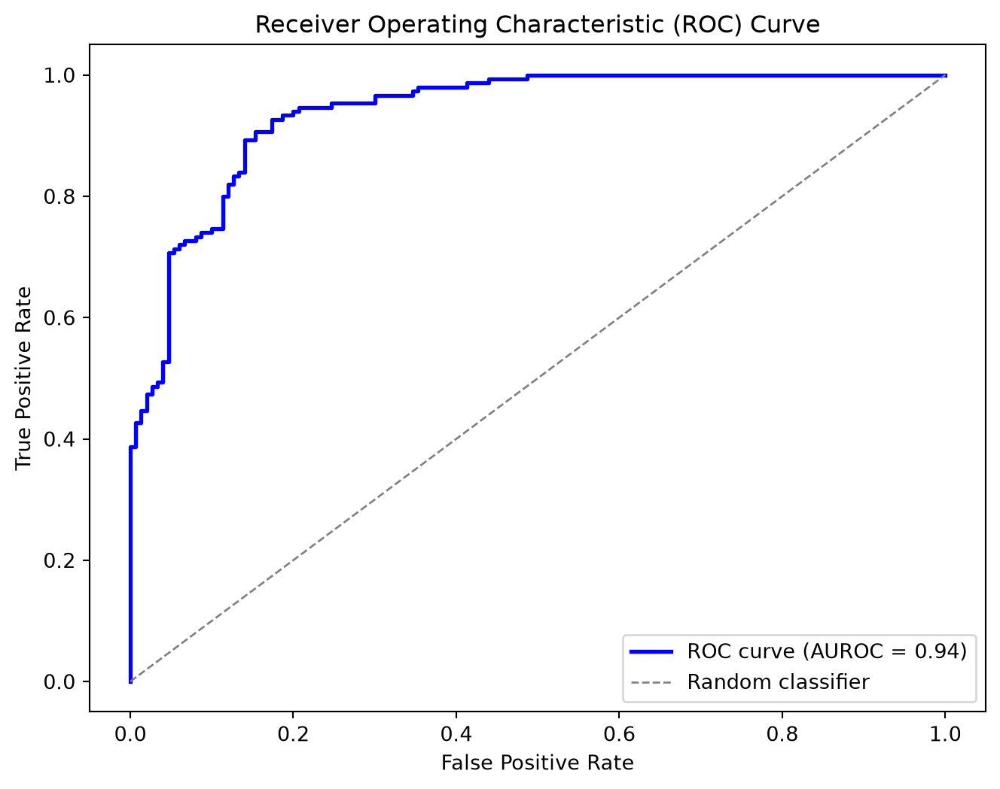](slides_files/figure-html/cell-41-output-2.png)

## See also

- [Multiclass Receiver Operating Characteristic (ROC)](https://scikit-learn.org/stable/auto_examples/model_selection/plot_roc.html) presents examples of micro- and macro-average curves.

------------------------------------------------------------------------

# An error occurred.

Unable to execute JavaScript.

The video above by StatQuest, Josh Starmer, offers a detailed, step-by-step guide on how to construct and analyze Receiver Operating Characteristic (ROC) curves.

# Closing Material

## Summary

- Derived binary and one-vs-rest counts from **confusion matrices**.
- Computed and interpreted **accuracy**, **precision**, **recall**, and the **F_1 score**, including the limitations of accuracy under class imbalance.
- Distinguished **micro averaging**, which gives each prediction equal weight, from **macro averaging**, which gives each class equal weight.
- Related the decision threshold to the **precision-recall trade-off** and to operating points on the **ROC curve**.
- Interpreted **AUROC** as a measure of score ranking. AUROC does not assess probability calibration or select a decision threshold.

## Key references

- Sokolova and Lapalme ([2009](#ref-Sokolova:2009aa)) systematically analyzes classification performance measures across binary, multiclass, and multilabel tasks.
- Hanley and McNeil ([1982](#ref-Hanley:1982aa)) establishes the probabilistic ranking interpretation of the area under an ROC curve.
- Davis and Goadrich ([2006](#ref-Davis:2006aa)) explains the relationship between ROC and precision-recall curves, including the effect of skewed class distributions.

## Evaluating Learning Algorithms

[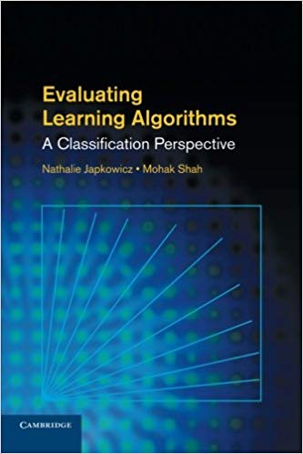](../../assets/images/evaluating_learning_algorithms.jpg)

- This [book](https://www.cambridge.org/core/books/evaluating-learning-algorithms/3CB22D16AB609D1770C24CA2CB5A11BF) examines the evaluation process, with particular attention to classification algorithms ([Japkowicz and Shah 2011](#ref-Japkowicz:2011aa)).

- [Nathalie Japkowicz](https://www.american.edu/cas/faculty/japkowic.cfm) previously served as a professor at the University of Ottawa.

- [Mohak Shah](http://www.mohakshah.com) earned his PhD from the University of Ottawa and has held several industry roles in AI and machine learning.

## Next lecture

- We will examine cross-validation and hyperparameter tuning.

## References

Davis, Jesse, and Mark Goadrich. 2006. “The relationship between Precision-Recall and ROC curves.” *Proceedings of the 23rd International Conference on Machine Learning - ICML ’06*, 233–40. <https://doi.org/10.1145/1143844.1143874>.

Géron, Aurélien. 2022. *Hands-on Machine Learning with Scikit-Learn, Keras, and TensorFlow*. 3rd ed. O’Reilly Media, Inc.

Hanley, J A, and B J McNeil. 1982. “The meaning and use of the area under a receiver operating characteristic (ROC) curve.” *Radiology* 143 (1): 29–36. <https://doi.org/10.1148/radiology.143.1.7063747>.

Japkowicz, Nathalie, and Mohak Shah. 2011. *Evaluating Learning Algorithms: A Classification Perspective*. Cambridge University Press.

Knowler, William C., David J. Pettitt, Peter J. Savage, and Peter H. Bennett. 1981. “Diabetes Incidence in Pima Indians: Contributions of Obesity and Parental Diabetes.” *American Journal of Epidemiology* 113 2: 144–56. <https://api.semanticscholar.org/CorpusID:25209675>.

Russell, Stuart, and Peter Norvig. 2020. *Artificial Intelligence: A Modern Approach*. 4th ed. Pearson. <http://aima.cs.berkeley.edu/>.

Sokolova, Marina, and Guy Lapalme. 2009. “A systematic analysis of performance measures for classification tasks.” *Information Processing and Management* 45 (4): 427–37. <https://doi.org/10.1016/j.ipm.2009.03.002>.

Unceta, Irene, Paula Subı́as-Beltrán, and Oriol Pujol. 2026. “The Epistemic Debt of Generative AI.” *Nature Machine Intelligence* 8 (9): 1328–30. <https://doi.org/10.1038/s42256-026-01294-w>.

------------------------------------------------------------------------

Marcel **Turcotte**

School of Electrical Engineering and **Computer Science** (EE**CS**)

University of Ottawa

## Appendix: 20 Newsgroups

## Worked example: 20 Newsgroups

Using the [20 Newsgroups text dataset](https://scikit-learn.org/stable/modules/generated/sklearn.datasets.fetch_20newsgroups.html#sklearn.datasets.fetch_20newsgroups) from [scikit-learn](https://scikit-learn.org).

The complete dataset contains approximately 18,000 newsgroup posts from 20 topics. This example uses four topics.

Code

``` python
from sklearn.datasets import fetch_20newsgroups
from sklearn.feature_extraction.text import TfidfVectorizer
from sklearn.linear_model import RidgeClassifier

categories = [
    "alt.atheism",
    "talk.religion.misc",
    "comp.graphics",
    "sci.space",
]

data_train = fetch_20newsgroups(
    subset="train",
    categories=categories,
    shuffle=True,
    random_state=seed,
)
data_test = fetch_20newsgroups(
    subset="test",
    categories=categories,
    shuffle=True,
    random_state=seed,
)

vectorizer = TfidfVectorizer(
    sublinear_tf=True,
    max_df=0.5,
    min_df=5,
    stop_words="english",
)
X_train = vectorizer.fit_transform(data_train.data)
X_test = vectorizer.transform(data_test.data)
y_train = data_train.target
y_test = data_test.target
target_names = data_train.target_names

clf = RidgeClassifier(tol=1e-2, solver="sparse_cg")
clf.fit(X_train, y_train)
y_pred = clf.predict(X_test)

fig, ax = plt.subplots(figsize=(10, 5))
ConfusionMatrixDisplay.from_predictions(y_test, y_pred, ax=ax)
ax.xaxis.set_ticklabels(target_names)
ax.yaxis.set_ticklabels(target_names)
ax.set_title(f"Confusion matrix for {clf.__class__.__name__}")
plt.show()
```

[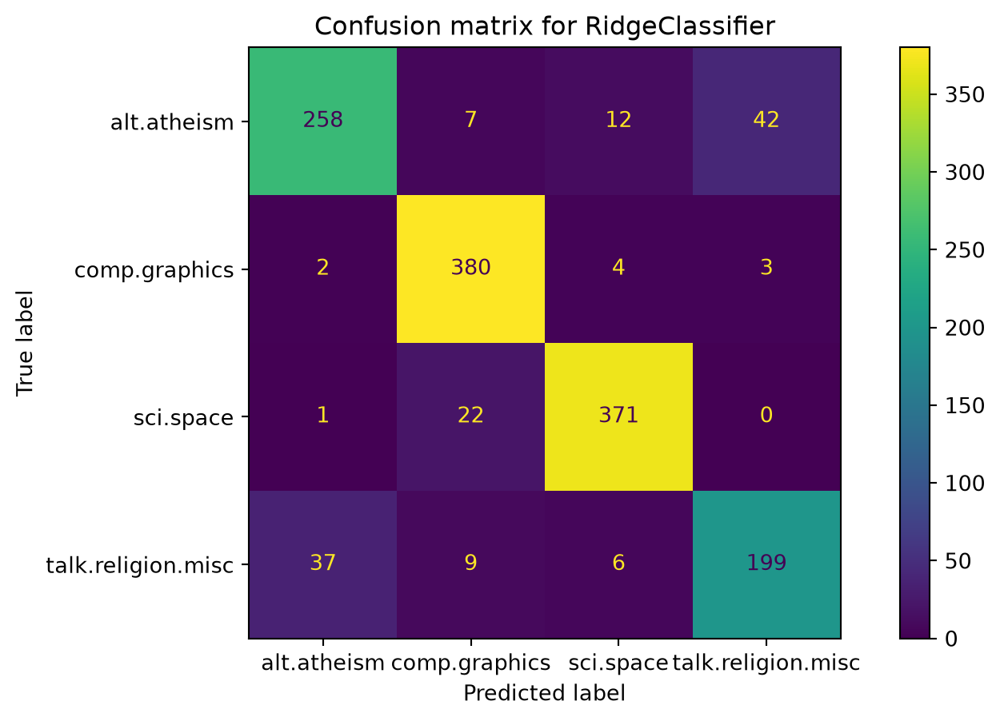](slides_files/figure-html/cell-42-output-1.png)

## Confusion matrix as an array

``` python
cm = confusion_matrix(y_test, y_pred)
cm
```

    array([[258,   7,  12,  42],
           [  2, 380,   4,   3],
           [  1,  22, 371,   0],
           [ 37,   9,   6, 199]])

## One-vs-rest counts

``` python
def true_positive(cm, i):
    return cm[i, i]

def false_positive(cm, i):
    return np.sum(cm[:, i]) - cm[i, i]

def false_negative(cm, i):
    return np.sum(cm[i, :]) - cm[i, i]

def true_negative(cm, i):
    n_examples = cm.sum()
    tp = true_positive(cm, i)
    fp = false_positive(cm, i)
    fn = false_negative(cm, i)
    return n_examples - (tp + fp + fn)
```

## Micro and macro precision

``` python
def precision_micro(cm):
    _, n_classes = cm.shape
    tp = fp = 0
    for i in range(n_classes):
        tp += true_positive(cm, i)
        fp += false_positive(cm, i)
    return tp / (tp + fp)

def precision_macro(cm):
    _, n_classes = cm.shape
    precision_sum = 0
    for i in range(n_classes):
        tp = true_positive(cm, i)
        fp = false_positive(cm, i)
        precision_sum += tp / (tp + fp)
    return precision_sum / n_classes

print(f"Micro precision: {precision_micro(cm):.3f}")
print(f"Macro precision: {precision_macro(cm):.3f}")
```

    Micro precision: 0.893
    Macro precision: 0.884

## Micro-average precision

\frac{(258+380+371+199)}{(258+380+371+199)+(40+38+22+45)} where

- 40 = 2 + 1 + 37
- 38 = 7 + 22 + 9
- 22 = 12 + 4 + 6
- 45 = 42 + 3 + 0

89.28307465 %

## Macro-average precision

- \mathrm{Precision}\_0 = \frac{258}{258+(2+1+37)} = 0.8657718121
- \mathrm{Precision}\_1 = \frac{380}{380+(7+22+9)} = 0.9090909091
- \mathrm{Precision}\_2 = \frac{371}{371+(12+4+6)} = 0.9440203562
- \mathrm{Precision}\_3 = \frac{199}{199+(42+3+0)} = 0.8155737705

\mathrm{Precision}\_{\mathrm{macro}} = \frac{0.8657718121 + 0.9090909091 + 0.9440203562 + 0.8155737705}{4}

88.3614212 %

## Micro and macro recall

``` python
def recall_micro(cm):
    _, n_classes = cm.shape
    tp = fn = 0
    for i in range(n_classes):
        tp += true_positive(cm, i)
        fn += false_negative(cm, i)
    return tp / (tp + fn)

def recall_macro(cm):
    _, n_classes = cm.shape
    recall_sum = 0
    for i in range(n_classes):
        tp = true_positive(cm, i)
        fn = false_negative(cm, i)
        recall_sum += tp / (tp + fn)
    return recall_sum / n_classes

print(f"Micro recall: {recall_micro(cm):.3f}")
print(f"Macro recall: {recall_macro(cm):.3f}")
```

    Micro recall: 0.893
    Macro recall: 0.880

## Appendix: Comparing Classifier Scores

## OpenML dataset

> **NOTE:**
>
> OpenML is an open platform for sharing datasets, algorithms, and experiments that support reproducible machine learning.

. . .

``` python
diabetes = fetch_openml(name='diabetes', version=1)
print(diabetes.DESCR)
```

**Author**: [Vincent Sigillito](vgs@aplcen.apl.jhu.edu)

**Source**: [Obtained from UCI](https://archive.ics.uci.edu/ml/datasets/pima+indians+diabetes)

**Please cite**: [UCI citation policy](https://archive.ics.uci.edu/ml/citation_policy.html)

1.  Title: Pima Indians Diabetes Database

2.  Sources:

    1.  Original owners: National Institute of Diabetes and Digestive and Kidney Diseases
    2.  Donor of database: Vincent Sigillito (vgs@aplcen.apl.jhu.edu) Research Center, RMI Group Leader Applied Physics Laboratory The Johns Hopkins University Johns Hopkins Road Laurel, MD 20707 (301) 953-6231
    3.  Date received: 9 May 1990

3.  Past Usage:

    1.  Smith,_(J.)W., Everhart,_(J.)E., Dickson,_(W.)C., Knowler,_(W.)C., & Johannes,_(R.)S. (1988). Using the ADAP learning algorithm to forecast the onset of diabetes mellitus. In {it Proceedings of the Symposium on Computer Applications and Medical Care} (pp. 261–265). IEEE Computer Society Press.

        The diagnostic, binary-valued variable investigated is whether the patient shows signs of diabetes according to World Health Organization criteria (i.e., if the 2 hour post-load plasma glucose was at least 200 mg/dl at any survey examination or if found during routine medical care). The population lives near Phoenix, Arizona, USA.

        Results: Their ADAP algorithm makes a real-valued prediction between 0 and 1. This was transformed into a binary decision using a cutoff of 0.448. Using 576 training instances, the sensitivity and specificity of their algorithm was 76% on the remaining 192 instances.

4.  Relevant Information: Several constraints were placed on the selection of these instances from a larger database. In particular, all patients here are females at least 21 years old of Pima Indian heritage. ADAP is an adaptive learning routine that generates and executes digital analogs of perceptron-like devices. It is a unique algorithm; see the paper for details.

5.  Number of Instances: 768

6.  Number of Attributes: 8 plus class

7.  For Each Attribute: (all numeric-valued)

    1.  Number of times pregnant
    2.  Plasma glucose concentration a 2 hours in an oral glucose tolerance test
    3.  Diastolic blood pressure (mm Hg)
    4.  Triceps skin fold thickness (mm)
    5.  2-Hour serum insulin (mu U/ml)
    6.  Body mass index (weight in kg/(height in m)^2)
    7.  Diabetes pedigree function
    8.  Age (years)
    9.  Class variable (0 or 1)

8.  Missing Attribute Values: None

9.  Class Distribution: (class value 1 is interpreted as “tested positive for diabetes”)

    Class Value Number of instances 0 500 1 268

10. Brief statistical analysis:

    Attribute number: Mean: Standard Deviation:

    1.                      3.8     3.4

    2.                    120.9    32.0

    3.                     69.1    19.4

    4.                     20.5    16.0

    5.                     79.8   115.2

    6.                     32.0     7.9

    7.                      0.5     0.3

    8.                     33.2    11.8

Relabeled values in attribute ‘class’ From: 0 To: tested_negative\
From: 1 To: tested_positive

Downloaded from openml.org.

The Pima diabetes dataset contains 768 examples and eight numerical features. It supports a compact demonstration of score-based evaluation, but its age, population, and data-quality limitations must be considered before drawing medical conclusions.

## Pima Indians Diabetes Dataset

``` python
# Load the Pima Indians Diabetes dataset
pima = fetch_openml(data_id=37, as_frame=True)

# Extract the features and target
X = pima.data
y = pima.target

# Encode the two target labels as 0 and 1
y = y.map({'tested_negative': 0, 'tested_positive': 1})

# Split the dataset
X_train, X_test, y_train, y_test = train_test_split(
    X,
    y,
    test_size=0.3,
    random_state=seed,
    stratify=y,
)
```

[Pima Indians Diabetes Dataset](https://www.openml.org/search?type=data&sort=version&status=any&order=asc&exact_name=diabetes&id=37) as described in Knowler et al. ([1981](#ref-Knowler:1981aa)) \[[PubMed](https://pubmed.ncbi.nlm.nih.gov/7468572/)\].

## Comparing Multiple Classifiers

``` python
from sklearn.linear_model import LogisticRegression
from sklearn.neighbors import KNeighborsClassifier
from sklearn.tree import DecisionTreeClassifier
from sklearn.ensemble import RandomForestClassifier
```

## Comparing Multiple Classifiers

Code

``` python
scaler = StandardScaler()
X_train_scaled = scaler.fit_transform(X_train)
X_test_scaled = scaler.transform(X_test)

lr = LogisticRegression(max_iter=1000)
lr.fit(X_train_scaled, y_train)

knn = KNeighborsClassifier()
knn.fit(X_train_scaled, y_train)

dt = DecisionTreeClassifier(random_state=seed)
dt.fit(X_train, y_train)

rf = RandomForestClassifier(random_state=seed)
rf.fit(X_train, y_train)
```

The two distance- and gradient-based classifiers use standardized features. The tree-based classifiers use the original feature values.

## ROC curves and AUROC

Code

``` python
from sklearn.metrics import roc_auc_score

y_pred_prob_lr = lr.predict_proba(X_test_scaled)[:, 1]
y_pred_prob_knn = knn.predict_proba(X_test_scaled)[:, 1]
y_pred_prob_dt = dt.predict_proba(X_test)[:, 1]
y_pred_prob_rf = rf.predict_proba(X_test)[:, 1]

# Compute ROC curves
fpr_lr, tpr_lr, _ = roc_curve(y_test, y_pred_prob_lr)
fpr_knn, tpr_knn, _ = roc_curve(y_test, y_pred_prob_knn)
fpr_dt, tpr_dt, _ = roc_curve(y_test, y_pred_prob_dt)
fpr_rf, tpr_rf, _ = roc_curve(y_test, y_pred_prob_rf)

# Compute AUROC scores
auc_lr = roc_auc_score(y_test, y_pred_prob_lr)
auc_knn = roc_auc_score(y_test, y_pred_prob_knn)
auc_dt = roc_auc_score(y_test, y_pred_prob_dt)
auc_rf = roc_auc_score(y_test, y_pred_prob_rf)

# Plot ROC curves
plt.figure(figsize=(5, 5))
plt.plot(
    fpr_lr,
    tpr_lr,
    color="blue",
    label=f"Logistic Regression (AUROC = {auc_lr:.2f})",
)
plt.plot(
    fpr_knn,
    tpr_knn,
    color="green",
    label=f"K-Nearest Neighbors (AUROC = {auc_knn:.2f})",
)
plt.plot(
    fpr_dt,
    tpr_dt,
    color="orange",
    label=f"Decision Tree (AUROC = {auc_dt:.2f})",
)
plt.plot(
    fpr_rf,
    tpr_rf,
    color="purple",
    label=f"Random Forest (AUROC = {auc_rf:.2f})",
)
plt.plot([0, 1], [0, 1], color="red", linestyle="--")
plt.xlim([0.0, 1.0])
plt.ylim([0.0, 1.05])
plt.xlabel("False Positive Rate")
plt.ylabel("True Positive Rate")
plt.title("ROC curves on the Pima diabetes test set")
plt.legend(loc="lower right")
plt.show()
```

[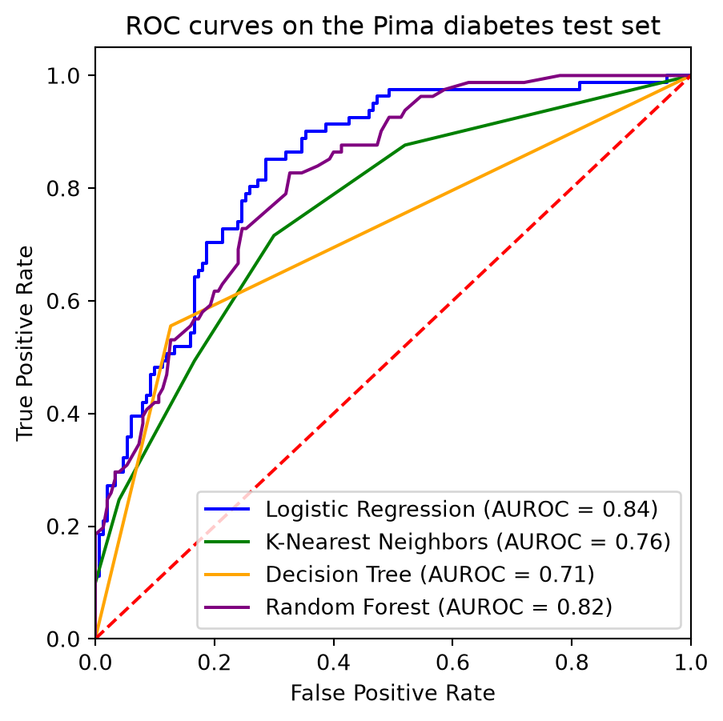](slides_files/figure-html/cell-51-output-1.png)

ROC curves provide a visual representation of a classifier’s performance across **all possible thresholds**. By plotting the True Positive Rate (TPR) against the False Positive Rate (FPR), they reveal the trade-off between sensitivity (recall) and specificity.

Unlike accuracy, an ROC curve summarizes score rankings across many thresholds. This worked example describes the fitted models on one held-out set. It is not a model-selection procedure. Lecture 8 separates validation from final testing.

## Footnotes

[^1]: The averaging step gives every class equal weight rather than weighting class-specific precision by class frequency.
