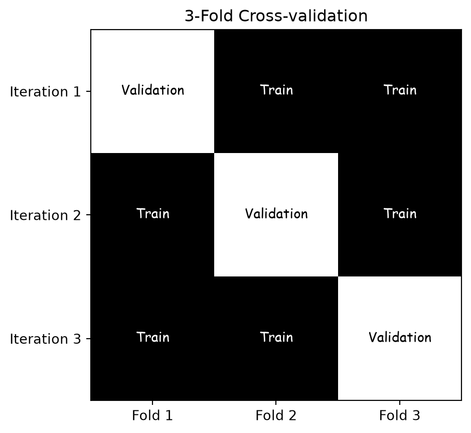
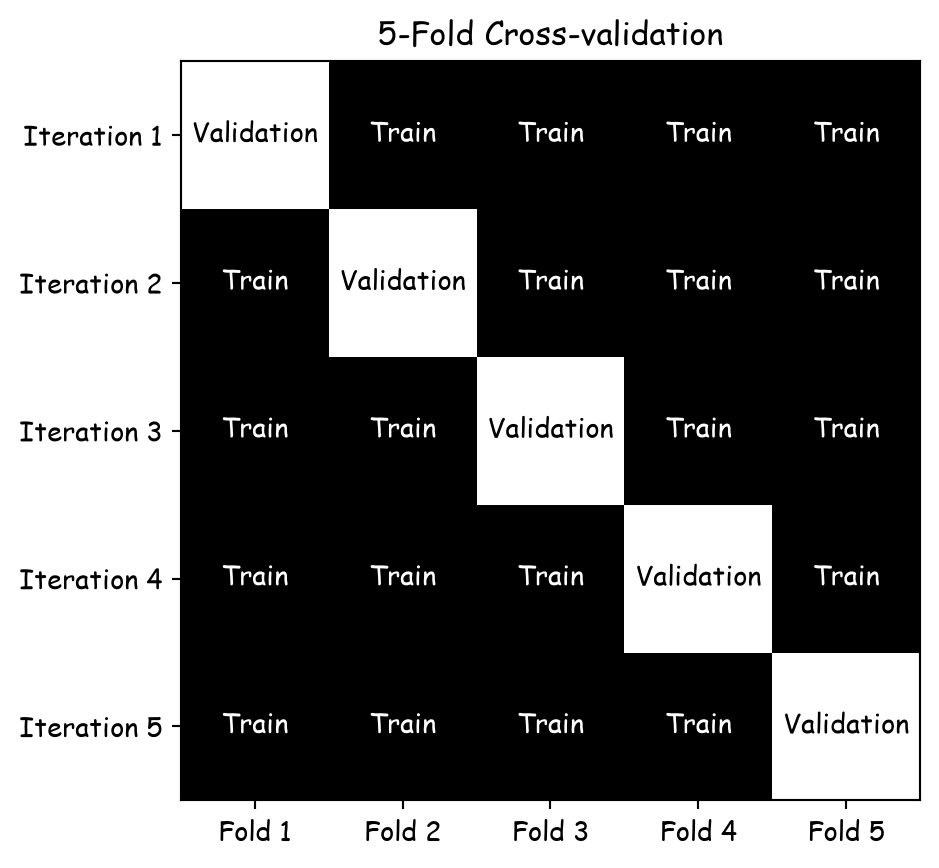

# Model Evaluation and Hyperparameter Tuning

CSI 4106 - Fall 2026

Author

Marcel Turcotte

Published

Version: Sep 23, 2026 16:48

# Preamble

## Message of the Day

[](https://static.wixstatic.com/media/a4c5cd_17f35b4279124d5a813dd3e3f61b4d5f~mv2.png/v1/fill/w_1960,h_1102,al_c,q_95,usm_0.66_1.00_0.01,enc_avif,quality_auto/ETH_Apertus_Keyvisual_Final-LY2-3.png)

[Apertus: a fully open, transparent, multilingual language model](https://ethz.ch/en/news-and-events/eth-news/news/2025/09/press-release-apertus-a-fully-open-transparent-multilingual-language-model.html), ETH Zürich, Press Release, 2025-09-02.

> EPFL, ETH Zurich and the Swiss National Supercomputing Centre (CSCS) released Apertus 2 September, Switzerland’s first large-scale, open, multilingual language model — a milestone in generative AI for transparency and diversity.

- [www.swiss-ai.org/apertus](https://www.swiss-ai.org/apertus)
- Downloads available at [Hugging Face](https://huggingface.co/collections/swiss-ai/apertus-llm-68b699e65415c231ace3b059)
- [Public access](https://publicai.co)

Should Canada undertake such an extensive project?

Canada is recognized for its exceptional AI research, supported by several renowned research institutions and scholars. Notable examples include:

- The [Vector Institute](https://vectorinstitute.ai/) in Toronto, which is home to distinguished researchers like [Geoffrey Hinton](https://vectorinstitute.ai/team/geoffrey-hinton/), a recipient of the 2018 Turing Award for his pioneering work in deep learning and the 2024 Nobel Prize in Physics.

- [Mila](https://mila.quebec/en) in Montréal, led by [Yoshua Bengio](https://mila.quebec/en/directory/yoshua-bengio), another 2018 Turing Award laureate recognized for his contributions to deep learning.

- The [Alberta Machine Intelligence Institute (Amii)](https://www.amii.ca), where [Richard S. Sutton](https://www.amii.ca/people/richard-s-sutton) is a key figure and was awarded the 2024 Turing Award for his influential work in reinforcement learning.

These institutions and individuals underscore Canada’s leadership and ongoing commitment to advancing artificial intelligence research.

The [Digital Research Alliance of Canada](https://www.alliancecan.ca/en), supported by a [\$2 billion commitment from the Government of Canada in 2024](https://ised-isde.canada.ca/site/ised/en/public-consultations/securing-canadas-ai-advantage-foundational-blueprint), provides cutting-edge infrastructure for advanced research. Notably, the high-performance computing resource, [Nibi](https://docs.alliancecan.ca/wiki/Nibi), was launched on July 31, 2025. It features 134,400 CPU cores and 288 NVIDIA H100 GPUs, significantly enhancing computational capacity. For further technical specifications, please refer to the [technical documentation](https://docs.alliancecan.ca/wiki/Technical_documentation).

## Learning Objectives

1.  **Understand the Purpose of Data Splitting:**
    - Describe the roles of the training, validation, and test sets in model evaluation.
    - Explain why and how datasets are divided for effective model training and evaluation.
2.  **Explain Cross-Validation Techniques:**
    - Define cross-validation and its importance in model evaluation.
    - Illustrate the process of k-fold cross-validation and its advantages over a single train-test split.
    - Discuss the concepts of underfitting and overfitting in the context of cross-validation.
3.  **Hyperparameter Tuning:**
    - Explain the difference between model parameters and hyperparameters.
    - Describe methods for tuning hyperparameters, including grid search and randomized search.
    - Implement hyperparameter tuning using `GridSearchCV` in scikit-learn.
4.  **Evaluate Model Performance:**
    - Interpret cross-validation results and understand metrics like mean and standard deviation of scores.
    - Discuss how cross-validation helps in assessing model generalization and reducing variability.
5.  **Machine Learning Engineering Workflow:**
    - Outline the steps involved in preparing data for machine learning models.
    - Utilize scikit-learn pipelines for efficient data preprocessing and model training.
    - Emphasize the significance of consistent data transformations across training and production environments.
6.  **Critical Evaluation of Machine Learning Models:**
    - Assess the limitations and challenges associated with hyperparameter tuning and model selection.
    - Recognize potential pitfalls in data preprocessing, such as incorrect handling of missing values or inconsistent encoding.
    - Advocate for thorough testing and validation to ensure model reliability and generalizability.
7.  **Integrate Knowledge in Practical Applications:**
    - Apply the learned concepts to real-world datasets (e.g., OpenML datasets like ‘diabetes’ and ‘adult’).
    - Interpret and analyze the results of model evaluations and experiments.
    - Develop a comprehensive understanding of the end-to-end machine learning pipeline.

The above learning objectives have been generated by OpenAI’s model, [o1](https://openai.com/index/introducing-openai-o1-preview/), based on the lecture content.

# Introduction

## Dataset - openml

> **NOTE:**
>
> OpenML is an open platform for sharing datasets, algorithms, and experiments - to learn how to learn better, together.

. . .

``` python
import numpy as np
np.random.seed(42)

from sklearn.datasets import fetch_openml

diabetes = fetch_openml(name='diabetes', version=1)
print(diabetes.DESCR)
```

**Author**: [Vincent Sigillito](vgs@aplcen.apl.jhu.edu)

**Source**: [Obtained from UCI](https://archive.ics.uci.edu/ml/datasets/pima+indians+diabetes)

**Please cite**: [UCI citation policy](https://archive.ics.uci.edu/ml/citation_policy.html)

1.  Title: Pima Indians Diabetes Database

2.  Sources:

    1.  Original owners: National Institute of Diabetes and Digestive and Kidney Diseases
    2.  Donor of database: Vincent Sigillito (vgs@aplcen.apl.jhu.edu) Research Center, RMI Group Leader Applied Physics Laboratory The Johns Hopkins University Johns Hopkins Road Laurel, MD 20707 (301) 953-6231
    3.  Date received: 9 May 1990

3.  Past Usage:

    1.  Smith,_(J.)W., Everhart,_(J.)E., Dickson,_(W.)C., Knowler,_(W.)C., & Johannes,_(R.)S. (1988). Using the ADAP learning algorithm to forecast the onset of diabetes mellitus. In {it Proceedings of the Symposium on Computer Applications and Medical Care} (pp. 261–265). IEEE Computer Society Press.

        The diagnostic, binary-valued variable investigated is whether the patient shows signs of diabetes according to World Health Organization criteria (i.e., if the 2 hour post-load plasma glucose was at least 200 mg/dl at any survey examination or if found during routine medical care). The population lives near Phoenix, Arizona, USA.

        Results: Their ADAP algorithm makes a real-valued prediction between 0 and 1. This was transformed into a binary decision using a cutoff of 0.448. Using 576 training instances, the sensitivity and specificity of their algorithm was 76% on the remaining 192 instances.

4.  Relevant Information: Several constraints were placed on the selection of these instances from a larger database. In particular, all patients here are females at least 21 years old of Pima Indian heritage. ADAP is an adaptive learning routine that generates and executes digital analogs of perceptron-like devices. It is a unique algorithm; see the paper for details.

5.  Number of Instances: 768

6.  Number of Attributes: 8 plus class

7.  For Each Attribute: (all numeric-valued)

    1.  Number of times pregnant
    2.  Plasma glucose concentration a 2 hours in an oral glucose tolerance test
    3.  Diastolic blood pressure (mm Hg)
    4.  Triceps skin fold thickness (mm)
    5.  2-Hour serum insulin (mu U/ml)
    6.  Body mass index (weight in kg/(height in m)^2)
    7.  Diabetes pedigree function
    8.  Age (years)
    9.  Class variable (0 or 1)

8.  Missing Attribute Values: None

9.  Class Distribution: (class value 1 is interpreted as “tested positive for diabetes”)

    Class Value Number of instances 0 500 1 268

10. Brief statistical analysis:

    Attribute number: Mean: Standard Deviation:

    1.                      3.8     3.4

    2.                    120.9    32.0

    3.                     69.1    19.4

    4.                     20.5    16.0

    5.                     79.8   115.2

    6.                     32.0     7.9

    7.                      0.5     0.3

    8.                     33.2    11.8

Relabeled values in attribute ‘class’ From: 0 To: tested_negative\
From: 1 To: tested_positive

Downloaded from openml.org.

Today’s dataset is the PIMA dataset, which contains 768 instances and 8 numerical attributes. The numerical nature of these attributes facilitates our analysis. Additionally, since the data originates from a published paper, it likely reflects careful data collection, potentially leading to robust results, as the authors would have needed high-quality data to support their publication.

## Dataset - `return_X_y`

`fetch_openml` returns a `Bunch`, a `DataFrame`, or `X` and `y`

``` python
from sklearn.datasets import fetch_openml

X, y = fetch_openml(name='diabetes', version=1, return_X_y=True)
```

. . .

Mild imbalance (ratio less than 3 or 4)

``` python
print(y.value_counts())
```

    class
    tested_negative    500
    tested_positive    268
    Name: count, dtype: int64

. . .

Converting the target labels to 0 and 1

``` python
y = y.map({'tested_negative': 0, 'tested_positive': 1})
```

# Cross-evaluation

## Training and test set

Sometimes called **holdout method**.

- **Guideline:** Typically, allocate **80%** of your dataset for **training** and reserve the remaining **20%** for testing.

- **Training Set:** This subset of data is utilized to **train** your model.

- **Test Set:** This is an **independent** subset used exclusively at the final stage to assess the model’s performance.

### Common Training and Testing Ratios

1.  **80:20 Split:**
    - **Training Set:** 80% of the data
    - **Testing Set:** 20% of the data
    - This is a widely used default split that provides a balance between having enough data to train the model and enough data to evaluate its performance.
2.  **90:10 Split:**
    - **Training Set:** 90% of the data
    - **Testing Set:** 10% of the data
    - This split might be used when the dataset is very large, ensuring a substantial amount of data for training while still having a decent-sized test set.

### Considerations for Choosing the Split Ratio

1.  **Dataset Size:**
    - For large datasets, a smaller proportion can be reserved for testing (e.g., 90:10) since even 10% of a large dataset can provide a robust evaluation.
2.  **Model Complexity:**
    - Complex models with many parameters may require more training data to avoid overfitting, suggesting a larger training set.
3.  **Validation Set:**
    - See discussion below.
4.  **Imbalanced Datasets:**
    - For imbalanced datasets, it’s essential to ensure that both the training and testing sets represent the class distribution adequately. **Stratified sampling can be used to maintain the class proportions in both sets.**

## Training and test set

**Training Error:**

- Generally tends to be **low**
- Achieved by optimizing learning algorithms to minimize error through parameter adjustments (e.g., weights)

## Training and test set

**Generalization Error:** The error rate observed when the model is evaluated on new, unseen data.

## Training and test set

**Underfitting:**

- **High training error**
- Model is too simple to capture underlying patterns
- Poor performance on both training and new data

**Overfitting:**

- Low training error, but **high generalization error**
- Model captures noise or irrelevant patterns
- Poor performance on new, unseen data

## Definition

**Cross-validation** is a method used to evaluate and improve the performance of machine learning models.

It involves partitioning the dataset into multiple subsets, **training the model on some subsets** while **validating it on the remaining ones**.

## k-fold cross-validation

1.  **Divide** the dataset into **k equally sized parts** (folds).
2.  T**raining and validation:**
    - For each iteration, **one fold is used as the validation set**, the remaining **k-1 folds are used as the training set**.
3.  **Evaluation:** The model’s performance is evaluated in each iteration, resulting in k performance measures.
4.  **Aggregation:** Statistics are calculated based on k performance measures.

Common choices for the value of k are 3, 5, 7, and 10.

In science, to estimate the value of a constant, it is common to repeat the experiment multiple times in order to calculate the mean and standard deviation of the obtained measurements. A high variance raises questions about the reliability of the experiment. Similarly, **k-fold cross-validation** generates k distinct evaluations. This method not only provides a more accurate estimate of the model’s performance but also assesses its robustness against data variability.

## 3-Fold Cross-validation

[](slides_files/figure-html/cell-7-output-1.png)

With each iteration, 2/3 of the dataset is used for training and 1/3 for validation.

Each row of the table represents an iteration within the k-fold cross-validation process, with the number of iterations equating to the number of folds. In each iteration, one fold is designated for validation, while the remaining k-1 folds are utilized for training the model.

## 5-Fold Cross-validation

[](slides_files/figure-html/cell-8-output-1.png)

With each iteration, 4/5 of the dataset is used for training and 1/5 for validation.

## More Reliable Model Evaluation

- More **reliable** estimate of model performance compared to a single train-test split.
- **Reduces the variability** associated with a single split, leading to a **more stable and unbiased evaluation**.
- For large values of k[^1], consider the **average**, **variance**, and **confidence interval**.

## Better Generalization

- Helps in assessing how the model **generalizes** to an independent dataset.
- It ensures that the model’s performance is not overly **optimistic** or **pessimistic** by averaging results over multiple folds.

## Efficient Use of Data

- **Particularly beneficial for small datasets**, cross-validation ensures that every data point is used for both training and validation.
- This **maximizes the use of available data**, leading to more accurate and reliable model training.

Some examples are more informative for learning algorithms, sometimes those near the decision boundary.

## Hyperparameter Tuning

- Commonly used during **hyperparameter tuning**, allowing for the **selection of the best model parameters** based on their performance across multiple folds.
- This helps in identifying the **optimal** configuration that balances **bias** and **variance**.

## Challenges

- **Computational Cost**: Requires multiple model trainings.
  - **Leave-One-Out** (LOO): Extreme case where ( k = N ).
- **Class Imbalance**: Folds may not represent minority classes.
  - Use **Stratified Cross-Validation** to maintain class proportions.
- **Complexity**: Error-prone implementation, especially for **nested cross-validation**, **bootstraps**, or integration into larger pipelines.

Leave-one-out cross-validation (LOO-CV) can lead to overoptimistic performance evaluation, particularly in certain contexts.

Here’s why:

    1.  **High Variance**: In LOO-CV, each iteration uses almost all the data for training, leaving only one instance for testing. This can result in high variance in the test error across iterations because the model is trained on nearly the full dataset. Since each training set is very similar to the full dataset, it can lead to overly optimistic estimates of generalization error, especially when the dataset is small or the model has high variance (e.g., decision trees or k-nearest neighbors).
    2.  **Overfitting**: Since LOO-CV uses nearly the entire dataset for training in each iteration, complex models (especially ones prone to overfitting) can fit very closely to the data, which might result in a low training error but a misleadingly low test error in some cases.
    3.  **Limited assessment of generalization**: LOO-CV might not give a reliable estimate of how well the model generalizes to completely unseen data because the difference between the training set and the full dataset is minimal, leading to a smaller gap between training and test performance.

In practice, this can make the evaluation appear more optimistic than it would be with more robust methods like k-fold cross-validation, where the test sets are larger, and the model has less opportunity to overfit the training data.

**Stratified (in cross-validation)**: a sampling strategy where each fold preserves the class distribution of the full dataset, ensuring that every class is represented proportionally in both training and validation splits.

## `cross_val_score`

``` python
from sklearn import tree

clf = tree.DecisionTreeClassifier()

from sklearn.model_selection import cross_val_score    

clf_scores = cross_val_score(clf, X, y, cv=5)

print("\nScores:", clf_scores)
print(f"\nMean: {clf_scores.mean():.2f}")
print(f"\nStandard deviation: {clf_scores.std():.2f}")
```

    Scores: [0.71428571 0.66883117 0.71428571 0.79738562 0.73202614]

    Mean: 0.73

    Standard deviation: 0.04

[sklearn.model_selection.cross_val_score](https://scikit-learn.org/stable/modules/generated/sklearn.model_selection.cross_val_score.html), see also [cross_validate](https://scikit-learn.org/stable/modules/generated/sklearn.model_selection.cross_validate.html#sklearn.model_selection.cross_validate).

As previously discussed, a significant limitation of decision trees is their propensity for overfitting, which leads to high variance when applied to new datasets. This issue is evident in the observed performance variability, with accuracy ranging from 67% to 79%, which is undesirable for achieving robust model generalization.

# Hyperparameter tuning

## Workflow

[](https://scikit-learn.org/stable/_images/grid_search_workflow.png)

**Attribution**: [Cross-validation: evaluating estimator performance](https://scikit-learn.org/stable/modules/cross_validation.html#cross-validation)

The above image implicitly introduces three categories of data subsets: **training**, **validation**, and **test**.

## Workflow - implementation

``` python
from sklearn.datasets import fetch_openml

X, y = fetch_openml(name='diabetes', version=1, return_X_y=True)

y = y.map({'tested_negative': 0, 'tested_positive': 1})

from sklearn.model_selection import train_test_split

X_train, X_test, y_train, y_test = train_test_split(X, y, test_size=0.1)
```

To maintain simplicity in these lecture notes, we have not applied any pre-processing steps.

## Definition

A **hyperparameter** is a configuration **external to the model** that is **set prior to the training process** and governs the learning process, influencing model performance and complexity.

The **weights of a model**, which are learned by the learning algorithm, are often referred to as the **model’s parameters**. To avoid confusion, **user-defined parameters**, such as the learning rate \alpha, are termed **hyperparameters**. Unlike model parameters, hyperparameters are *not* learned by the learning algorithm.

## Hyperparameters - Decision Tree

- `criterion`: `gini`, `entropy`, `log_loss`, measure the quality of a split.
- `max_depth`: limits the **number of levels** in the tree to prevent overfitting.

**See**: [DecisionTreeClassifier](https://scikit-learn.org/dev/modules/generated/sklearn.tree.DecisionTreeClassifier.html)

## Hyperparameters - Logistic Regression

- `penalty`: `l1` or `l2`, helps in preventing overfitting.
- `solver`: `liblinear`, `newton-cg`, `lbfgs`, `sag`, `saga`.
- `max_iter`: maximum number of iterations taken for the solvers to converge.
- `tol`: stopping criteria, smaller values mean higher precision.

**See**: [LogisticRegression](https://scikit-learn.org/1.5/modules/generated/sklearn.linear_model.LogisticRegression.html) and [SGDClassifier](https://scikit-learn.org/1.5/modules/generated/sklearn.linear_model.SGDClassifier.html).

## Hyperparameters - KNN

- `n_neighbors`: number of neighbors to use for k-neighbors queries.
- `weights`: `uniform` or `distance`, equal weight or distance-based weight.

**See**: [KNeighborsClassifier](https://scikit-learn.org/dev/modules/generated/sklearn.neighbors.KNeighborsClassifier.html)

## Experiment: `max_depth`

``` python
for value in [3, 5, 7, None]:

  clf = tree.DecisionTreeClassifier(max_depth=value)

  clf_scores = cross_val_score(clf, X_train, y_train, cv=10)

  print("\nmax_depth = ", value)
  print(f"Mean: {clf_scores.mean():.2f}")
  print(f"Standard deviation: {clf_scores.std():.2f}")
```

    max_depth =  3
    Mean: 0.74
    Standard deviation: 0.04

    max_depth =  5
    Mean: 0.76
    Standard deviation: 0.04

    max_depth =  7
    Mean: 0.73
    Standard deviation: 0.04

    max_depth =  None
    Mean: 0.71
    Standard deviation: 0.05

## Experiment: `criterion`

``` python
for value in ["gini", "entropy", "log_loss"]:

  clf = tree.DecisionTreeClassifier(max_depth=5, criterion=value)

  clf_scores = cross_val_score(clf, X_train, y_train, cv=10)

  print("\ncriterion = ", value)
  print(f"Mean: {clf_scores.mean():.2f}")
  print(f"Standard deviation: {clf_scores.std():.2f}")
```

    criterion =  gini
    Mean: 0.76
    Standard deviation: 0.04

    criterion =  entropy
    Mean: 0.75
    Standard deviation: 0.05

    criterion =  log_loss
    Mean: 0.75
    Standard deviation: 0.05

For this specific problem and dataset, the `criterion` parameter has a limited impact on the learning process.

## Experiment: `n_neighbors`

``` python
from sklearn.neighbors import KNeighborsClassifier

for value in range(1, 11):

  clf = KNeighborsClassifier(n_neighbors=value)

  clf_scores = cross_val_score(clf, X_train, y_train, cv=10)

  print("\nn_neighbors = ", value)
  print(f"Mean: {clf_scores.mean():.2f}")
  print(f"Standard deviation: {clf_scores.std():.2f}")
```

    n_neighbors =  1
    Mean: 0.67
    Standard deviation: 0.05

    n_neighbors =  2
    Mean: 0.71
    Standard deviation: 0.03

    n_neighbors =  3
    Mean: 0.69
    Standard deviation: 0.05

    n_neighbors =  4
    Mean: 0.73
    Standard deviation: 0.03

    n_neighbors =  5
    Mean: 0.72
    Standard deviation: 0.03

    n_neighbors =  6
    Mean: 0.73
    Standard deviation: 0.05

    n_neighbors =  7
    Mean: 0.74
    Standard deviation: 0.04

    n_neighbors =  8
    Mean: 0.75
    Standard deviation: 0.04

    n_neighbors =  9
    Mean: 0.73
    Standard deviation: 0.05

    n_neighbors =  10
    Mean: 0.73
    Standard deviation: 0.04

## Experiment: `weights`

``` python
from sklearn.neighbors import KNeighborsClassifier

for value in ["uniform", "distance"]:

  clf = KNeighborsClassifier(n_neighbors=5, weights=value)

  clf_scores = cross_val_score(clf, X_train, y_train, cv=10)

  print("\nweights = ", value)
  print(f"Mean: {clf_scores.mean():.2f}")
  print(f"Standard deviation: {clf_scores.std():.2f}")
```

    weights =  uniform
    Mean: 0.72
    Standard deviation: 0.03

    weights =  distance
    Mean: 0.73
    Standard deviation: 0.04

For this specific problem and dataset, the `weights` parameter has a limited impact on the learning process.

At this point, you might hypothesize that certain combinations of hyperparameters could be more optimal than others.

## Hyperparameter Tuning: Grid Search

- **Many hyperparameters** need tuning

  - Major **disadvantage** of ML algorithms

- **Manual exploration** of combinations is tedious

- **Grid search** is more systematic

  1.  **Enumerate all** possible hyperparameter combinations

  2.  Train on training set, evaluate on validation set

**Initially**, try powers of 2 or 10. Next, **refine** with grid search near optimal values if time permits.

The **training set** referred to here is **different** from the one previously mentioned. In each iteration of the k-fold cross-validation process, a **unique** **training** and **validation set** is created.

In some contexts, the **choice of the model** itself can be considered a hyperparameter. For instance, when performing model selection within a machine learning pipeline, different algorithms (e.g., decision trees, support vector machines, neural networks) can be treated as hyperparameters. This approach allows for the selection of the best-performing model through automated processes such as grid search or random search, alongside the tuning of other hyperparameters.

Thus, while traditionally hyperparameters refer to settings within a specific model, the model choice can also be incorporated into hyperparameter optimization frameworks.

As will be discussed later, the choice of the **number of layers** and the **number of nodes** are often considered hyperparameters when training **deep learning** algorithms.

## `GridSearchCV`

``` python
from sklearn.model_selection import GridSearchCV

param_grid = [
  {'max_depth': range(1, 10),
   'criterion': ["gini", "entropy", "log_loss"]}
]

clf = tree.DecisionTreeClassifier()

grid_search = GridSearchCV(clf, param_grid, cv=5)

grid_search.fit(X_train, y_train)

(grid_search.best_params_, grid_search.best_score_)
```

    ({'criterion': 'gini', 'max_depth': 5}, np.float64(0.7481910124074653))

## GridSearchCV

``` python
param_grid = [
  {'n_neighbors': range(1, 15),
   'weights': ["uniform", "distance"]}
]

clf = KNeighborsClassifier()

grid_search = GridSearchCV(clf, param_grid, cv=5)

grid_search.fit(X_train, y_train)

(grid_search.best_params_, grid_search.best_score_)
```

    ({'n_neighbors': 14, 'weights': 'uniform'}, np.float64(0.7554165363361485))

The variable `param_grid` contains a dictionary specifying the names of the parameters to be tuned, along with the respective values to be tested.

In this instance, the parameters `n_neighbors` and `weights` are being tuned. However, additional parameters could be included if necessary.

## `GridSearchCV`

``` python
from sklearn.linear_model import LogisticRegression

# 2 * 5 * 5 * 3 = 150 tests!

param_grid = [
  {'penalty': ["l1", "l2", None],
   'solver' : ['liblinear', 'newton-cg', 'lbfgs', 'sag', 'saga'],
   'max_iter' : [100, 200, 400, 800, 1600],
   'tol' : [0.01, 0.001, 0.0001]}
]

clf = LogisticRegression()

grid_search = GridSearchCV(clf, param_grid, cv=5)

grid_search.fit(X_train, y_train)

(grid_search.best_params_, grid_search.best_score_)
```

    ({'max_iter': 100, 'penalty': 'l2', 'solver': 'newton-cg', 'tol': 0.001},
     np.float64(0.7756646856427901))

## Randomized Search

- **Large number of combinations** (many hyperparameters, many values)
- Use **RandomizedSearchCV**:
  - Supply **list of values** or **probability distribution** for hyperparameters
  - Specify **number of iterations** (combinations to try)
  - Predictable **execution time**

**See**: [Comparing randomized search and grid search for hyperparameter estimation](https://scikit-learn.org/stable/auto_examples/model_selection/plot_randomized_search.html).

## Workflow

[](https://scikit-learn.org/stable/_images/grid_search_workflow.png)

**Attribution**: [Cross-validation: evaluating estimator performance](https://scikit-learn.org/stable/modules/cross_validation.html#cross-validation)

As the ongoing example illustrates, in addition to evaluating various hyperparameter values, multiple models can also be tested.

## Finally, we proceed with testing

``` python
clf = LogisticRegression(max_iter=100, penalty='l2', solver='newton-cg', tol=0.001)

clf.fit(X_train, y_train)

y_pred = clf.predict(X_test)

from sklearn.metrics import classification_report

print(classification_report(y_test, y_pred))
```

                  precision    recall  f1-score   support

               0       0.83      0.83      0.83        52
               1       0.64      0.64      0.64        25

        accuracy                           0.77        77
       macro avg       0.73      0.73      0.73        77
    weighted avg       0.77      0.77      0.77        77

It appears that we are facing a **class imbalance issue**, which should have been identified earlier in our workflow!

# Prologue

## Summary

- **Training Set Size**: Impact on model efficacy and generalization.
- **Attribute Encoding**: Evaluation of techniques to capture biological phenomena.
- **Preprocessing**:
  - Data Scaling
  - Handling Missing Values
  - Managing Class Imbalance

## Next lecture

- We will further discuss machine learning engineering.

## References

Russell, Stuart, and Peter Norvig. 2020. *Artificial Intelligence: A Modern Approach*. 4th ed. Pearson. <http://aima.cs.berkeley.edu/>.

------------------------------------------------------------------------

Marcel **Turcotte**

School of Electrical Engineering and **Computer Science** (EE**CS**)

University of Ottawa

## Footnotes

[^1]: 10-fold cross-validation.
