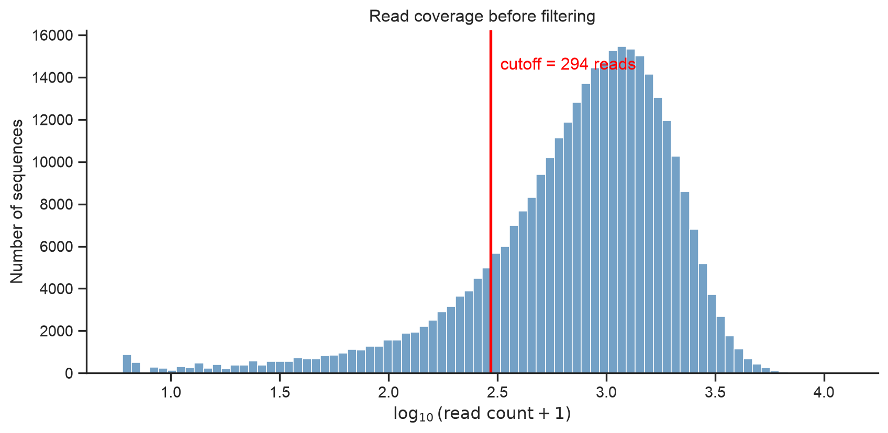
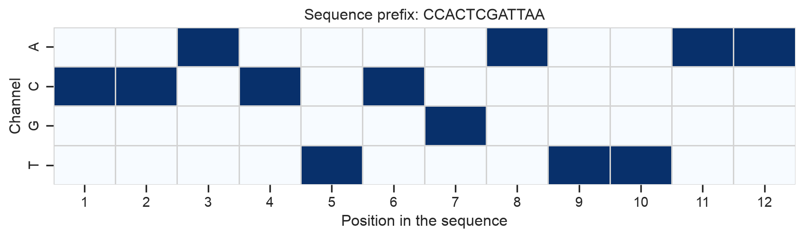
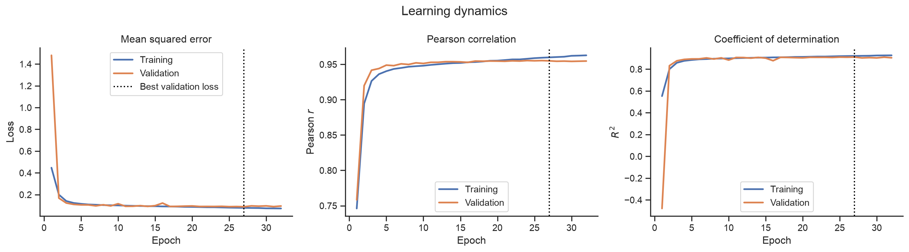
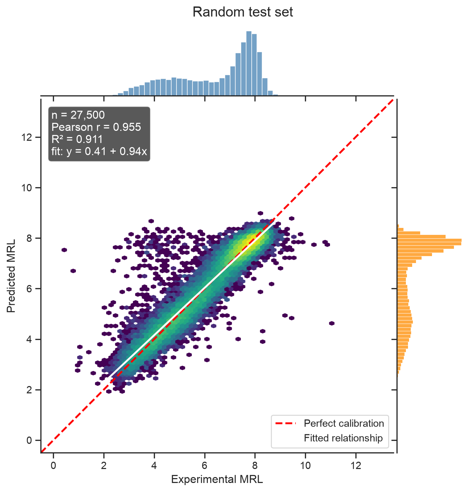
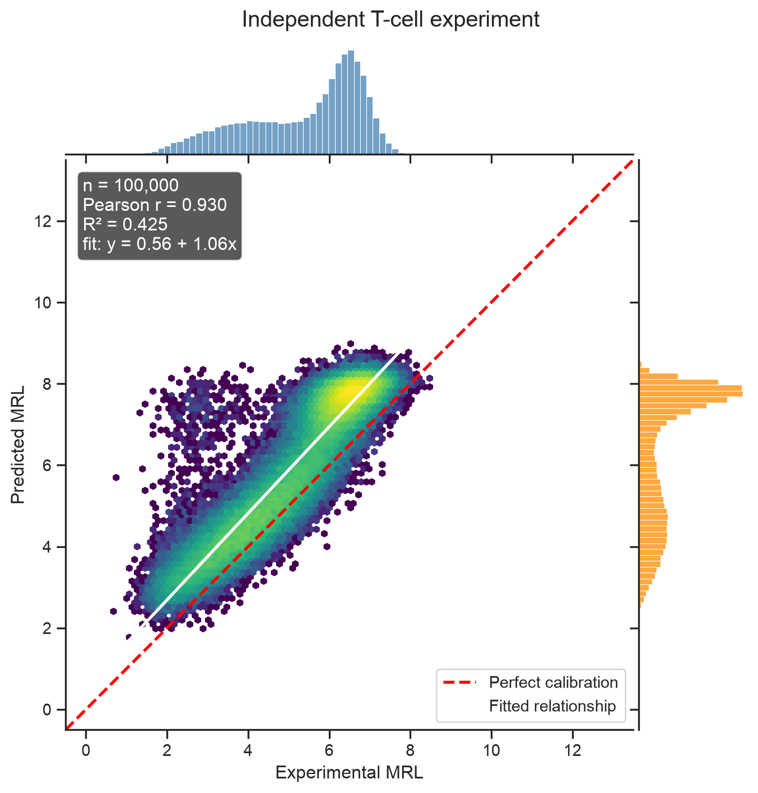
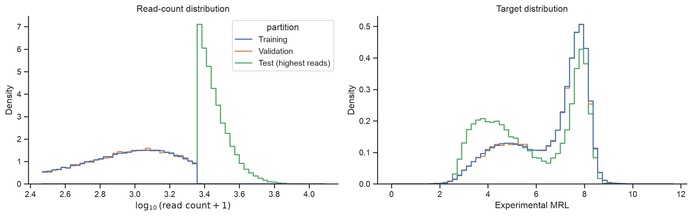
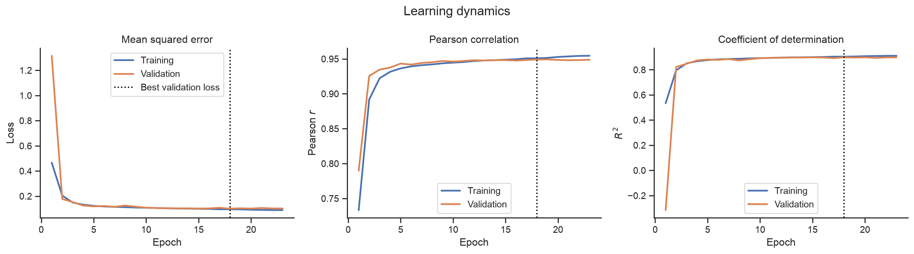
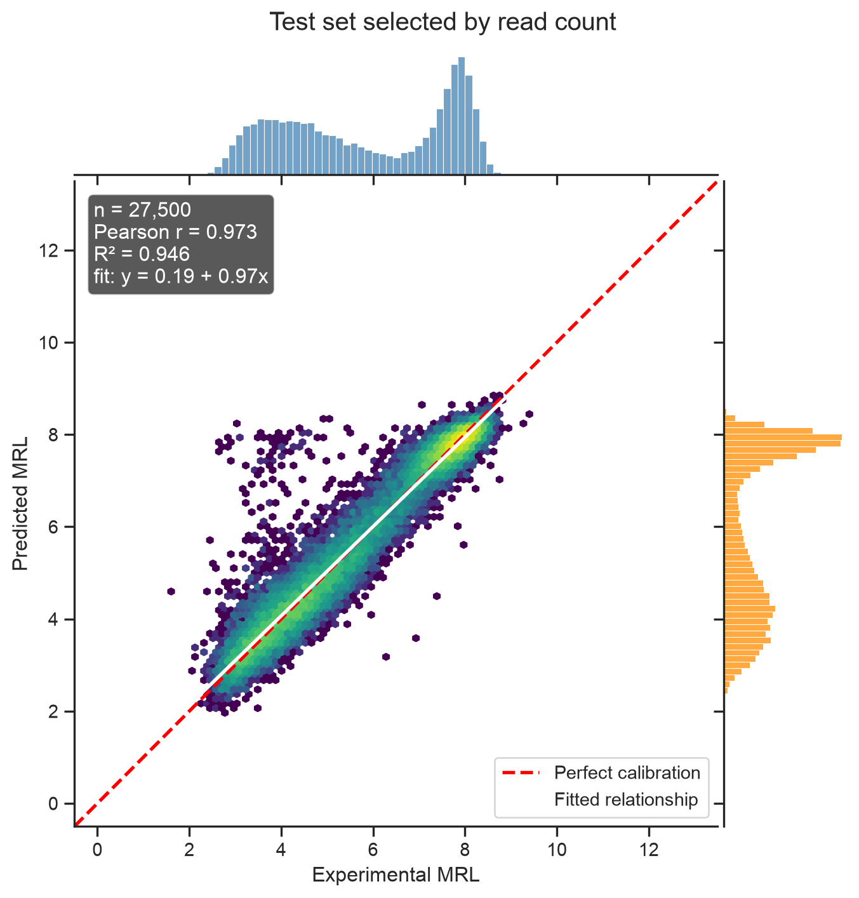
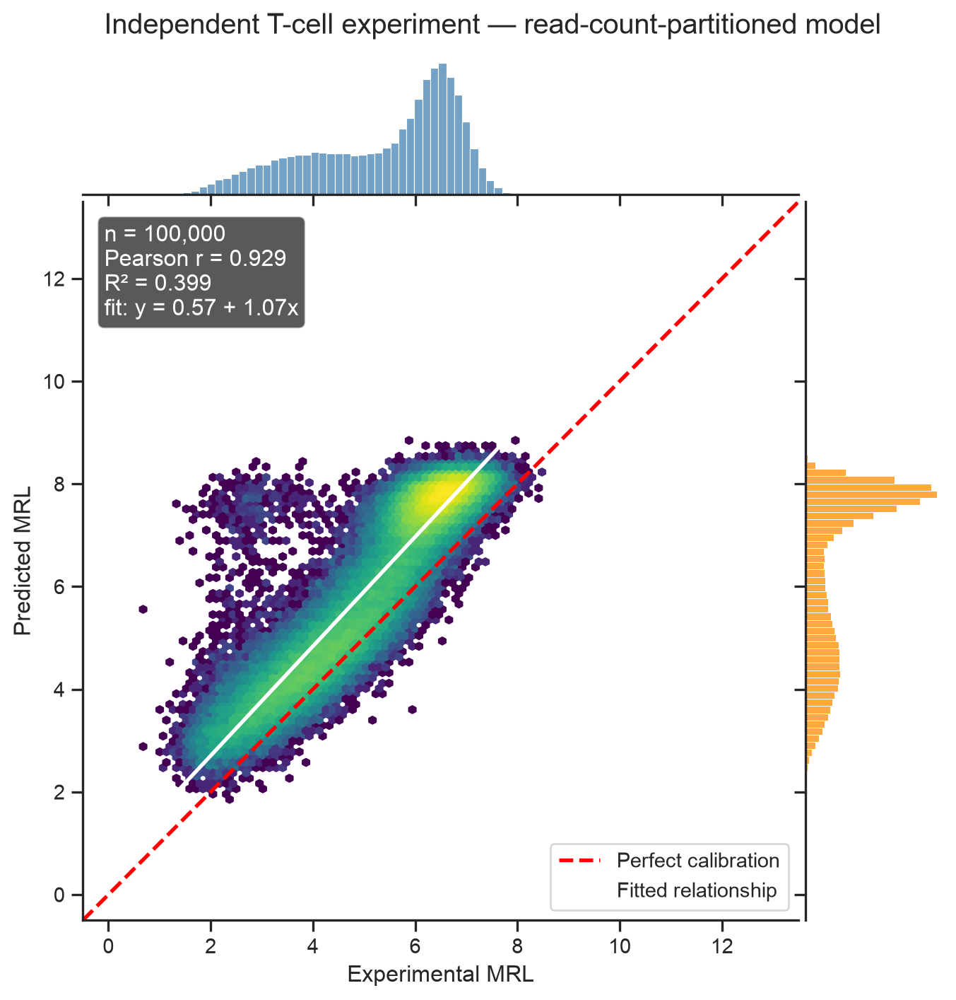

# Predicting Mean Ribosome Load with a 1D Convolutional Neural Network

CSI 4106 — Introduction to Artificial Intelligence (PyTorch backend)

Author

Marcel Turcotte

Published

Version: Aug 31, 2026 21:13

# 1 Introduction

Convolutional neural networks are most often introduced using images. Images provide compelling visual examples, but training image classifiers can require substantial computational resources. In this notebook, we study a smaller one-dimensional problem for which convolution is equally natural.

Our machine-learning task can be stated without biological prerequisites:

> Given a string of length 50 over the alphabet `{A, C, G, T}`, predict a continuous value that usually lies between 0 and 13.

The strings are 5′ untranslated regions (5′ UTRs), and the target is the mean ribosome load (MRL). A 5′ UTR is a segment of an RNA molecule that precedes the protein-coding region. MRL summarizes how many ribosomes are associated with the RNA and therefore provides an experimental measure related to translation.

The experiment is adapted from Sample et al. and incorporates architectural ideas used in later work, including Tang et al. Our partitioning strategy is deliberately different. After removing low-coverage measurements, we randomly partition the data so that the test set is drawn from the same filtered population as the training set.

> **NOTE:**
>
> A short convolutional kernel examines a local substring at every position. The same learned weights are reused across the entire sequence. This gives a 1D CNN the same two important inductive biases as an image CNN: **local connectivity** and **parameter sharing**.

## 1.1 Learning objectives

By the end of this notebook, you should be able to:

- represent fixed-length strings as numeric tensors using one-hot encoding;
- explain how a `Conv1D` layer processes a sequence;
- distinguish training, validation, and test data;
- use early stopping to control neural-network training;
- interpret loss, Pearson correlation, and \\R^2\\ learning curves; and
- explain how predictions can be highly correlated with observations while remaining poorly calibrated.

# 2 Preparation

We use Keras with PyTorch as its backend. NumPy and pandas support data processing, while Matplotlib and seaborn support visualization. Scikit-learn and SciPy provide familiar preprocessing and evaluation functions.

The `csi4106-pytorch` Jupyter kernel sets `KERAS_BACKEND="torch"` before Python starts. This is important because Keras selects its backend when the package is first imported. Keeping the setting in the kernel specification also confines it to this isolated environment; it does not change the backend used by other notebooks.

``` python
from contextlib import redirect_stderr, redirect_stdout
from io import StringIO
from pathlib import Path

import numpy as np
import pandas as pd

import matplotlib.pyplot as plt
import seaborn as sns

from scipy.stats import pearsonr, spearmanr
from sklearn.metrics import mean_squared_error, r2_score
from sklearn.preprocessing import StandardScaler

import torch
import keras
from keras import callbacks, layers, ops
```

All important choices are collected in one configuration cell. Keeping these values together makes the experiment easier to inspect and reproduce.

``` python
SEED = 42
SEQUENCE_LENGTH = 50

N_RETAINED = 275_000
N_TRAIN = 220_000
N_VALIDATION = 27_500
N_TEST = 27_500

BATCH_SIZE = 512
MAX_EPOCHS = 50
PATIENCE = 5

# Shared limits make the two prediction plots directly comparable.
MRL_PLOT_LIMITS = (-0.5, 13.5)

DATA_DIR = Path("data")
MODEL_DIR = Path("models") / "pytorch"
DATA_DIR.mkdir(exist_ok=True)
MODEL_DIR.mkdir(parents=True, exist_ok=True)

DATASETS = {
    "GSM3130435_egfp_unmod_1.csv.gz": (
        "https://ftp.ncbi.nlm.nih.gov/geo/samples/GSM3130nnn/"
        "GSM3130435/suppl/GSM3130435_egfp_unmod_1.csv.gz"
    ),
    "GSE232927_processed_defined_end_tcell_r1.csv.gz": (
        "https://ftp.ncbi.nlm.nih.gov/geo/series/GSE232nnn/"
        "GSE232927/suppl/"
        "GSE232927_processed_defined_end_tcell_r1.csv.gz"
    ),
    "GSE232927_processed_defined_end_tcell_r2.csv.gz": (
        "https://ftp.ncbi.nlm.nih.gov/geo/series/GSE232nnn/"
        "GSE232927/suppl/"
        "GSE232927_processed_defined_end_tcell_r2.csv.gz"
    ),
}

assert N_TRAIN + N_VALIDATION + N_TEST == N_RETAINED

keras.utils.set_random_seed(SEED)
sns.set_theme(style="ticks", context="notebook")

if keras.backend.backend() != "torch":
    raise RuntimeError(
        "This notebook requires the Keras PyTorch backend. "
        "Select the csi4106-pytorch Jupyter kernel and restart."
    )

# A Keras tensor reveals the device selected by the PyTorch backend.
device_description = str(ops.ones((1,)).device)
print(
    f"Keras {keras.__version__}; PyTorch {torch.__version__}; "
    f"training device: {device_description}"
)
```

    Keras 3.15.1; PyTorch 2.13.0; training device: mps:0

On Apple hardware, current Keras versions select the PyTorch MPS device when it is available. The kernel may also set `PYTORCH_ENABLE_MPS_FALLBACK=1`, allowing operations unsupported by MPS to run on the CPU. This improves compatibility, although frequent fallbacks can reduce performance.

The helper below downloads a dataset only when it is not already available. `keras.utils.get_file` also returns the local path, which we can pass directly to pandas. Its progress display is suppressed by default because terminal control characters can produce long outputs in a rendered notebook. Passing `show_progress=True` restores the interactive progress bar.

``` python
def download_dataset(filename, show_progress=False):
    """Download one of the configured datasets and return its local path."""
    if filename not in DATASETS:
        raise KeyError(f"Unknown dataset: {filename}")

    arguments = {
        "fname": filename,
        "origin": DATASETS[filename],
        "cache_dir": str(Path.cwd()),
        "cache_subdir": str(DATA_DIR),
    }

    if show_progress:
        path = keras.utils.get_file(**arguments)
    else:
        with redirect_stdout(StringIO()), redirect_stderr(StringIO()):
            path = keras.utils.get_file(**arguments)

    return Path(path)
```

# 3 Loading and validating the main dataset

The source files use slightly different column names. We standardize them at the boundary of our program so that all subsequent functions can use the same simple vocabulary: `utr`, `mrl`, and `read_count`.

``` python
def load_utr_dataset(path, expected_length=SEQUENCE_LENGTH):
    """Load and validate a processed UTR dataset.

    The returned DataFrame always contains the columns ``utr``, ``mrl``, and
    ``read_count``.
    """
    data = pd.read_csv(path)

    if "utr" not in data.columns and "UTR" in data.columns:
        data = data.rename(columns={"UTR": "utr"})

    if "total_reads" in data.columns:
        read_column = "total_reads"
    elif "total" in data.columns:
        read_column = "total"
    else:
        raise ValueError("The dataset has no total_reads or total column.")

    required = {"utr", "rl", read_column}
    missing = required.difference(data.columns)
    if missing:
        raise ValueError(f"Missing required columns: {sorted(missing)}")

    data = (
        data.loc[:, ["utr", "rl", read_column]]
        .rename(columns={"rl": "mrl", read_column: "read_count"})
        .copy()
    )

    data["utr"] = data["utr"].astype("string").str.upper()
    data["mrl"] = pd.to_numeric(data["mrl"], errors="coerce")
    data["read_count"] = pd.to_numeric(
        data["read_count"], errors="coerce"
    )

    if data[["utr", "mrl", "read_count"]].isna().any().any():
        raise ValueError("Missing or non-numeric values were found.")

    valid_sequence = data["utr"].str.fullmatch(
        rf"[ACGTN]{{{expected_length}}}"
    )
    if not valid_sequence.all():
        n_invalid = int((~valid_sequence).sum())
        raise ValueError(
            f"Found {n_invalid} sequences that are not length "
            f"{expected_length} strings over A, C, G, T, and N."
        )

    if (data["read_count"] < 0).any():
        raise ValueError("Read counts must be non-negative.")

    if data["utr"].duplicated().any():
        raise ValueError("The dataset contains duplicate UTR sequences.")

    return data.reset_index(drop=True)
```

``` python
main_path = download_dataset("GSM3130435_egfp_unmod_1.csv.gz")
main_data = load_utr_dataset(main_path)

print(f"Loaded {len(main_data):,} sequences.")
main_data.head()
```

    Loaded 326,033 sequences.

|     | utr                                               | mrl      | read_count |
|-----|---------------------------------------------------|----------|------------|
| 0   | CCACTCGATTAACATGTTAACAACATACTCGTCCGGCCGATCAGCG... | 3.039939 | 12126.0    |
| 1   | CAAATCATGTGCAGCCCTGGCGACCGTACTGCGGTACAAGAAAGTA... | 3.895109 | 10368.0    |
| 2   | GTTATACTAGAAGAAACTTGAGATTATGGAGCAGTCCGTCAAGGAC... | 3.334524 | 9963.0     |
| 3   | CTTAGACAAAAACAACGCGCTTTCCAGTATGCGGAGCCTTGACGGT... | 3.575082 | 9934.0     |
| 4   | GTATCAAATCACGGCCAACCCGACGGAGTACCCCGCGTCGATGGTC... | 4.593712 | 9511.0     |

The target and read counts are measured on very different scales. A compact summary gives us an initial view of both variables.

``` python
main_data[["mrl", "read_count"]].describe(
    percentiles=[0.01, 0.25, 0.50, 0.75, 0.99]
).round(3)
```

|       | mrl        | read_count |
|-------|------------|------------|
| count | 326033.000 | 326033.000 |
| mean  | 6.449      | 1068.042   |
| std   | 1.749      | 825.737    |
| min   | 0.000      | 5.000      |
| 1%    | 2.081      | 14.000     |
| 25%   | 5.082      | 453.000    |
| 50%   | 7.090      | 890.000    |
| 75%   | 7.807      | 1488.000   |
| 99%   | 9.109      | 3735.000   |
| max   | 13.000     | 12126.000  |

# 4 Filtering measurements by read count

Measurements based on very few reads are less precise. We therefore retain exactly the 275,000 sequences with the highest read counts.

``` python
def select_top_by_reads(data, n):
    """Return the n highest-read rows and the read count at the boundary."""
    if not 0 < n <= len(data):
        raise ValueError("n must be between 1 and the number of rows.")

    ranked = data.sort_values(
        "read_count", ascending=False, kind="stable"
    ).reset_index(drop=True)
    cutoff = float(ranked.loc[n - 1, "read_count"])
    return ranked.iloc[:n].copy(), cutoff


retained_data, read_cutoff = select_top_by_reads(main_data, N_RETAINED)
retained_fraction = N_RETAINED / len(main_data)

print(f"Read-count boundary: {read_cutoff:,.0f}")
print(f"Retained: {N_RETAINED:,} sequences ({retained_fraction:.1%})")
```

    Read-count boundary: 294
    Retained: 275,000 sequences (84.3%)

Read counts are strongly right-skewed. We plot \\log\_{10}(\text{reads}+1)\\ so that both low- and high-coverage measurements remain visible. The red line is the read count of the 275,000th ranked sequence.

``` python
log_read_counts = np.log10(main_data["read_count"].to_numpy() + 1)
log_cutoff = np.log10(read_cutoff + 1)

fig, ax = plt.subplots(figsize=(9, 4.5))
sns.histplot(log_read_counts, bins=80, color="steelblue", ax=ax)
ax.axvline(log_cutoff, color="red", linewidth=2)
ax.text(
    log_cutoff,
    ax.get_ylim()[1] * 0.92,
    f"  cutoff = {read_cutoff:,.0f} reads",
    color="red",
    va="top",
)
ax.set(
    xlabel=r"$\log_{10}(\mathrm{read\ count}+1)$",
    ylabel="Number of sequences",
    title="Read coverage before filtering",
)
sns.despine()
plt.tight_layout()
plt.show()
```



Distribution of read counts. The red line marks the retention boundary.

> **NOTE:**
>
> Because read counts are integers, multiple sequences can be tied at the boundary. We use a stable ranking and retain exactly 275,000 rows. The red line therefore represents the boundary value, not a rule that resolves ties.

# 5 Representing nucleotide strings

A neural network operates on numbers rather than characters. We represent each nucleotide using four binary values:

| Nucleotide  |   A |   C |   G |   T |
|:------------|----:|----:|----:|----:|
| A           |   1 |   0 |   0 |   0 |
| C           |   0 |   1 |   0 |   0 |
| G           |   0 |   0 |   1 |   0 |
| T           |   0 |   0 |   0 |   1 |
| N (unknown) |   0 |   0 |   0 |   0 |

A string of length 50 consequently becomes a \\50 \times 4\\ matrix.

``` python
def one_hot_encode(sequences, sequence_length=SEQUENCE_LENGTH):
    """Encode nucleotide strings as an (n, sequence_length, 4) array."""
    sequences = pd.Series(sequences, dtype="string").str.upper()

    valid = sequences.str.fullmatch(rf"[ACGTN]{{{sequence_length}}}")
    if not valid.all():
        raise ValueError("Every sequence must have the expected format.")

    # Convert all ASCII characters at once and look up their channel indices.
    characters = np.frombuffer(
        "".join(sequences).encode("ascii"), dtype=np.uint8
    ).reshape(-1, sequence_length)

    channel_lookup = np.full(256, -1, dtype=np.int8)
    for channel, nucleotide in enumerate("ACGT"):
        channel_lookup[ord(nucleotide)] = channel

    channels = channel_lookup[characters]
    encoded = np.zeros(
        (len(sequences), sequence_length, 4), dtype=np.float32
    )

    rows, positions = np.nonzero(channels >= 0)
    encoded[rows, positions, channels[rows, positions]] = 1.0
    return encoded
```

We visualize the beginning of one sequence before encoding the complete dataset.

``` python
example_sequence = retained_data.loc[0, "utr"]
example_encoding = one_hot_encode([example_sequence])[0]
positions_to_show = 12

fig, ax = plt.subplots(figsize=(9, 2.8))
sns.heatmap(
    example_encoding[:positions_to_show].T,
    cmap="Blues",
    vmin=0,
    vmax=1,
    cbar=False,
    linewidths=0.5,
    linecolor="lightgray",
    xticklabels=np.arange(1, positions_to_show + 1),
    yticklabels=list("ACGT"),
    ax=ax,
)
ax.set(
    xlabel="Position in the sequence",
    ylabel="Channel",
    title=f"Sequence prefix: {example_sequence[:positions_to_show]}",
)
plt.tight_layout()
plt.show()

print("Complete sequence length:", len(example_sequence))
print("Encoded shape:", example_encoding.shape)
```



One-hot encoding of the first 12 positions of a UTR.

    Complete sequence length: 50
    Encoded shape: (50, 4)

# 6 Experiment 1: random partitioning

## 6.1 Creating training, validation, and test sets

We randomly shuffle the retained sequences and then create three disjoint partitions:

- 220,000 sequences for fitting the model;
- 27,500 sequences for early stopping and model selection; and
- 27,500 sequences for the final evaluation.

The test set remains untouched until training is complete.

``` python
def random_partition(data, seed=SEED):
    """Create the agreed random training, validation, and test partitions."""
    if len(data) != N_RETAINED:
        raise ValueError(f"Expected exactly {N_RETAINED:,} retained rows.")

    shuffled = data.sample(frac=1, random_state=seed).reset_index(drop=True)

    train = shuffled.iloc[:N_TRAIN].copy()
    validation = shuffled.iloc[
        N_TRAIN:N_TRAIN + N_VALIDATION
    ].copy()
    test = shuffled.iloc[N_TRAIN + N_VALIDATION:].copy()

    if (len(train), len(validation), len(test)) != (
        N_TRAIN,
        N_VALIDATION,
        N_TEST,
    ):
        raise AssertionError("Unexpected partition sizes.")

    train_sequences = set(train["utr"])
    validation_sequences = set(validation["utr"])
    test_sequences = set(test["utr"])

    if not train_sequences.isdisjoint(validation_sequences):
        raise AssertionError("Training and validation sets overlap.")
    if not train_sequences.isdisjoint(test_sequences):
        raise AssertionError("Training and test sets overlap.")
    if not validation_sequences.isdisjoint(test_sequences):
        raise AssertionError("Validation and test sets overlap.")

    return train, validation, test


train_data, validation_data, test_data = random_partition(retained_data)
```

The three partitions should have similar MRL and read-count distributions. This small table is a useful check on the randomization.

``` python
def summarize_partitions(partitions):
    """Summarize the size and target distribution of named partitions."""
    rows = []
    for name, data in partitions.items():
        rows.append(
            {
                "partition": name,
                "n": len(data),
                "mean MRL": data["mrl"].mean(),
                "SD MRL": data["mrl"].std(),
                "median reads": data["read_count"].median(),
            }
        )
    return pd.DataFrame(rows).set_index("partition")


random_partition_summary = summarize_partitions(
    {
        "Training": train_data,
        "Validation": validation_data,
        "Test": test_data,
    }
)
random_partition_summary.round(3)
```

|            | n      | mean MRL | SD MRL | median reads |
|------------|--------|----------|--------|--------------|
| partition  |        |          |        |              |
| Training   | 220000 | 6.475    | 1.611  | 1049.0       |
| Validation | 27500  | 6.464    | 1.612  | 1053.0       |
| Test       | 27500  | 6.463    | 1.608  | 1051.0       |

We standardize the training targets to have mean zero and standard deviation one. The same transformation is then applied to validation and test targets. Fitting this transformation on training data only prevents information from the validation and test sets from leaking into model development.

``` python
target_scaler = StandardScaler()

y_train = target_scaler.fit_transform(
    train_data[["mrl"]]
).astype(np.float32)
y_validation = target_scaler.transform(
    validation_data[["mrl"]]
).astype(np.float32)
y_test = target_scaler.transform(
    test_data[["mrl"]]
).astype(np.float32)

x_train = one_hot_encode(train_data["utr"])
x_validation = one_hot_encode(validation_data["utr"])
x_test = one_hot_encode(test_data["utr"])

print("Training features:", x_train.shape, x_train.dtype)
print("Validation features:", x_validation.shape, x_validation.dtype)
print("Test features:", x_test.shape, x_test.dtype)
print("Training targets:", y_train.shape, y_train.dtype)
```

    Training features: (220000, 50, 4) float32
    Validation features: (27500, 50, 4) float32
    Test features: (27500, 50, 4) float32
    Training targets: (220000, 1) float32

## 6.2 Building the convolutional neural network

The input shape is `(50, 4)`: 50 positions and four nucleotide channels. Although native PyTorch convolutional layers commonly use channels-first tensors, Keras retains its channels-last interface and handles the backend conversion. No tensor permutation is required in our code.

``` python
def build_mrl_cnn(
    sequence_length=SEQUENCE_LENGTH,
    n_filters=160,
    kernel_size=8,
    latent_dimension=80,
):
    """Build the 1D CNN used to predict standardized MRL."""
    model = keras.Sequential(
        [
            keras.Input(shape=(sequence_length, 4), name="one_hot_utr"),
            layers.Conv1D(
                n_filters,
                kernel_size,
                padding="same",
                activation="relu",
                name="convolution_1",
            ),
            layers.Conv1D(
                n_filters,
                kernel_size,
                padding="same",
                activation="relu",
                name="convolution_2",
            ),
            layers.BatchNormalization(name="batch_normalization_1"),
            layers.Dropout(0.2, name="dropout_1"),
            layers.Conv1D(
                n_filters,
                kernel_size,
                padding="same",
                activation="relu",
                name="convolution_3",
            ),
            layers.BatchNormalization(name="batch_normalization_2"),
            layers.Dropout(0.4, name="dropout_2"),
            layers.Conv1D(
                n_filters // 2,
                kernel_size,
                padding="same",
                activation="relu",
                name="convolution_4",
            ),
            layers.BatchNormalization(name="batch_normalization_3"),
            layers.Dropout(0.2, name="dropout_3"),
            layers.Flatten(name="flatten"),
            layers.Dense(
                latent_dimension,
                activation="relu",
                name="latent_representation",
            ),
            layers.Dense(1, name="scaled_mrl"),
        ],
        name="mrl_cnn",
    )
    return model


model = build_mrl_cnn()
model.summary()
```

```
Model: "mrl_cnn"
```

```
┏━━━━━━━━━━━━━━━━━━━━━━━━━━━━━━━━━┳━━━━━━━━━━━━━━━━━━━━━━━━┳━━━━━━━━━━━━━━━┓
┃ Layer (type)                    ┃ Output Shape           ┃       Param # ┃
┡━━━━━━━━━━━━━━━━━━━━━━━━━━━━━━━━━╇━━━━━━━━━━━━━━━━━━━━━━━━╇━━━━━━━━━━━━━━━┩
│ convolution_1 (Conv1D)          │ (None, 50, 160)        │         5,280 │
├─────────────────────────────────┼────────────────────────┼───────────────┤
│ convolution_2 (Conv1D)          │ (None, 50, 160)        │       204,960 │
├─────────────────────────────────┼────────────────────────┼───────────────┤
│ batch_normalization_1           │ (None, 50, 160)        │           640 │
│ (BatchNormalization)            │                        │               │
├─────────────────────────────────┼────────────────────────┼───────────────┤
│ dropout_1 (Dropout)             │ (None, 50, 160)        │             0 │
├─────────────────────────────────┼────────────────────────┼───────────────┤
│ convolution_3 (Conv1D)          │ (None, 50, 160)        │       204,960 │
├─────────────────────────────────┼────────────────────────┼───────────────┤
│ batch_normalization_2           │ (None, 50, 160)        │           640 │
│ (BatchNormalization)            │                        │               │
├─────────────────────────────────┼────────────────────────┼───────────────┤
│ dropout_2 (Dropout)             │ (None, 50, 160)        │             0 │
├─────────────────────────────────┼────────────────────────┼───────────────┤
│ convolution_4 (Conv1D)          │ (None, 50, 80)         │       102,480 │
├─────────────────────────────────┼────────────────────────┼───────────────┤
│ batch_normalization_3           │ (None, 50, 80)         │           320 │
│ (BatchNormalization)            │                        │               │
├─────────────────────────────────┼────────────────────────┼───────────────┤
│ dropout_3 (Dropout)             │ (None, 50, 80)         │             0 │
├─────────────────────────────────┼────────────────────────┼───────────────┤
│ flatten (Flatten)               │ (None, 4000)           │             0 │
├─────────────────────────────────┼────────────────────────┼───────────────┤
│ latent_representation (Dense)   │ (None, 80)             │       320,080 │
├─────────────────────────────────┼────────────────────────┼───────────────┤
│ scaled_mrl (Dense)              │ (None, 1)              │            81 │
└─────────────────────────────────┴────────────────────────┴───────────────┘
```

```
 Total params: 839,441 (3.20 MB)
```

```
 Trainable params: 838,641 (3.20 MB)
```

```
 Non-trainable params: 800 (3.12 KB)
```

Every convolution uses a kernel width of eight and `padding="same"`. Consequently, the spatial dimension remains 50 while the network constructs increasingly abstract representations of local sequence patterns. The final linear unit outputs one standardized MRL prediction.

## 6.3 Training the model

Keras provides a streaming implementation of \\R^2\\. We implement Pearson correlation in the same way by accumulating the sufficient statistics over an entire epoch. Calculating correlation separately in each mini-batch and then averaging those values would not equal the correlation over the full dataset.

``` python
@keras.utils.register_keras_serializable(package="CSI4106")
class PearsonCorrelation(keras.metrics.Metric):
    """Pearson correlation accumulated over all examples in an epoch."""

    def __init__(self, name="pearson_r", **kwargs):
        super().__init__(name=name, **kwargs)
        self.count = self.add_weight(name="count", initializer="zeros")
        self.sum_true = self.add_weight(name="sum_true", initializer="zeros")
        self.sum_pred = self.add_weight(name="sum_pred", initializer="zeros")
        self.sum_true_squared = self.add_weight(
            name="sum_true_squared", initializer="zeros"
        )
        self.sum_pred_squared = self.add_weight(
            name="sum_pred_squared", initializer="zeros"
        )
        self.sum_products = self.add_weight(
            name="sum_products", initializer="zeros"
        )

    def update_state(self, y_true, y_pred, sample_weight=None):
        y_true = ops.cast(ops.reshape(y_true, [-1]), self.dtype)
        y_pred = ops.cast(ops.reshape(y_pred, [-1]), self.dtype)

        self.count.assign_add(ops.cast(ops.size(y_true), self.dtype))
        self.sum_true.assign_add(ops.sum(y_true))
        self.sum_pred.assign_add(ops.sum(y_pred))
        self.sum_true_squared.assign_add(ops.sum(ops.square(y_true)))
        self.sum_pred_squared.assign_add(ops.sum(ops.square(y_pred)))
        self.sum_products.assign_add(ops.sum(y_true * y_pred))

    def result(self):
        covariance = (
            self.sum_products
            - self.sum_true * self.sum_pred / self.count
        )
        true_variation = (
            self.sum_true_squared
            - ops.square(self.sum_true) / self.count
        )
        pred_variation = (
            self.sum_pred_squared
            - ops.square(self.sum_pred) / self.count
        )
        denominator = ops.sqrt(true_variation * pred_variation)
        return ops.divide_no_nan(covariance, denominator)

    def reset_state(self):
        for variable in self.variables:
            variable.assign(0)
```

Mean squared error is both our optimization objective and the loss displayed during training. Pearson correlation and \\R^2\\ are monitoring metrics; they do not change the gradient updates.

``` python
def compile_mrl_cnn(model):
    """Configure the optimizer, loss, and epoch-level metrics."""
    model.compile(
        optimizer=keras.optimizers.Adam(learning_rate=1e-3),
        loss="mean_squared_error",
        metrics=[
            PearsonCorrelation(),
            keras.metrics.R2Score(name="r2"),
        ],
    )
    return model


model = compile_mrl_cnn(model)
```

Early stopping monitors validation loss. When validation loss has not improved for five epochs, training stops and Keras restores the weights from the best epoch. A checkpoint is also written to disk so that the model can be reused in later notebooks.

> **WARNING:**
>
> This is the most computationally expensive cell in the notebook. Runtime depends strongly on the PyTorch device selected by Keras. The cell trains on all 220,000 examples and may take several minutes.

``` python
random_split_model_path = MODEL_DIR / "mrl_cnn_random_split.keras"

training_callbacks = [
    callbacks.EarlyStopping(
        monitor="val_loss",
        mode="min",
        patience=PATIENCE,
        restore_best_weights=True,
        verbose=1,
    ),
    callbacks.ModelCheckpoint(
        filepath=str(random_split_model_path),
        monitor="val_loss",
        mode="min",
        save_best_only=True,
        verbose=0,
    ),
]

history = model.fit(
    x_train,
    y_train,
    validation_data=(x_validation, y_validation),
    epochs=MAX_EPOCHS,
    batch_size=BATCH_SIZE,
    shuffle=True,
    callbacks=training_callbacks,
    verbose=2,
)
```

    Epoch 1/50
    430/430 - 28s - 66ms/step - loss: 0.4471 - pearson_r: 0.7461 - r2: 0.5529 - val_loss: 1.4796 - val_pearson_r: 0.7583 - val_r2: -4.7841e-01
    Epoch 2/50
    430/430 - 27s - 62ms/step - loss: 0.2000 - pearson_r: 0.8945 - r2: 0.8000 - val_loss: 0.1684 - val_pearson_r: 0.9199 - val_r2: 0.8317
    Epoch 3/50
    430/430 - 28s - 65ms/step - loss: 0.1416 - pearson_r: 0.9265 - r2: 0.8584 - val_loss: 0.1234 - val_pearson_r: 0.9417 - val_r2: 0.8767
    Epoch 4/50
    430/430 - 28s - 65ms/step - loss: 0.1237 - pearson_r: 0.9361 - r2: 0.8763 - val_loss: 0.1106 - val_pearson_r: 0.9441 - val_r2: 0.8895
    Epoch 5/50
    430/430 - 28s - 66ms/step - loss: 0.1157 - pearson_r: 0.9404 - r2: 0.8843 - val_loss: 0.1062 - val_pearson_r: 0.9489 - val_r2: 0.8939
    Epoch 6/50
    430/430 - 27s - 62ms/step - loss: 0.1098 - pearson_r: 0.9435 - r2: 0.8902 - val_loss: 0.1058 - val_pearson_r: 0.9482 - val_r2: 0.8943
    Epoch 7/50
    430/430 - 27s - 63ms/step - loss: 0.1071 - pearson_r: 0.9449 - r2: 0.8929 - val_loss: 0.0970 - val_pearson_r: 0.9507 - val_r2: 0.9031
    Epoch 8/50
    430/430 - 27s - 63ms/step - loss: 0.1040 - pearson_r: 0.9466 - r2: 0.8960 - val_loss: 0.1071 - val_pearson_r: 0.9498 - val_r2: 0.8930
    Epoch 9/50
    430/430 - 27s - 62ms/step - loss: 0.1025 - pearson_r: 0.9474 - r2: 0.8975 - val_loss: 0.0965 - val_pearson_r: 0.9521 - val_r2: 0.9036
    Epoch 10/50
    430/430 - 28s - 64ms/step - loss: 0.1012 - pearson_r: 0.9481 - r2: 0.8988 - val_loss: 0.1165 - val_pearson_r: 0.9513 - val_r2: 0.8836
    Epoch 11/50
    430/430 - 27s - 64ms/step - loss: 0.0990 - pearson_r: 0.9492 - r2: 0.9010 - val_loss: 0.0929 - val_pearson_r: 0.9529 - val_r2: 0.9071
    Epoch 12/50
    430/430 - 28s - 65ms/step - loss: 0.0973 - pearson_r: 0.9501 - r2: 0.9027 - val_loss: 0.0935 - val_pearson_r: 0.9529 - val_r2: 0.9066
    Epoch 13/50
    430/430 - 27s - 63ms/step - loss: 0.0956 - pearson_r: 0.9510 - r2: 0.9044 - val_loss: 0.0989 - val_pearson_r: 0.9537 - val_r2: 0.9012
    Epoch 14/50
    430/430 - 27s - 63ms/step - loss: 0.0942 - pearson_r: 0.9517 - r2: 0.9058 - val_loss: 0.0921 - val_pearson_r: 0.9537 - val_r2: 0.9080
    Epoch 15/50
    430/430 - 28s - 66ms/step - loss: 0.0937 - pearson_r: 0.9520 - r2: 0.9063 - val_loss: 0.0989 - val_pearson_r: 0.9535 - val_r2: 0.9012
    Epoch 16/50
    430/430 - 27s - 62ms/step - loss: 0.0919 - pearson_r: 0.9529 - r2: 0.9081 - val_loss: 0.1225 - val_pearson_r: 0.9528 - val_r2: 0.8776
    Epoch 17/50
    430/430 - 27s - 62ms/step - loss: 0.0912 - pearson_r: 0.9533 - r2: 0.9088 - val_loss: 0.0916 - val_pearson_r: 0.9546 - val_r2: 0.9085
    Epoch 18/50
    430/430 - 27s - 62ms/step - loss: 0.0899 - pearson_r: 0.9540 - r2: 0.9101 - val_loss: 0.0926 - val_pearson_r: 0.9544 - val_r2: 0.9075
    Epoch 19/50
    430/430 - 26s - 60ms/step - loss: 0.0878 - pearson_r: 0.9551 - r2: 0.9122 - val_loss: 0.0946 - val_pearson_r: 0.9547 - val_r2: 0.9055
    Epoch 20/50
    430/430 - 26s - 61ms/step - loss: 0.0875 - pearson_r: 0.9553 - r2: 0.9125 - val_loss: 0.0962 - val_pearson_r: 0.9546 - val_r2: 0.9039
    Epoch 21/50
    430/430 - 26s - 61ms/step - loss: 0.0859 - pearson_r: 0.9561 - r2: 0.9141 - val_loss: 0.0913 - val_pearson_r: 0.9543 - val_r2: 0.9088
    Epoch 22/50
    430/430 - 26s - 61ms/step - loss: 0.0842 - pearson_r: 0.9570 - r2: 0.9158 - val_loss: 0.0916 - val_pearson_r: 0.9550 - val_r2: 0.9085
    Epoch 23/50
    430/430 - 26s - 61ms/step - loss: 0.0841 - pearson_r: 0.9570 - r2: 0.9159 - val_loss: 0.0913 - val_pearson_r: 0.9547 - val_r2: 0.9088
    Epoch 24/50
    430/430 - 26s - 61ms/step - loss: 0.0825 - pearson_r: 0.9579 - r2: 0.9175 - val_loss: 0.0926 - val_pearson_r: 0.9554 - val_r2: 0.9075
    Epoch 25/50
    430/430 - 26s - 61ms/step - loss: 0.0807 - pearson_r: 0.9588 - r2: 0.9193 - val_loss: 0.0896 - val_pearson_r: 0.9550 - val_r2: 0.9104
    Epoch 26/50
    430/430 - 26s - 61ms/step - loss: 0.0796 - pearson_r: 0.9594 - r2: 0.9204 - val_loss: 0.0906 - val_pearson_r: 0.9553 - val_r2: 0.9094
    Epoch 27/50
    430/430 - 27s - 63ms/step - loss: 0.0786 - pearson_r: 0.9599 - r2: 0.9214 - val_loss: 0.0890 - val_pearson_r: 0.9550 - val_r2: 0.9111
    Epoch 28/50
    430/430 - 29s - 67ms/step - loss: 0.0778 - pearson_r: 0.9603 - r2: 0.9222 - val_loss: 0.0968 - val_pearson_r: 0.9544 - val_r2: 0.9033
    Epoch 29/50
    430/430 - 29s - 68ms/step - loss: 0.0769 - pearson_r: 0.9608 - r2: 0.9231 - val_loss: 0.0941 - val_pearson_r: 0.9546 - val_r2: 0.9060
    Epoch 30/50
    430/430 - 28s - 65ms/step - loss: 0.0744 - pearson_r: 0.9621 - r2: 0.9256 - val_loss: 0.0968 - val_pearson_r: 0.9542 - val_r2: 0.9033
    Epoch 31/50
    430/430 - 28s - 64ms/step - loss: 0.0738 - pearson_r: 0.9624 - r2: 0.9262 - val_loss: 0.0902 - val_pearson_r: 0.9544 - val_r2: 0.9098
    Epoch 32/50
    430/430 - 27s - 63ms/step - loss: 0.0731 - pearson_r: 0.9628 - r2: 0.9269 - val_loss: 0.0955 - val_pearson_r: 0.9547 - val_r2: 0.9046
    Epoch 32: early stopping
    Restoring model weights from the end of the best epoch: 27.

## 6.4 Visualizing learning dynamics

The Keras `History` object records every loss and metric named during model compilation. We display three complementary views of learning.

``` python
def plot_training_history(history):
    """Plot training and validation loss, Pearson r, and R-squared."""
    values = history.history
    epochs = np.arange(1, len(values["loss"]) + 1)
    best_epoch = int(np.argmin(values["val_loss"])) + 1

    panels = [
        ("loss", "Mean squared error", "Loss"),
        ("pearson_r", "Pearson correlation", r"Pearson $r$"),
        ("r2", "Coefficient of determination", r"$R^2$"),
    ]

    fig, axes = plt.subplots(1, 3, figsize=(15, 4.2))
    for ax, (metric, title, ylabel) in zip(axes, panels):
        ax.plot(epochs, values[metric], label="Training", linewidth=2)
        ax.plot(
            epochs,
            values[f"val_{metric}"],
            label="Validation",
            linewidth=2,
        )
        ax.axvline(
            best_epoch,
            color="black",
            linestyle=":",
            linewidth=1.5,
            label="Best validation loss" if metric == "loss" else None,
        )
        ax.set(
            xlabel="Epoch",
            ylabel=ylabel,
            title=title,
        )
        ax.legend()
        sns.despine(ax=ax)

    fig.suptitle("Learning dynamics", fontsize=15)
    fig.tight_layout()
    return fig, axes
```

``` python
plot_training_history(history)
plt.show()
```



Training and validation metrics. The dotted line marks the epoch with the lowest validation loss.

## 6.5 Evaluating the test set

The network predicts standardized MRL. We transform its output back to the original experimental scale before calculating final metrics or plotting the results.

``` python
def predict_mrl(model, encoded_sequences, scaler, batch_size=BATCH_SIZE):
    """Predict MRL and return values on the original experimental scale."""
    scaled_predictions = model.predict(
        encoded_sequences,
        batch_size=batch_size,
        verbose=0,
    )
    return scaler.inverse_transform(scaled_predictions).ravel()


def regression_metrics(observed, predicted):
    """Return the principal regression metrics for one evaluation set."""
    observed = np.asarray(observed).ravel()
    predicted = np.asarray(predicted).ravel()

    return {
        "n": len(observed),
        "Pearson r": pearsonr(observed, predicted)[0],
        "Spearman rho": spearmanr(observed, predicted)[0],
        "R2": r2_score(observed, predicted),
        "RMSE": np.sqrt(mean_squared_error(observed, predicted)),
    }
```

``` python
test_observed = test_data["mrl"].to_numpy()
test_predicted = predict_mrl(model, x_test, target_scaler)

test_metrics = regression_metrics(test_observed, test_predicted)
pd.DataFrame([test_metrics], index=["Random test set"]).round(4)
```

|                 | n     | Pearson r | Spearman rho | R2     | RMSE   |
|-----------------|-------|-----------|--------------|--------|--------|
| Random test set | 27500 | 0.9549    | 0.9258       | 0.9111 | 0.4796 |

With tens of thousands of points, an ordinary scatter plot suffers from severe overplotting. A hexagonal density plot shows where observations concentrate, while marginal histograms show the distribution along each axis.

``` python
def plot_observed_vs_predicted(
    observed,
    predicted,
    title,
    limits=MRL_PLOT_LIMITS,
):
    """Plot prediction density, marginal distributions, and calibration lines."""
    observed = np.asarray(observed).ravel()
    predicted = np.asarray(predicted).ravel()
    metrics = regression_metrics(observed, predicted)

    grid = sns.JointGrid(
        x=observed,
        y=predicted,
        height=7,
        ratio=5,
        space=0.05,
        xlim=limits,
        ylim=limits,
    )

    grid.ax_joint.hexbin(
        observed,
        predicted,
        gridsize=60,
        mincnt=1,
        bins="log",
        cmap="viridis",
    )
    sns.histplot(x=observed, bins=50, color="steelblue", ax=grid.ax_marg_x)
    sns.histplot(y=predicted, bins=50, color="darkorange", ax=grid.ax_marg_y)

    line_x = np.asarray(limits)
    grid.ax_joint.plot(
        line_x,
        line_x,
        color="red",
        linestyle="--",
        linewidth=2,
        label="Perfect calibration",
    )

    slope, intercept = np.polyfit(observed, predicted, deg=1)
    grid.ax_joint.plot(
        line_x,
        intercept + slope * line_x,
        color="white",
        linewidth=2,
        label="Fitted relationship",
    )

    annotation = (
        f"n = {metrics['n']:,}\n"
        f"Pearson r = {metrics['Pearson r']:.3f}\n"
        f"R² = {metrics['R2']:.3f}\n"
        f"fit: y = {intercept:.2f} + {slope:.2f}x"
    )
    grid.ax_joint.text(
        0.03,
        0.97,
        annotation,
        transform=grid.ax_joint.transAxes,
        ha="left",
        va="top",
        color="white",
        bbox={"boxstyle": "round", "facecolor": "black", "alpha": 0.65},
    )
    grid.ax_joint.set(
        xlabel="Experimental MRL",
        ylabel="Predicted MRL",
    )
    grid.ax_joint.legend(loc="lower right")
    grid.fig.suptitle(title, y=1.02, fontsize=15)
    return grid
```

``` python
plot_observed_vs_predicted(
    test_observed,
    test_predicted,
    title="Random test set",
)
plt.show()
```



Experimental and predicted MRL for the randomly sampled test set.

## 6.6 Evaluation on an independent T-cell experiment

The preceding test set came from the same experiment and filtered population as the training data. We now ask a more difficult question: does the model transfer to measurements made in a different cellular context?

Two biological replicates are available. A sequence measured more deeply in one replicate should receive more influence from that replicate. We therefore combine replicate MRLs using their read counts as weights:

\\ \operatorname{MRL}\_{\mathrm{merged}} = \frac{ \operatorname{MRL}\_1 n_1 + \operatorname{MRL}\_2 n_2 }{n_1+n_2}, \\

where \\n_1\\ and \\n_2\\ are the replicate read counts.

``` python
def merge_replicates(replicate_1, replicate_2):
    """Outer-join two replicates and calculate read-weighted MRL."""
    first = replicate_1.rename(
        columns={
            "mrl": "mrl_1",
            "read_count": "read_count_1",
        }
    )
    second = replicate_2.rename(
        columns={
            "mrl": "mrl_2",
            "read_count": "read_count_2",
        }
    )

    merged = first.merge(second, how="outer", on="utr", validate="one_to_one")

    for replicate in (1, 2):
        read_column = f"read_count_{replicate}"
        mrl_column = f"mrl_{replicate}"

        merged[read_column] = merged[read_column].fillna(0)
        inconsistent = (
            (merged[read_column] > 0) & merged[mrl_column].isna()
        )
        if inconsistent.any():
            raise ValueError(
                f"Replicate {replicate} has positive reads but missing MRL."
            )
        merged[mrl_column] = merged[mrl_column].fillna(0)

    merged["read_count"] = (
        merged["read_count_1"] + merged["read_count_2"]
    )

    positive_reads = merged["read_count"] > 0
    merged = merged.loc[positive_reads].copy()
    merged["mrl"] = (
        merged["mrl_1"] * merged["read_count_1"]
        + merged["mrl_2"] * merged["read_count_2"]
    ) / merged["read_count"]

    return merged.loc[:, ["utr", "mrl", "read_count"]].reset_index(
        drop=True
    )
```

``` python
tcell_r1_path = download_dataset(
    "GSE232927_processed_defined_end_tcell_r1.csv.gz"
)
tcell_r2_path = download_dataset(
    "GSE232927_processed_defined_end_tcell_r2.csv.gz"
)

tcell_r1 = load_utr_dataset(tcell_r1_path)
tcell_r2 = load_utr_dataset(tcell_r2_path)

tcell_merged = merge_replicates(tcell_r1, tcell_r2)
tcell_data, tcell_read_cutoff = select_top_by_reads(tcell_merged, 100_000)

print(f"Replicate 1: {len(tcell_r1):,} sequences")
print(f"Replicate 2: {len(tcell_r2):,} sequences")
print(f"Merged union: {len(tcell_merged):,} sequences")
print(f"Retained: {len(tcell_data):,} sequences")
print(f"Read-count boundary: {tcell_read_cutoff:,.0f}")
```

    Replicate 1: 349,633 sequences
    Replicate 2: 352,724 sequences
    Merged union: 387,794 sequences
    Retained: 100,000 sequences
    Read-count boundary: 888

The independent data must not influence preprocessing. We reuse both the one-hot encoder and the target scaler fitted during the original experiment.

``` python
x_tcell = one_hot_encode(tcell_data["utr"])
tcell_observed = tcell_data["mrl"].to_numpy()
tcell_predicted = predict_mrl(model, x_tcell, target_scaler)

tcell_metrics = regression_metrics(tcell_observed, tcell_predicted)

evaluation_summary = pd.DataFrame(
    [test_metrics, tcell_metrics],
    index=["Random test set", "Independent T-cell set"],
)
evaluation_summary.round(4)
```

|                        | n      | Pearson r | Spearman rho | R2     | RMSE   |
|------------------------|--------|-----------|--------------|--------|--------|
| Random test set        | 27500  | 0.9549    | 0.9258       | 0.9111 | 0.4796 |
| Independent T-cell set | 100000 | 0.9303    | 0.8939       | 0.4248 | 1.0896 |

``` python
plot_observed_vs_predicted(
    tcell_observed,
    tcell_predicted,
    title="Independent T-cell experiment",
)
plt.show()
```



Experimental and predicted MRL for the merged T-cell replicates.

### 6.6.1 Correlation, ranking, and calibration

The two red and white reference lines answer different questions:

- The dashed red identity line represents perfect numerical predictions.
- The fitted white line represents the linear relationship actually present in the data.

Pearson correlation measures the strength of a linear relationship. It is unchanged when every prediction receives the same offset and positive scaling. Predictive \\R^2\\ is stricter:

\\ R^2 = 1- \frac{\sum_i(y_i-\hat{y}\_i)^2} {\sum_i(y_i-\bar{y})^2}. \\

It therefore penalizes offsets and scaling errors. The independent data can exhibit a high Pearson correlation while obtaining a lower \\R^2\\ when the white fitted line differs from the red identity line.

Spearman correlation, included in the results table, measures monotonic rank-order agreement more directly. This is useful for our eventual design application: a genetic algorithm primarily needs the model to rank promising candidate sequences effectively.

> **IMPORTANT:**
>
> Some literature reports the square of Pearson correlation and labels it “R-squared.” Here, `R2` always denotes the predictive coefficient of determination calculated from errors relative to the identity line.

## 6.7 Saving the reusable predictor

The best model was saved during training. We also save the two numbers required to transform predictions back to the original MRL scale. These artifacts will allow a later genetic-algorithm notebook to score new strings without loading the experimental training data.

``` python
scaler_path = MODEL_DIR / "mrl_target_scaler.npz"
np.savez(
    scaler_path,
    mean=target_scaler.mean_.astype(np.float32),
    scale=target_scaler.scale_.astype(np.float32),
)

print("Saved model:", random_split_model_path)
print("Saved target transformation:", scaler_path)
```

    Saved model: models/pytorch/mrl_cnn_random_split.keras
    Saved target transformation: models/pytorch/mrl_target_scaler.npz

The complete prediction interface is now: validate strings, one-hot encode them, apply the model, and undo target standardization.

``` python
example_sequences = pd.Series(
    [
        "A" * SEQUENCE_LENGTH,
        "C" * SEQUENCE_LENGTH,
        ("ACGT" * 13)[:SEQUENCE_LENGTH],
    ],
    name="utr",
)

example_predictions = predict_mrl(
    model,
    one_hot_encode(example_sequences),
    target_scaler,
)

pd.DataFrame(
    {
        "utr": example_sequences,
        "predicted_mrl": example_predictions,
    }
).round({"predicted_mrl": 3})
```

|     | utr                                               | predicted_mrl |
|-----|---------------------------------------------------|---------------|
| 0   | AAAAAAAAAAAAAAAAAAAAAAAAAAAAAAAAAAAAAAAAAAAAAA... | 7.966         |
| 1   | CCCCCCCCCCCCCCCCCCCCCCCCCCCCCCCCCCCCCCCCCCCCCC... | 5.193         |
| 2   | ACGTACGTACGTACGTACGTACGTACGTACGTACGTACGTACGTAC... | 6.865         |

# 7 Experiment 2: partitioning by read count

Our primary experiment uses a random test set because it asks how well the model generalizes to new sequences from the same filtered population. Sample et al. asked a different question and reserved the most deeply measured sequences for evaluation.

To isolate the effect of this design choice, we keep exactly the same partition sizes as before:

- the 27,500 highest-read sequences form the test set;
- 220,000 of the remaining sequences form the training set; and
- the final 27,500 sequences form the validation set.

Only the rule used to select the test set changes.

``` python
def read_count_partition(data, seed=SEED):
    """Reserve the highest-read rows for testing, then split the remainder."""
    if len(data) != N_RETAINED:
        raise ValueError(f"Expected exactly {N_RETAINED:,} retained rows.")

    ranked = data.sort_values(
        "read_count", ascending=False, kind="stable"
    ).reset_index(drop=True)

    test = ranked.iloc[:N_TEST].copy()
    remaining = ranked.iloc[N_TEST:].sample(
        frac=1,
        random_state=seed,
    ).reset_index(drop=True)

    train = remaining.iloc[:N_TRAIN].copy()
    validation = remaining.iloc[N_TRAIN:].copy()

    if (len(train), len(validation), len(test)) != (
        N_TRAIN,
        N_VALIDATION,
        N_TEST,
    ):
        raise AssertionError("Unexpected partition sizes.")

    return train, validation, test


read_train_data, read_validation_data, read_test_data = (
    read_count_partition(retained_data)
)

read_partition_summary = summarize_partitions(
    {
        "Training": read_train_data,
        "Validation": read_validation_data,
        "Test (highest reads)": read_test_data,
    }
)
read_partition_summary.round(3)
```

|                      | n      | mean MRL | SD MRL | median reads |
|----------------------|--------|----------|--------|--------------|
| partition            |        |          |        |              |
| Training             | 220000 | 6.543    | 1.570  | 962.0        |
| Validation           | 27500  | 6.542    | 1.569  | 960.0        |
| Test (highest reads) | 27500  | 5.846    | 1.825  | 2749.0       |

The distributions below show that choosing the test set by read count changes both measurement coverage and, potentially, the target distribution.

``` python
partition_plot_data = pd.concat(
    [
        read_train_data[["mrl", "read_count"]].assign(
            partition="Training"
        ),
        read_validation_data[["mrl", "read_count"]].assign(
            partition="Validation"
        ),
        read_test_data[["mrl", "read_count"]].assign(
            partition="Test (highest reads)"
        ),
    ],
    ignore_index=True,
)
partition_plot_data["log_read_count"] = np.log10(
    partition_plot_data["read_count"] + 1
)

fig, axes = plt.subplots(1, 2, figsize=(13, 4.2))
sns.histplot(
    data=partition_plot_data,
    x="log_read_count",
    hue="partition",
    bins=60,
    stat="density",
    common_norm=False,
    element="step",
    fill=False,
    ax=axes[0],
)
axes[0].set(
    xlabel=r"$\log_{10}(\mathrm{read\ count}+1)$",
    ylabel="Density",
    title="Read-count distribution",
)

sns.histplot(
    data=partition_plot_data,
    x="mrl",
    hue="partition",
    bins=60,
    stat="density",
    common_norm=False,
    element="step",
    fill=False,
    ax=axes[1],
    legend=False,
)
axes[1].set(
    xlabel="Experimental MRL",
    ylabel="Density",
    title="Target distribution",
)

for ax in axes:
    sns.despine(ax=ax)
fig.tight_layout()
plt.show()
```



Distributions induced by selecting the test set according to read count.

We now retrain the same architecture from scratch. The target transformation is again fitted using training data only.

``` python
read_target_scaler = StandardScaler()

read_y_train = read_target_scaler.fit_transform(
    read_train_data[["mrl"]]
).astype(np.float32)
read_y_validation = read_target_scaler.transform(
    read_validation_data[["mrl"]]
).astype(np.float32)

read_x_train = one_hot_encode(read_train_data["utr"])
read_x_validation = one_hot_encode(read_validation_data["utr"])
read_x_test = one_hot_encode(read_test_data["utr"])

print("Training features:", read_x_train.shape, read_x_train.dtype)
print("Validation features:", read_x_validation.shape, read_x_validation.dtype)
print("Test features:", read_x_test.shape, read_x_test.dtype)
```

    Training features: (220000, 50, 4) float32
    Validation features: (27500, 50, 4) float32
    Test features: (27500, 50, 4) float32

The seed, architecture, optimizer, batch size, early-stopping rule, and maximum number of epochs are identical to Experiment 1. Consequently, the data partitioning strategy is the only intentional experimental difference.

> **WARNING:**
>
> This cell performs a second complete model fit and therefore approximately doubles the total training time of the notebook.

``` python
# Reset the random state before constructing the second model.
keras.utils.set_random_seed(SEED)
read_count_model = compile_mrl_cnn(build_mrl_cnn())
read_count_model_path = MODEL_DIR / "mrl_cnn_read_count_split.keras"

read_history = read_count_model.fit(
    read_x_train,
    read_y_train,
    validation_data=(read_x_validation, read_y_validation),
    epochs=MAX_EPOCHS,
    batch_size=BATCH_SIZE,
    shuffle=True,
    callbacks=[
        callbacks.EarlyStopping(
            monitor="val_loss",
            mode="min",
            patience=PATIENCE,
            restore_best_weights=True,
            verbose=1,
        ),
        callbacks.ModelCheckpoint(
            filepath=str(read_count_model_path),
            monitor="val_loss",
            mode="min",
            save_best_only=True,
        ),
    ],
    verbose=2,
)
```

    Epoch 1/50
    430/430 - 26s - 61ms/step - loss: 0.4659 - pearson_r: 0.7333 - r2: 0.5341 - val_loss: 1.3152 - val_pearson_r: 0.7898 - val_r2: -3.1564e-01
    Epoch 2/50
    430/430 - 27s - 63ms/step - loss: 0.2047 - pearson_r: 0.8918 - r2: 0.7953 - val_loss: 0.1779 - val_pearson_r: 0.9255 - val_r2: 0.8221
    Epoch 3/50
    430/430 - 27s - 63ms/step - loss: 0.1493 - pearson_r: 0.9224 - r2: 0.8507 - val_loss: 0.1527 - val_pearson_r: 0.9346 - val_r2: 0.8473
    Epoch 4/50
    430/430 - 27s - 63ms/step - loss: 0.1323 - pearson_r: 0.9315 - r2: 0.8677 - val_loss: 0.1257 - val_pearson_r: 0.9376 - val_r2: 0.8743
    Epoch 5/50
    430/430 - 27s - 63ms/step - loss: 0.1232 - pearson_r: 0.9364 - r2: 0.8768 - val_loss: 0.1188 - val_pearson_r: 0.9432 - val_r2: 0.8812
    Epoch 6/50
    430/430 - 27s - 63ms/step - loss: 0.1179 - pearson_r: 0.9392 - r2: 0.8821 - val_loss: 0.1215 - val_pearson_r: 0.9418 - val_r2: 0.8784
    Epoch 7/50
    430/430 - 27s - 62ms/step - loss: 0.1146 - pearson_r: 0.9410 - r2: 0.8854 - val_loss: 0.1151 - val_pearson_r: 0.9441 - val_r2: 0.8848
    Epoch 8/50
    430/430 - 26s - 61ms/step - loss: 0.1125 - pearson_r: 0.9421 - r2: 0.8875 - val_loss: 0.1257 - val_pearson_r: 0.9452 - val_r2: 0.8743
    Epoch 9/50
    430/430 - 25s - 58ms/step - loss: 0.1096 - pearson_r: 0.9436 - r2: 0.8904 - val_loss: 0.1159 - val_pearson_r: 0.9470 - val_r2: 0.8841
    Epoch 10/50
    430/430 - 25s - 58ms/step - loss: 0.1078 - pearson_r: 0.9446 - r2: 0.8922 - val_loss: 0.1086 - val_pearson_r: 0.9460 - val_r2: 0.8914
    Epoch 11/50
    430/430 - 25s - 58ms/step - loss: 0.1061 - pearson_r: 0.9454 - r2: 0.8939 - val_loss: 0.1052 - val_pearson_r: 0.9470 - val_r2: 0.8948
    Epoch 12/50
    430/430 - 25s - 58ms/step - loss: 0.1033 - pearson_r: 0.9469 - r2: 0.8967 - val_loss: 0.1045 - val_pearson_r: 0.9480 - val_r2: 0.8954
    Epoch 13/50
    430/430 - 24s - 57ms/step - loss: 0.1019 - pearson_r: 0.9477 - r2: 0.8981 - val_loss: 0.1032 - val_pearson_r: 0.9477 - val_r2: 0.8968
    Epoch 14/50
    430/430 - 25s - 58ms/step - loss: 0.1011 - pearson_r: 0.9481 - r2: 0.8989 - val_loss: 0.1031 - val_pearson_r: 0.9482 - val_r2: 0.8969
    Epoch 15/50
    430/430 - 25s - 57ms/step - loss: 0.0997 - pearson_r: 0.9488 - r2: 0.9003 - val_loss: 0.1016 - val_pearson_r: 0.9482 - val_r2: 0.8984
    Epoch 16/50
    430/430 - 25s - 57ms/step - loss: 0.0985 - pearson_r: 0.9495 - r2: 0.9015 - val_loss: 0.1029 - val_pearson_r: 0.9476 - val_r2: 0.8971
    Epoch 17/50
    430/430 - 25s - 57ms/step - loss: 0.0960 - pearson_r: 0.9508 - r2: 0.9040 - val_loss: 0.1079 - val_pearson_r: 0.9484 - val_r2: 0.8921
    Epoch 18/50
    430/430 - 25s - 57ms/step - loss: 0.0960 - pearson_r: 0.9508 - r2: 0.9040 - val_loss: 0.1008 - val_pearson_r: 0.9490 - val_r2: 0.8992
    Epoch 19/50
    430/430 - 24s - 57ms/step - loss: 0.0947 - pearson_r: 0.9514 - r2: 0.9053 - val_loss: 0.1036 - val_pearson_r: 0.9492 - val_r2: 0.8964
    Epoch 20/50
    430/430 - 25s - 57ms/step - loss: 0.0922 - pearson_r: 0.9528 - r2: 0.9078 - val_loss: 0.1014 - val_pearson_r: 0.9485 - val_r2: 0.8986
    Epoch 21/50
    430/430 - 24s - 57ms/step - loss: 0.0908 - pearson_r: 0.9535 - r2: 0.9092 - val_loss: 0.1058 - val_pearson_r: 0.9481 - val_r2: 0.8942
    Epoch 22/50
    430/430 - 25s - 57ms/step - loss: 0.0895 - pearson_r: 0.9542 - r2: 0.9105 - val_loss: 0.1024 - val_pearson_r: 0.9482 - val_r2: 0.8976
    Epoch 23/50
    430/430 - 25s - 57ms/step - loss: 0.0891 - pearson_r: 0.9544 - r2: 0.9109 - val_loss: 0.1018 - val_pearson_r: 0.9488 - val_r2: 0.8982
    Epoch 23: early stopping
    Restoring model weights from the end of the best epoch: 18.

We first inspect the learning dynamics and verify that early stopping selected a model with stable validation performance.

``` python
plot_training_history(read_history)
plt.show()
```



Training and validation metrics for the read-count partition.

The final evaluation uses the 27,500 sequences with the highest read counts. The comparison table places its results beside those from the random test set.

``` python
read_test_observed = read_test_data["mrl"].to_numpy()
read_test_predicted = predict_mrl(
    read_count_model,
    read_x_test,
    read_target_scaler,
)

split_comparison = pd.DataFrame(
    [
        test_metrics,
        regression_metrics(read_test_observed, read_test_predicted),
    ],
    index=["Random test selection", "Highest-read test selection"],
)
split_comparison.round(4)
```

|                             | n     | Pearson r | Spearman rho | R2     | RMSE   |
|-----------------------------|-------|-----------|--------------|--------|--------|
| Random test selection       | 27500 | 0.9549    | 0.9258       | 0.9111 | 0.4796 |
| Highest-read test selection | 27500 | 0.9727    | 0.9575       | 0.9456 | 0.4257 |

``` python
plot_observed_vs_predicted(
    read_test_observed,
    read_test_predicted,
    title="Test set selected by read count",
)
plt.show()
```



Experimental and predicted MRL for the test set selected by read count.

## 7.1 Evaluation on the independent T-cell experiment

We now apply the second model to the same 100,000 merged T-cell sequences used to evaluate Experiment 1. Reusing an identical external evaluation set lets us compare the effect of the training-partition strategy directly. Predictions from the second model must be returned to the experimental MRL scale using the target transformation fitted on its own training partition.

``` python
read_tcell_predicted = predict_mrl(
    read_count_model,
    x_tcell,
    read_target_scaler,
)
read_tcell_metrics = regression_metrics(
    tcell_observed,
    read_tcell_predicted,
)

cross_cell_comparison = pd.DataFrame(
    [
        tcell_metrics,
        read_tcell_metrics,
    ],
    index=[
        "Experiment 1: random partition",
        "Experiment 2: read-count partition",
    ],
)
cross_cell_comparison.round(4)
```

|  | n | Pearson r | Spearman rho | R2 | RMSE |
|----|----|----|----|----|----|
| Experiment 1: random partition | 100000 | 0.9303 | 0.8939 | 0.4248 | 1.0896 |
| Experiment 2: read-count partition | 100000 | 0.9293 | 0.8947 | 0.3988 | 1.1140 |

``` python
plot_observed_vs_predicted(
    tcell_observed,
    read_tcell_predicted,
    title="Independent T-cell experiment — read-count-partitioned model",
)
plt.show()
```



Experimental and predicted MRL for the merged T-cell replicates using the read-count-partitioned model.

Finally, we save the target transformation associated with the second model. The best model itself was saved by `ModelCheckpoint` during training.

``` python
read_scaler_path = MODEL_DIR / "mrl_target_scaler_read_count_split.npz"
np.savez(
    read_scaler_path,
    mean=read_target_scaler.mean_.astype(np.float32),
    scale=read_target_scaler.scale_.astype(np.float32),
)

print("Saved model:", read_count_model_path)
print("Saved target transformation:", read_scaler_path)
```

    Saved model: models/pytorch/mrl_cnn_read_count_split.keras
    Saved target transformation: models/pytorch/mrl_target_scaler_read_count_split.npz

The two experiments estimate different forms of generalization. Their scores should therefore be interpreted alongside the displayed target distributions. In particular, \\R^2\\ depends on the variance of the observed values in its test set, so a change in \\R^2\\ cannot automatically be attributed solely to a change in model quality.

# 8 References

- Sample, P. J., Wang, B., Reid, D. W., Presnyak, V., McFadyen, I. J., Morris, D. R., & Seelig, G. (2019). Human 5′ UTR design and variant effect prediction from a massively parallel translation assay. *Nature Biotechnology*, *37*(7), 803–809. <https://doi.org/10.1038/s41587-019-0164-5>
- Castillo-Hair, S., Fedak, S., Wang, B., Linder, J., Havens, K., Certo, M., & Seelig, G. (2024). Optimizing 5′ UTRs for mRNA-delivered gene editing using deep learning. *Nature Communications*, *15*(1), 5284. <https://doi.org/10.1038/s41467-024-49508-2>
- Tang, X., Huo, M., Chen, Y., et al. (2024). A novel deep generative model for mRNA vaccine development: Designing 5′ UTRs with N1-methyl-pseudouridine modification. *Acta Pharmaceutica Sinica B*, *14*(4), 1814–1826. <https://doi.org/10.1016/j.apsb.2023.11.003>
